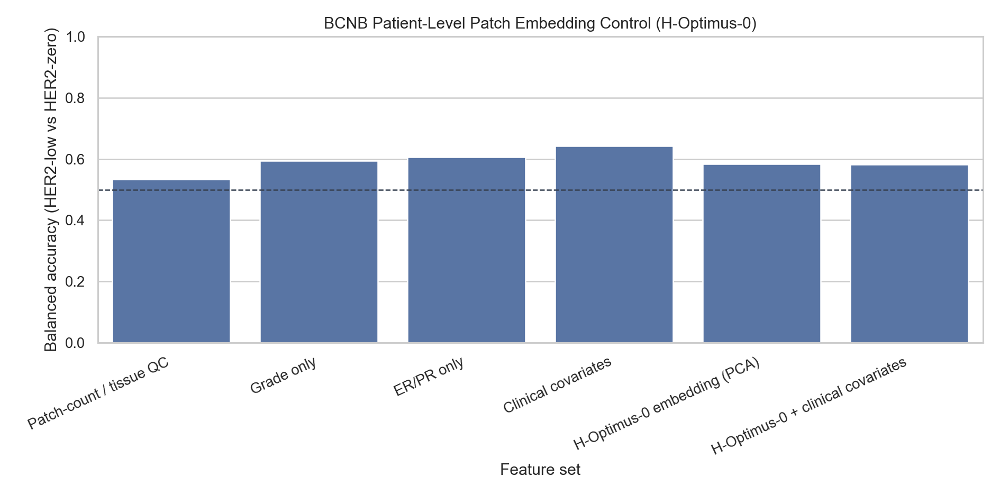

# BCNB Patient-Level Patch Embedding Control (H-Optimus-0)

Status: BCNB external-cohort patch analysis for HER2-low versus HER2-zero.

## Method

- Cohort: 781 BCNB patients with precomputed patch embeddings (654 HER2-low, 127 HER2-zero).
- Embedding input: patient-level mean of capped precomputed 256x256 H&E patches from `paper_patches.zip`.
- Model: `bioptimus/H-optimus-0`, 1536-d patient embedding.
- Classifier: class-balanced regularized logistic regression with repeated stratified 5-fold CV (5 repeats).
- Embedding dimensionality reduction: PCA fit inside each training fold only (20 components).
- Sanity: 200 shuffled-label permutations for the embedding.

## Results

| Feature set | Features | PCA | Balanced accuracy | AUC | Sensitivity | Specificity |
| --- | --- | --- | --- | --- | --- | --- |
| Patch-count / tissue QC | 4 |  | 0.534 | 0.529 | 0.490 | 0.578 |
| Grade only | 2 |  | 0.595 | 0.604 | 0.517 | 0.673 |
| ER/PR only | 4 |  | 0.606 | 0.570 | 0.354 | 0.858 |
| Clinical covariates | 13 |  | 0.643 | 0.627 | 0.532 | 0.753 |
| H-Optimus-0 embedding (PCA) | 1536 | 20 | 0.585 | 0.634 | 0.509 | 0.661 |
| H-Optimus-0 + clinical covariates | 1553 | 20 | 0.582 | 0.635 | 0.502 | 0.662 |

## Embedding PCA Robustness

| PCA components | Balanced accuracy | AUC |
| --- | --- | --- |
| 5 | 0.542 | 0.562 |
| 10 | 0.573 | 0.598 |
| 20 | 0.585 | 0.634 |
| 30 | 0.622 | 0.666 |
| 50 | 0.621 | 0.661 |

## Shuffled-Label Sanity

| Metric | Observed | Null mean | Null 95% | Empirical p |
| --- | --- | --- | --- | --- |
| Balanced accuracy | 0.585 | 0.499 | 0.543 | 0.0050 |
| AUC | 0.634 | 0.495 | 0.554 | 0.0050 |

## Interpretation

- H-Optimus-0 patch embeddings reach balanced accuracy 0.585 and AUC 0.634 versus 0.643 and AUC 0.627 for clinical covariates.
- Interpret this as external-cohort effect-size evidence, not just a p-value: a statistically non-null but small signal is not a strong image classifier.
- This is patient-level analysis, not patch-level analysis; patch-level splits would leak patient identity and overweight patients with many patches.
- Because these are precomputed tumor-region patches, this does not test whole-slide slide-size or tissue-area confounding. Full WSIs remain the stronger input if the patch signal is interesting.

## Output Files

- `docs/bcnb_patch_embedding_control_hoptimus0_hash20260605_capped10_low_zero.md`
- `results/bcnb_patch_embedding_control_hoptimus0_hash20260605_capped10_low_zero/bcnb_patch_embedding_metrics.csv`
- `results/bcnb_patch_embedding_control_hoptimus0_hash20260605_capped10_low_zero/bcnb_patch_embedding_pca_robustness.csv`
- `results/bcnb_patch_embedding_control_hoptimus0_hash20260605_capped10_low_zero/bcnb_patch_embedding_permutation.csv`
- `docs/assets/bcnb_patch_embedding_control_hoptimus0_hash20260605_capped10_low_zero/`
