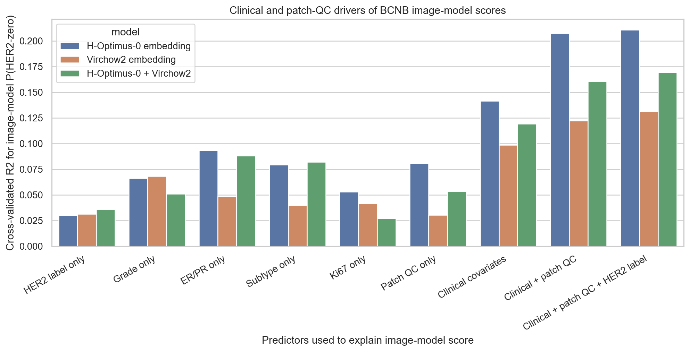
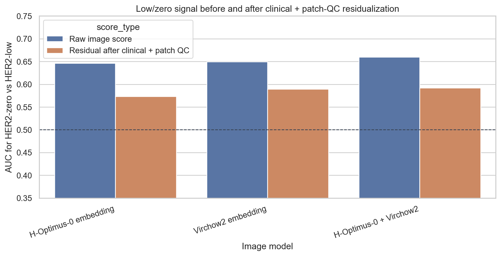
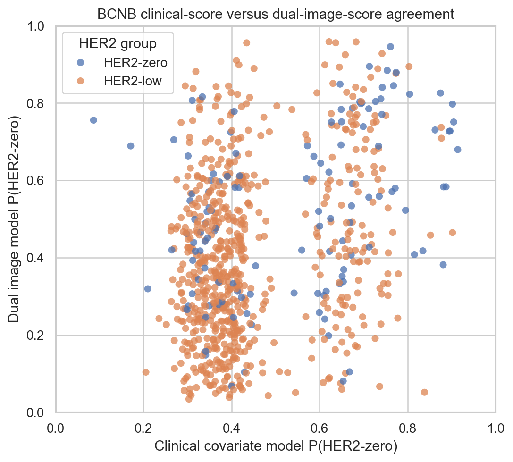

# BCNB Patch Model Score Covariate Drivers

Status: clinical and patch-QC driver analysis for BCNB image-model patient scores.

## Method

- Input scores: patient-mean out-of-fold P(HER2-zero) from the BCNB stratified analysis.
- Target: explain each image model score using clinical covariates, patch-QC variables, and the true HER2-low/zero label.
- Score-explainer model: ridge linear regression with repeated stratified 5-fold CV (5 repeats), evaluated by patient-mean out-of-fold R2.
- Residualization: predict the image score from clinical covariates + patch QC, subtract that prediction, then test whether residual score still separates HER2-zero from HER2-low.

## Cross-Validated Score Explainability

| Image model | Predictor set | Features | CV R2 | Pred/obs r | MAE |
| --- | --- | --- | --- | --- | --- |
| H-Optimus-0 embedding | HER2 label only | 1 | 0.030 | 0.174 | 0.145 |
| H-Optimus-0 embedding | Grade only | 2 | 0.066 | 0.258 | 0.142 |
| H-Optimus-0 embedding | ER/PR only | 4 | 0.093 | 0.306 | 0.140 |
| H-Optimus-0 embedding | Clinical covariates | 14 | 0.142 | 0.378 | 0.136 |
| H-Optimus-0 embedding | Patch QC only | 4 | 0.080 | 0.284 | 0.140 |
| H-Optimus-0 embedding | Clinical + patch QC | 18 | 0.207 | 0.456 | 0.130 |
| H-Optimus-0 embedding | Clinical + patch QC + HER2 label | 19 | 0.211 | 0.460 | 0.129 |
| Virchow2 embedding | HER2 label only | 1 | 0.031 | 0.178 | 0.141 |
| Virchow2 embedding | Grade only | 2 | 0.068 | 0.261 | 0.137 |
| Virchow2 embedding | ER/PR only | 4 | 0.048 | 0.221 | 0.139 |
| Virchow2 embedding | Clinical covariates | 14 | 0.099 | 0.317 | 0.136 |
| Virchow2 embedding | Patch QC only | 4 | 0.030 | 0.176 | 0.139 |
| Virchow2 embedding | Clinical + patch QC | 18 | 0.122 | 0.352 | 0.132 |
| Virchow2 embedding | Clinical + patch QC + HER2 label | 19 | 0.131 | 0.365 | 0.131 |
| H-Optimus-0 + Virchow2 | HER2 label only | 1 | 0.036 | 0.189 | 0.181 |
| H-Optimus-0 + Virchow2 | Grade only | 2 | 0.051 | 0.226 | 0.180 |
| H-Optimus-0 + Virchow2 | ER/PR only | 4 | 0.088 | 0.297 | 0.177 |
| H-Optimus-0 + Virchow2 | Clinical covariates | 14 | 0.119 | 0.347 | 0.173 |
| H-Optimus-0 + Virchow2 | Patch QC only | 4 | 0.053 | 0.231 | 0.178 |
| H-Optimus-0 + Virchow2 | Clinical + patch QC | 18 | 0.161 | 0.402 | 0.168 |
| H-Optimus-0 + Virchow2 | Clinical + patch QC + HER2 label | 19 | 0.169 | 0.413 | 0.166 |

## Residual Low/Zero Signal After Clinical + Patch QC

| Image model | Raw AUC | Raw delta | Residual AUC | Residual delta | Residual p |
| --- | --- | --- | --- | --- | --- |
| H-Optimus-0 embedding | 0.646 | 0.092 | 0.573 | 0.035 | 0.009 |
| Virchow2 embedding | 0.649 | 0.091 | 0.589 | 0.046 | 0.001 |
| H-Optimus-0 + Virchow2 | 0.660 | 0.123 | 0.592 | 0.059 | 0.001 |

## Direct Score-Covariate Associations

| Image model | Covariate | Statistic | Value | p |
| --- | --- | --- | --- | --- |
| H-Optimus-0 embedding | clinical_covariate_score | rho | 0.246 | 3.21e-12 |
| H-Optimus-0 embedding | grade | rho | 0.232 | 1.28e-09 |
| H-Optimus-0 embedding | ki67 | rho | 0.164 | 7.24e-06 |
| H-Optimus-0 embedding | ER | eta2 | 0.101 | 6.46e-16 |
| H-Optimus-0 embedding | PR | eta2 | 0.068 | 4.89e-11 |
| H-Optimus-0 embedding | molecular_subtype | eta2 | 0.087 | 1.06e-12 |
| Virchow2 embedding | clinical_covariate_score | rho | 0.196 | 3.15e-08 |
| Virchow2 embedding | grade | rho | 0.220 | 1.01e-08 |
| Virchow2 embedding | ki67 | rho | 0.165 | 6.01e-06 |
| Virchow2 embedding | ER | eta2 | 0.057 | 6.90e-10 |
| Virchow2 embedding | PR | eta2 | 0.038 | 6.07e-07 |
| Virchow2 embedding | molecular_subtype | eta2 | 0.048 | 1.56e-07 |
| H-Optimus-0 + Virchow2 | clinical_covariate_score | rho | 0.250 | 1.24e-12 |
| H-Optimus-0 + Virchow2 | grade | rho | 0.195 | 3.88e-07 |
| H-Optimus-0 + Virchow2 | ki67 | rho | 0.087 | 0.017 |
| H-Optimus-0 + Virchow2 | ER | eta2 | 0.093 | 5.17e-15 |
| H-Optimus-0 + Virchow2 | PR | eta2 | 0.053 | 3.00e-09 |
| H-Optimus-0 + Virchow2 | molecular_subtype | eta2 | 0.089 | 7.84e-14 |

## Interpretation

- The true HER2-low/zero label alone explains very little of the image-model score, which is expected for a weak classifier.
- Clinical covariates and patch QC explain a modest but non-trivial fraction of the image scores, especially for the dual embedding.
- After clinical + patch-QC residualization, residual AUC remains above 0.5 but is still modest, so the image signal is not fully reducible to the measured covariates and is not strong enough for classifier-grade claims.
- This supports the current paper framing: BCNB contains weak image-readable morphology/covariate signal around the low/zero boundary, but the available patch-level evidence does not justify a standalone HER2-low/zero detector.

## Output Files

- `docs/bcnb_patch_score_covariate_drivers_hoptimus0_virchow2_hash_capped10_low_zero.md`
- `results/bcnb_patch_score_covariate_drivers_hoptimus0_virchow2_hash_capped10_low_zero/bcnb_patch_score_driver_r2.csv`
- `results/bcnb_patch_score_covariate_drivers_hoptimus0_virchow2_hash_capped10_low_zero/bcnb_patch_score_residual_label_tests.csv`
- `results/bcnb_patch_score_covariate_drivers_hoptimus0_virchow2_hash_capped10_low_zero/bcnb_patch_score_covariate_associations.csv`
- `results/bcnb_patch_score_covariate_drivers_hoptimus0_virchow2_hash_capped10_low_zero/bcnb_patch_score_residual_predictions.csv`
- `docs/assets/bcnb_patch_score_covariate_drivers_hoptimus0_virchow2_hash_capped10_low_zero/`
