# BCNB Patch Score Visual QC

Status: visual audit of BCNB patch model score extremes.

## Method

- Model score: `H-Optimus-0 + Virchow2` patient-mean out-of-fold P(HER2-zero).
- Patch input: `paper_patches.zip` with the deterministic hash-capped manifest, up to 10 patches per patient.
- Selected cases: top 4 true HER2-zero scored zero-like, top 4 HER2-low scored zero-like, and top 4 HER2-low scored low-like.
- This is visual QC, not a new classifier result. It asks whether score extremes look dominated by obvious patch artifacts or by plausible tumor morphology/context.

## Selected Cases

| Category | Patient | Group | P0 | Grade | ER | PR | Subtype | Montage |
| --- | --- | --- | --- | --- | --- | --- | --- | --- |
| true_zero_scored_zero_like | 6 | HER2-zero | 0.946 | 3.0 | Negative | Negative | Triple negative | true_zero_scored_zero_like_patient_6.png |
| true_zero_scored_zero_like | 954 | HER2-zero | 0.895 | 3.0 | Negative | Negative | Triple negative | true_zero_scored_zero_like_patient_954.png |
| true_zero_scored_zero_like | 658 | HER2-zero | 0.884 | 3.0 | Negative | Positive | Triple negative | true_zero_scored_zero_like_patient_658.png |
| true_zero_scored_zero_like | 627 | HER2-zero | 0.879 | 3.0 | Negative | Negative | Triple negative | true_zero_scored_zero_like_patient_627.png |
| low_scored_zero_like | 840 | HER2-low | 0.959 | 3.0 | Negative | Negative | Triple negative | low_scored_zero_like_patient_840.png |
| low_scored_zero_like | 100 | HER2-low | 0.958 | 3.0 | Negative | Negative | Triple negative | low_scored_zero_like_patient_100.png |
| low_scored_zero_like | 429 | HER2-low | 0.956 | NA | Positive | Positive | Luminal B | low_scored_zero_like_patient_429.png |
| low_scored_zero_like | 1030 | HER2-low | 0.956 | 2.0 | Positive | Positive | Luminal A | low_scored_zero_like_patient_1030.png |
| low_scored_low_like | 226 | HER2-low | 0.034 | 2.0 | Positive | Positive | Luminal B | low_scored_low_like_patient_226.png |
| low_scored_low_like | 458 | HER2-low | 0.038 | 2.0 | Positive | Positive | Luminal B | low_scored_low_like_patient_458.png |
| low_scored_low_like | 849 | HER2-low | 0.043 | 1.0 | Positive | Positive | Luminal A | low_scored_low_like_patient_849.png |
| low_scored_low_like | 859 | HER2-low | 0.044 | 3.0 | Positive | Positive | Luminal B | low_scored_low_like_patient_859.png |

## Patch QC Summary

| Category | Patients | Mean tissue | Min tissue | Mean brightness | Mean colorfulness |
| --- | --- | --- | --- | --- | --- |
| low_scored_low_like | 4 | 0.867 | 0.669 | 0.590 | 0.091 |
| low_scored_zero_like | 4 | 0.947 | 0.699 | 0.526 | 0.098 |
| true_zero_scored_zero_like | 4 | 0.951 | 0.688 | 0.471 | 0.094 |

## Interpretation

- The high zero-like HER2-low cases are not obviously low-tissue or blank-patch artifacts in this hash-capped sample.
- Score extremes are enriched for clinically aggressive-looking covariate profiles already seen in the quantitative analyses, especially grade 3 / ER-negative / PR-negative / triple-negative cases among zero-like scores.
- This supports the same cautious interpretation as the score-driver analysis: the image score appears to reflect morphology/context that partly overlaps with clinical covariates, not a clean HER2-low/zero-specific detector.
- Full WSI review or pathologist annotation would be the stronger next visual step if this becomes a manuscript figure.

## Montages

### Patient 6: true_zero_scored_zero_like

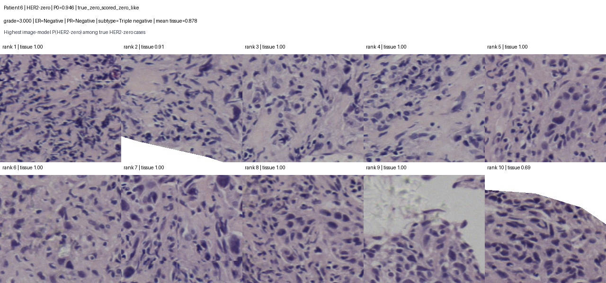

### Patient 954: true_zero_scored_zero_like

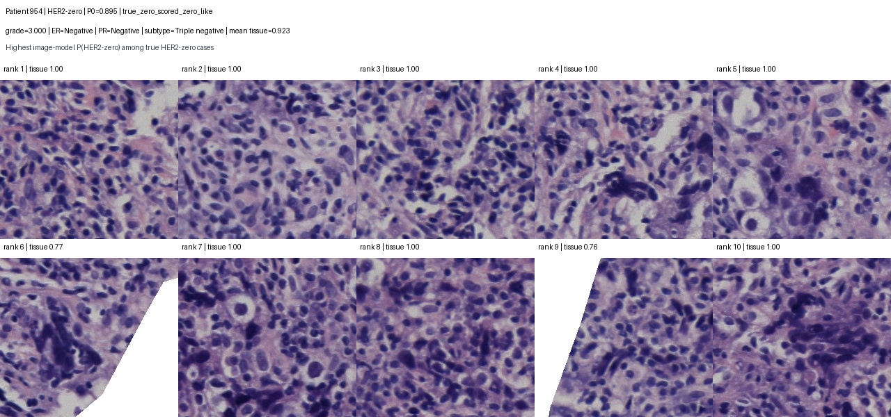

### Patient 658: true_zero_scored_zero_like

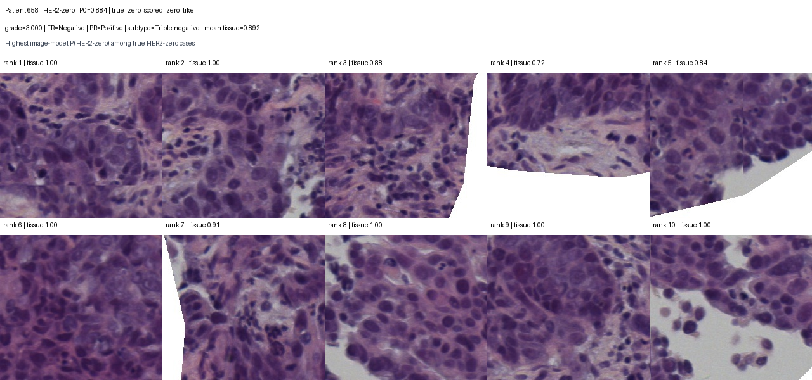

### Patient 627: true_zero_scored_zero_like

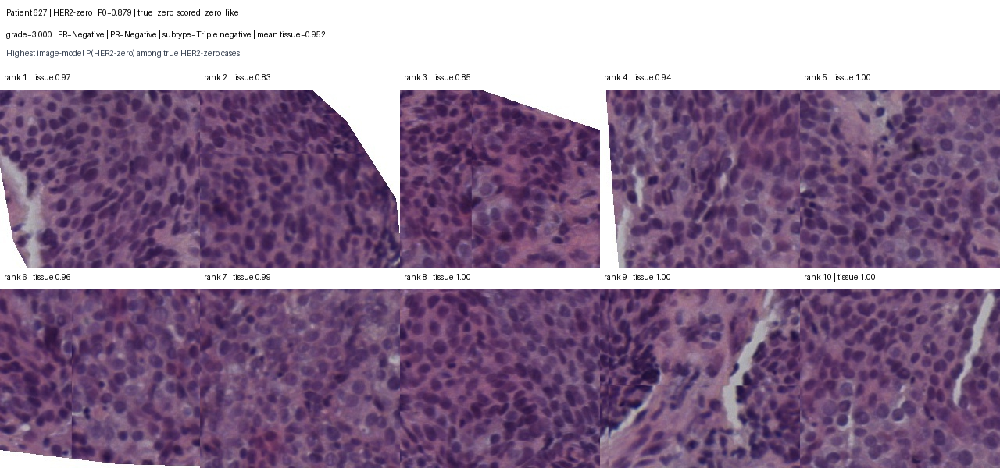

### Patient 840: low_scored_zero_like

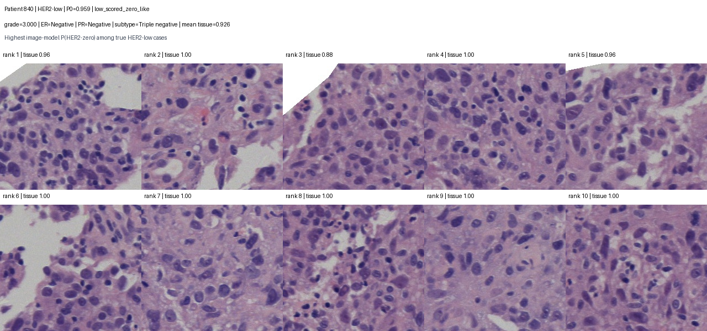

### Patient 100: low_scored_zero_like

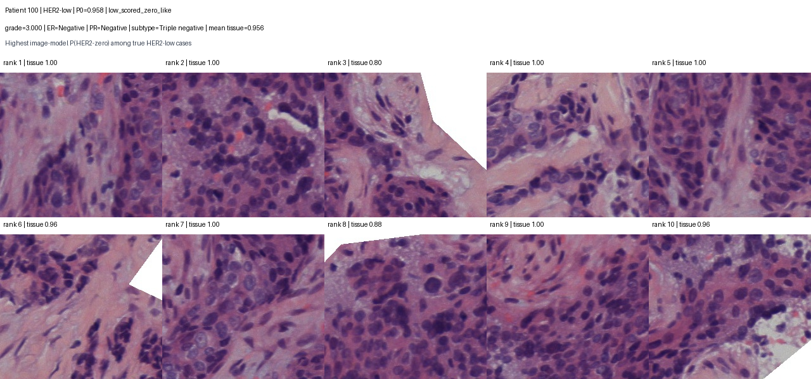

### Patient 429: low_scored_zero_like

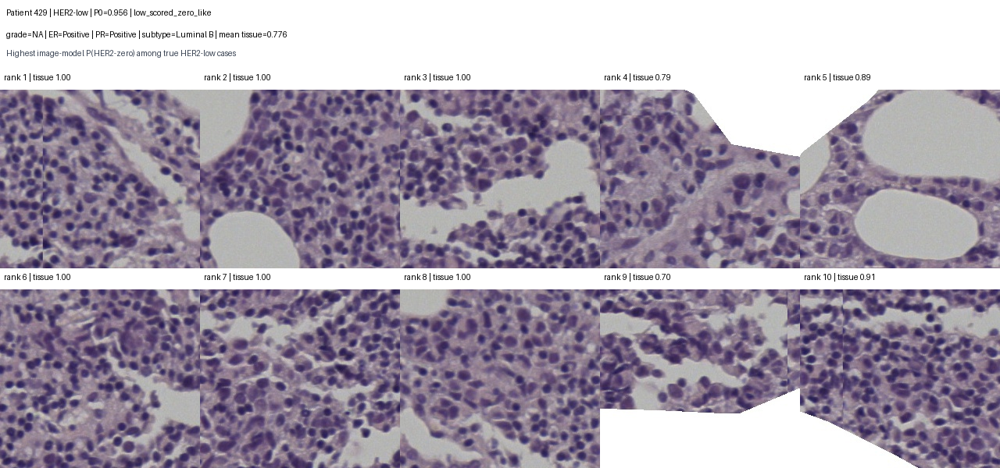

### Patient 1030: low_scored_zero_like

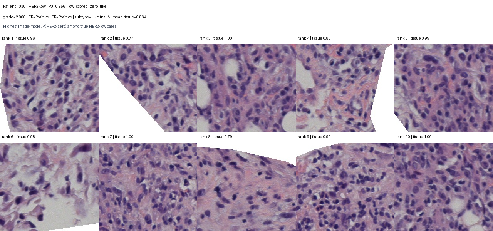

### Patient 226: low_scored_low_like

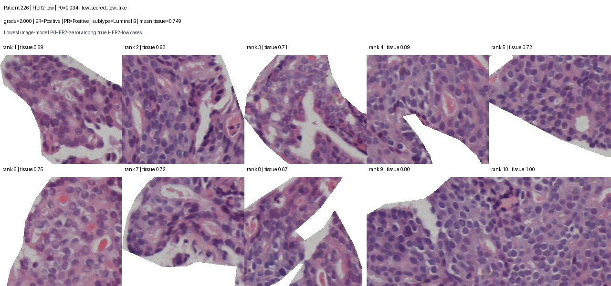

### Patient 458: low_scored_low_like

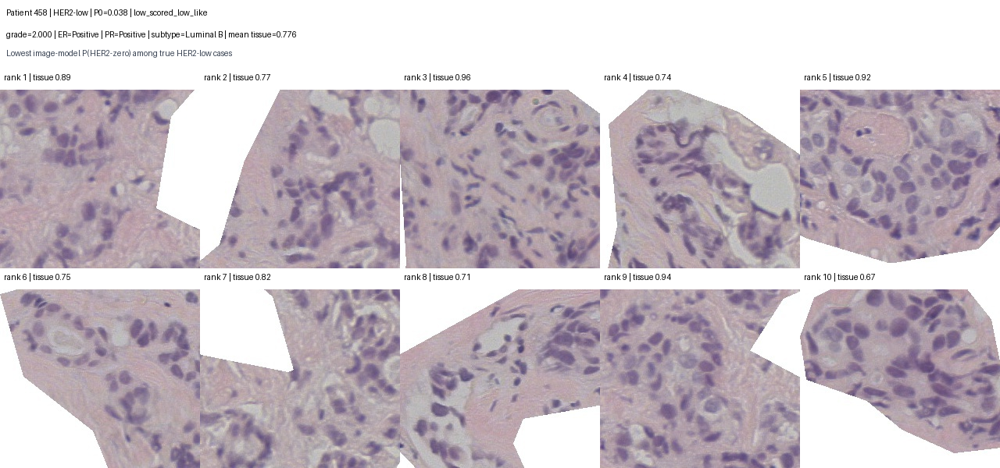

### Patient 849: low_scored_low_like

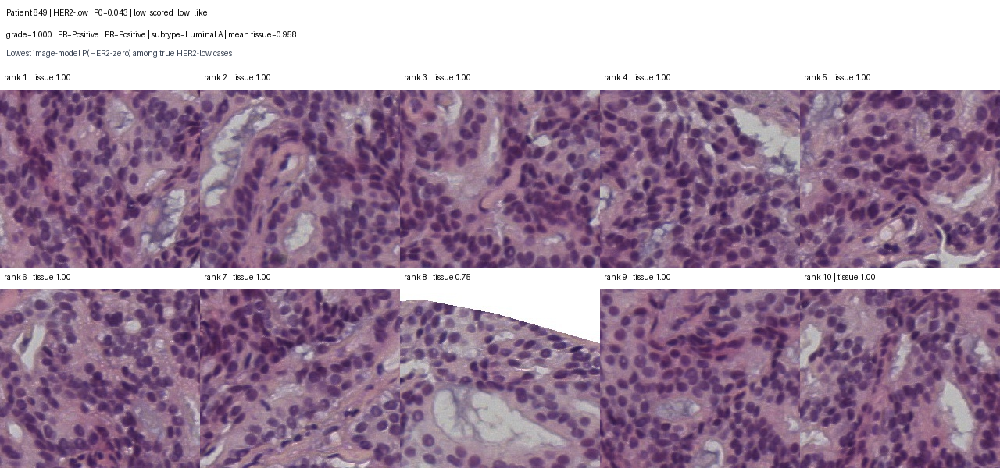

### Patient 859: low_scored_low_like

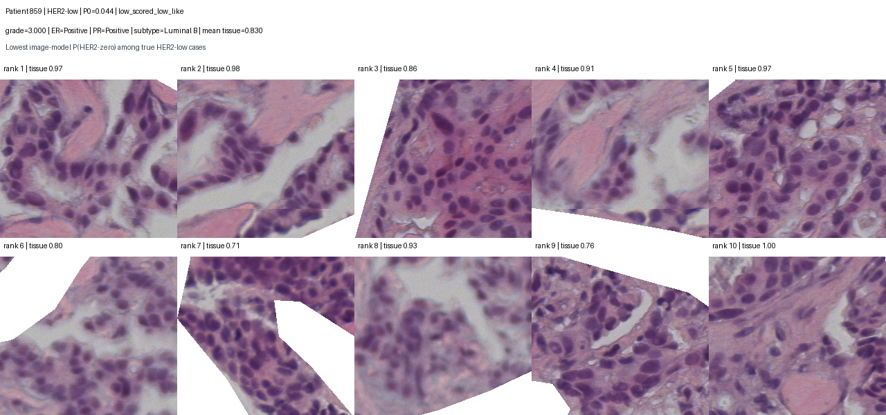

## Output Files

- `docs/bcnb_patch_score_visual_qc_hoptimus0_virchow2_hash_capped10_low_zero.md`
- `results/bcnb_patch_score_visual_qc_hoptimus0_virchow2_hash_capped10_low_zero/bcnb_patch_score_visual_qc_cases.csv`
- `results/bcnb_patch_score_visual_qc_hoptimus0_virchow2_hash_capped10_low_zero/bcnb_patch_score_visual_qc_patch_metrics.csv`
- `results/bcnb_patch_score_visual_qc_hoptimus0_virchow2_hash_capped10_low_zero/bcnb_patch_score_visual_qc_summary.csv`
- `docs/assets/bcnb_patch_score_visual_qc_hoptimus0_virchow2_hash_capped10_low_zero/`
