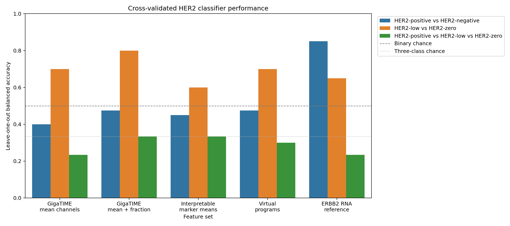
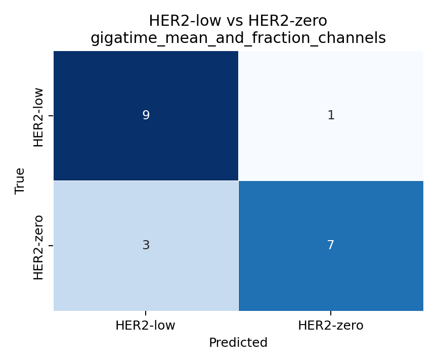
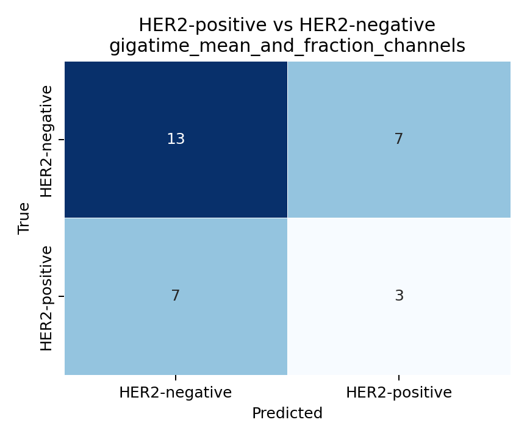
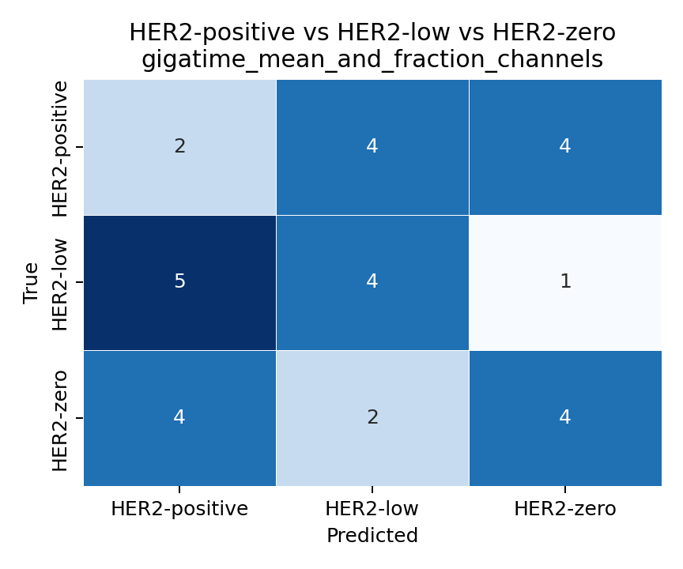

# Clinical HER2 Classifier Baseline

This document records the first diagnostic-model style analysis in the project. Until now, the project mostly compared group averages. This step asks a different question:

> If we train a classifier from GigaTIME slide-level features, can it predict clinical HER2 labels for held-out slides?

This is still a tiny pilot, not a diagnostic model.

## Why This Was Done

The scientific goal is to eventually know whether H&E-derived GigaTIME features can help predict HER2 status. To evaluate that, we need real classification metrics, not only group-mean plots.

This baseline tests:

- input: slide-level GigaTIME virtual channel features from the 256-tile run
- output: clinical HER2 labels
- model: regularized logistic classifier and nearest-centroid baseline
- evaluation: leave-one-out cross-validation

Every reported prediction is cross-validated. In other words, the model predicts each slide only after that slide has been removed from the training set.

## Command

```bash
conda run -n gigatime-tcga python scripts/train_her2_classifier_baseline.py
```

Inputs:

- `results/gigatime_tcga_brca_clinical_her2_tile256/clinical_summary/joined_slide_clinical_her2_gigatime.csv`

Local outputs:

- `results/gigatime_tcga_brca_clinical_her2_tile256/classifier_baseline/classifier_crossval_predictions.csv`
- `results/gigatime_tcga_brca_clinical_her2_tile256/classifier_baseline/classifier_metrics.csv`
- `results/gigatime_tcga_brca_clinical_her2_tile256/classifier_baseline/classifier_confusion_matrices.csv`
- `results/gigatime_tcga_brca_clinical_her2_tile256/classifier_baseline/classifier_baseline_summary.md`

Tracked figures:

- `docs/assets/clinical_her2_classifier_baseline/classifier_balanced_accuracy.png`
- `docs/assets/clinical_her2_classifier_baseline/confusion_her2_low_vs_zero.png`
- `docs/assets/clinical_her2_classifier_baseline/confusion_her2_positive_vs_negative.png`
- `docs/assets/clinical_her2_classifier_baseline/confusion_her2_three_class.png`

## Classification Tasks

Three tasks were tested:

1. `HER2-positive` versus `HER2-negative`, where HER2-negative combines HER2-low and HER2-zero.
2. `HER2-low` versus `HER2-zero`.
3. Full three-class prediction: `HER2-positive` versus `HER2-low` versus `HER2-zero`.

## Feature Sets

The classifier tested several feature sets:

| Feature set | Features | Source |
|---|---:|---|
| GigaTIME mean channels | 23 | H&E-derived GigaTIME virtual channel means |
| GigaTIME mean + fraction channels | 46 | H&E-derived GigaTIME mean and thresholded fraction channels |
| Interpretable marker means | 10 | H&E-derived immune/tumor marker subset |
| Virtual programs | 5 | H&E-derived composite programs |
| ERBB2 RNA reference | 1 | RNA reference only, not H&E |

The ERBB2 RNA feature is included only as a reference. It is not an image-based model.

## Best Cross-Validated Results

| Task | Best feature set | Accuracy | Balanced accuracy | Macro AUC | Sensitivity | Specificity |
|---|---|---:|---:|---:|---:|---:|
| HER2-low vs HER2-zero | GigaTIME mean + fraction channels | 0.800 | 0.800 | 0.870 | 0.700 | 0.900 |
| HER2-positive vs HER2-negative | ERBB2 RNA reference | 0.900 | 0.850 | 0.800 | 0.700 | 1.000 |
| Three-class HER2 group | GigaTIME mean + fraction channels | 0.333 | 0.333 | 0.555 |  |  |

Important: the best HER2-positive versus HER2-negative result came from ERBB2 RNA, not H&E/GigaTIME features.

## GigaTIME-Only Interpretation

The most promising GigaTIME-only task was HER2-low versus HER2-zero:

- Best GigaTIME feature set: mean + fraction channels
- Accuracy: 0.800
- Balanced accuracy: 0.800
- Macro AUC: 0.870

This is interesting because HER2-low versus HER2-zero is the biologically subtle comparison we care about. However, it is based on only 20 cases, so it could be unstable.

For HER2-positive versus HER2-negative, GigaTIME-only performance was weak:

- Best GigaTIME feature set: mean + fraction channels
- Accuracy: 0.533
- Balanced accuracy: 0.475
- Macro AUC: 0.430

For full three-class prediction, performance was at chance:

- Best GigaTIME feature set: mean + fraction channels
- Accuracy: 0.333
- Balanced accuracy: 0.333
- Macro AUC: 0.555



## Confusion Matrices

The confusion matrices below show the best GigaTIME/H&E regularized logistic model for each task. They do not use the ERBB2 RNA reference feature.

### HER2-Low Versus HER2-Zero



### HER2-Positive Versus HER2-Negative



### Three-Class HER2 Group



## What This Means

What looks promising:

- GigaTIME features may contain signal for separating HER2-low from HER2-zero in this selected pilot.
- The HER2-low versus HER2-zero result is consistent with the earlier group-average finding.
- The classifier framework now works end to end.

What does not look ready:

- GigaTIME features do not currently predict HER2-positive versus HER2-negative reliably.
- The full three-class classifier is at chance.
- The cohort is too small for any diagnostic claim.
- The best HER2-positive classifier was ERBB2 RNA, not H&E/GigaTIME.

## Proposal Language

A careful way to describe this result:

> We implemented a first slide-level HER2 classifier using GigaTIME-derived virtual channel features and leave-one-out cross-validation. In this 30-case pilot, GigaTIME features showed promising separation of HER2-low versus HER2-zero cases, but did not reliably classify HER2-positive versus HER2-negative disease or the full three-class HER2 grouping. These results support further model development focused on tumor-region selection, larger cohorts, and external validation, but they are not sufficient for clinical diagnosis.

## Next Step

The next classifier improvement should focus on data quality and model structure:

1. Restrict features to tumor-rich tiles rather than all tissue tiles.
2. Add tile-level aggregation features such as percentiles, maximum signal, and spatial heterogeneity, not only slide means.
3. Increase the cohort size beyond 10 cases per group.
4. Use nested cross-validation or an external test set before reporting model selection results.
5. Eventually train a multiple-instance learning model using tile-level features or embeddings.
