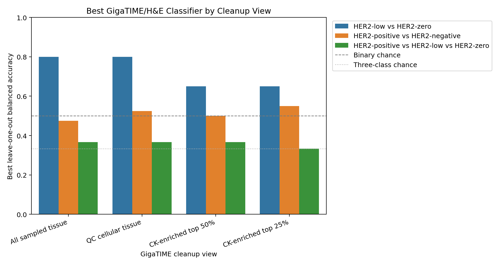
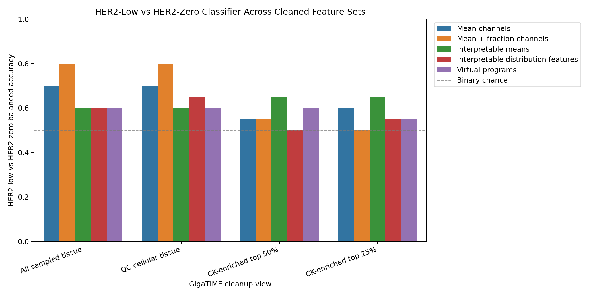
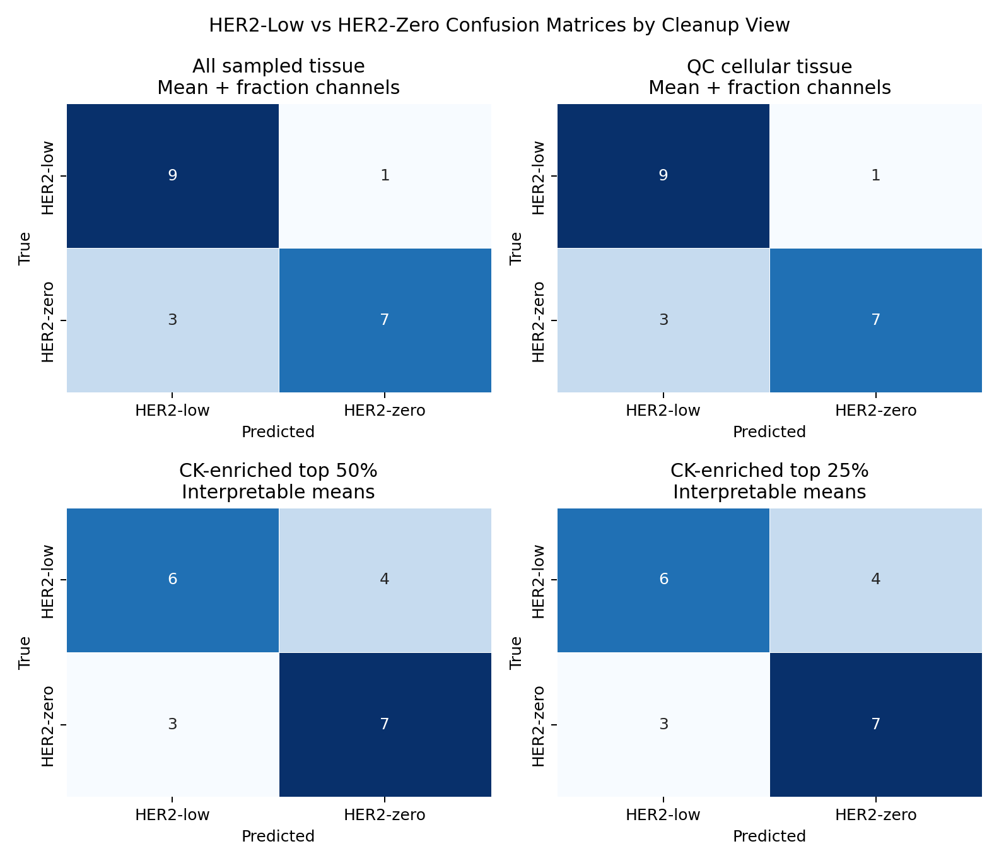

# Cleaned GigaTIME HER2 Classifier Comparison

This analysis reruns the slide-level HER2 classifier after cleaning the GigaTIME tile inputs. It compares all sampled tissue against cellular and virtual CK-enriched feature views.

Every prediction is leave-one-out cross-validated. This remains a small 30-case pilot, not a clinical model.

## Feature Views

- All sampled tissue: the original 256-tile slide aggregation.
- QC cellular tissue: tissue fraction >= 0.70 and virtual DAPI mean >= 0.05.
- CK-enriched top 50%: top half of virtual CK tiles within each slide after QC.
- CK-enriched top 25%: top quarter of virtual CK tiles within each slide after QC.

Virtual CK and DAPI are GigaTIME predictions, not real stains or pathologist tumor annotations.

## Feature Sets

| Feature set | Number of features |
| --- | --- |
| Mean channels | 23 |
| Mean + fraction channels | 46 |
| Interpretable means | 10 |
| Interpretable distribution features | 50 |
| Virtual programs | 8 |
| ERBB2 RNA reference | 1 |

## Best GigaTIME/H&E Result Per View and Task

| Cleanup view | Task | Best feature set | N | Accuracy | Balanced accuracy | Macro AUC | Sensitivity | Specificity |
| --- | --- | --- | --- | --- | --- | --- | --- | --- |
| All sampled tissue | HER2-low vs HER2-zero | Mean + fraction channels | 20 | 0.800 | 0.800 | 0.870 | 0.700 | 0.900 |
| All sampled tissue | HER2-positive vs HER2-negative | Mean + fraction channels | 30 | 0.533 | 0.475 | 0.430 | 0.300 | 0.650 |
| All sampled tissue | HER2-positive vs HER2-low vs HER2-zero | Interpretable distribution features | 30 | 0.367 | 0.367 | 0.547 |  |  |
| QC cellular tissue | HER2-low vs HER2-zero | Mean + fraction channels | 20 | 0.800 | 0.800 | 0.900 | 0.700 | 0.900 |
| QC cellular tissue | HER2-positive vs HER2-negative | Mean + fraction channels | 30 | 0.567 | 0.525 | 0.420 | 0.400 | 0.650 |
| QC cellular tissue | HER2-positive vs HER2-low vs HER2-zero | Interpretable means | 30 | 0.367 | 0.367 | 0.500 |  |  |
| CK-enriched top 50% | HER2-low vs HER2-zero | Interpretable means | 20 | 0.650 | 0.650 | 0.670 | 0.700 | 0.600 |
| CK-enriched top 50% | HER2-positive vs HER2-negative | Interpretable means | 30 | 0.600 | 0.500 | 0.410 | 0.200 | 0.800 |
| CK-enriched top 50% | HER2-positive vs HER2-low vs HER2-zero | Interpretable means | 30 | 0.367 | 0.367 | 0.498 |  |  |
| CK-enriched top 25% | HER2-low vs HER2-zero | Interpretable means | 20 | 0.650 | 0.650 | 0.630 | 0.700 | 0.600 |
| CK-enriched top 25% | HER2-positive vs HER2-negative | Interpretable means | 30 | 0.667 | 0.550 | 0.535 | 0.200 | 0.900 |
| CK-enriched top 25% | HER2-positive vs HER2-low vs HER2-zero | Interpretable means | 30 | 0.333 | 0.333 | 0.505 |  |  |

## HER2-Low Versus HER2-Zero Focus

| Cleanup view | Best feature set | Accuracy | Balanced accuracy | Macro AUC | Sensitivity | Specificity |
| --- | --- | --- | --- | --- | --- | --- |
| All sampled tissue | Mean + fraction channels | 0.800 | 0.800 | 0.870 | 0.700 | 0.900 |
| QC cellular tissue | Mean + fraction channels | 0.800 | 0.800 | 0.900 | 0.700 | 0.900 |
| CK-enriched top 50% | Interpretable means | 0.650 | 0.650 | 0.670 | 0.700 | 0.600 |
| CK-enriched top 25% | Interpretable means | 0.650 | 0.650 | 0.630 | 0.700 | 0.600 |

## Main Result

- All sampled tissue HER2-low versus HER2-zero balanced accuracy: 0.800, macro AUC: 0.870.
- QC cellular tissue preserved the HER2-low versus HER2-zero result: balanced accuracy 0.800, macro AUC 0.900.
- CK-enriched top 50% reduced HER2-low versus HER2-zero performance to balanced accuracy 0.650.
- CK-enriched top 25% HER2-low versus HER2-zero balanced accuracy was 0.650.
- CK-enriched top 25% modestly improved HER2-positive versus HER2-negative balanced accuracy to 0.550, but sensitivity remained low at 0.200.

## ERBB2 RNA Reference

ERBB2 RNA is repeated as a non-H&E reference. It does not depend on the cleanup view and should not be interpreted as image-derived performance.

| Cleanup view | Task | Accuracy | Balanced accuracy | Macro AUC |
| --- | --- | --- | --- | --- |
| All sampled tissue | HER2-low vs HER2-zero | 0.650 | 0.650 | 0.690 |
| All sampled tissue | HER2-positive vs HER2-negative | 0.900 | 0.850 | 0.800 |
| All sampled tissue | HER2-positive vs HER2-low vs HER2-zero | 0.233 | 0.233 | 0.567 |
| QC cellular tissue | HER2-low vs HER2-zero | 0.650 | 0.650 | 0.690 |
| QC cellular tissue | HER2-positive vs HER2-negative | 0.900 | 0.850 | 0.800 |
| QC cellular tissue | HER2-positive vs HER2-low vs HER2-zero | 0.233 | 0.233 | 0.567 |
| CK-enriched top 50% | HER2-low vs HER2-zero | 0.650 | 0.650 | 0.690 |
| CK-enriched top 50% | HER2-positive vs HER2-negative | 0.900 | 0.850 | 0.800 |
| CK-enriched top 50% | HER2-positive vs HER2-low vs HER2-zero | 0.233 | 0.233 | 0.567 |
| CK-enriched top 25% | HER2-low vs HER2-zero | 0.650 | 0.650 | 0.690 |
| CK-enriched top 25% | HER2-positive vs HER2-negative | 0.900 | 0.850 | 0.800 |
| CK-enriched top 25% | HER2-positive vs HER2-low vs HER2-zero | 0.233 | 0.233 | 0.567 |

## Interpretation

The cleaned-view comparison asks whether the classifier signal is stronger in tumor-enriched tile views or in broader tissue context.

In this run, cellular-tissue cleanup preserved the HER2-low versus HER2-zero classifier signal, which argues against the result being only blank/background artifact. However, the signal weakened when restricted to the most CK-enriched tiles. That suggests the current GigaTIME signal may be capturing broader tissue or microenvironment context more than a purely epithelial tumor-cell HER2 phenotype.

The practical next step is not to claim diagnosis. It is to inspect the cases that change classification between all-tissue/QC-cellular and CK-enriched views, because those flips can reveal whether GigaTIME is using tumor regions, stromal context, immune infiltrates, or tile-selection artifacts.

## Outputs

- `results/gigatime_tcga_brca_clinical_her2_tile256/cleaned_classifier_comparison/cleaned_classifier_predictions.csv`
- `results/gigatime_tcga_brca_clinical_her2_tile256/cleaned_classifier_comparison/cleaned_classifier_metrics.csv`
- `results/gigatime_tcga_brca_clinical_her2_tile256/cleaned_classifier_comparison/cleaned_classifier_confusion_matrices.csv`
- `docs/assets/clinical_her2_cleaned_classifier/`
