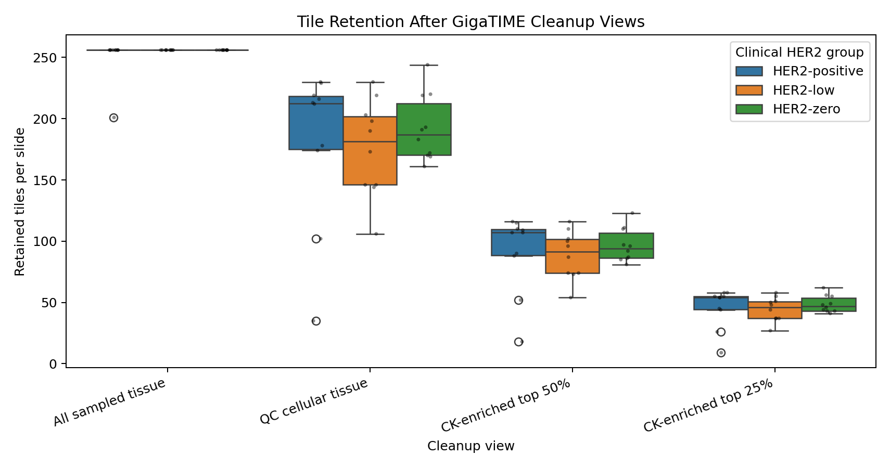
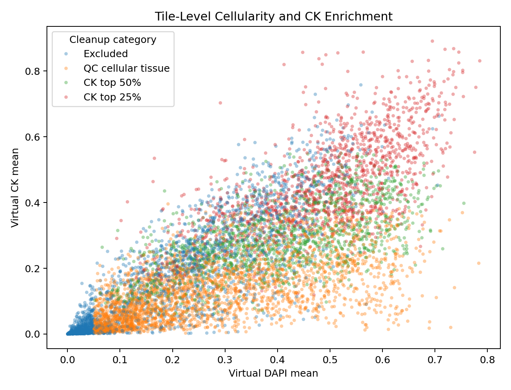
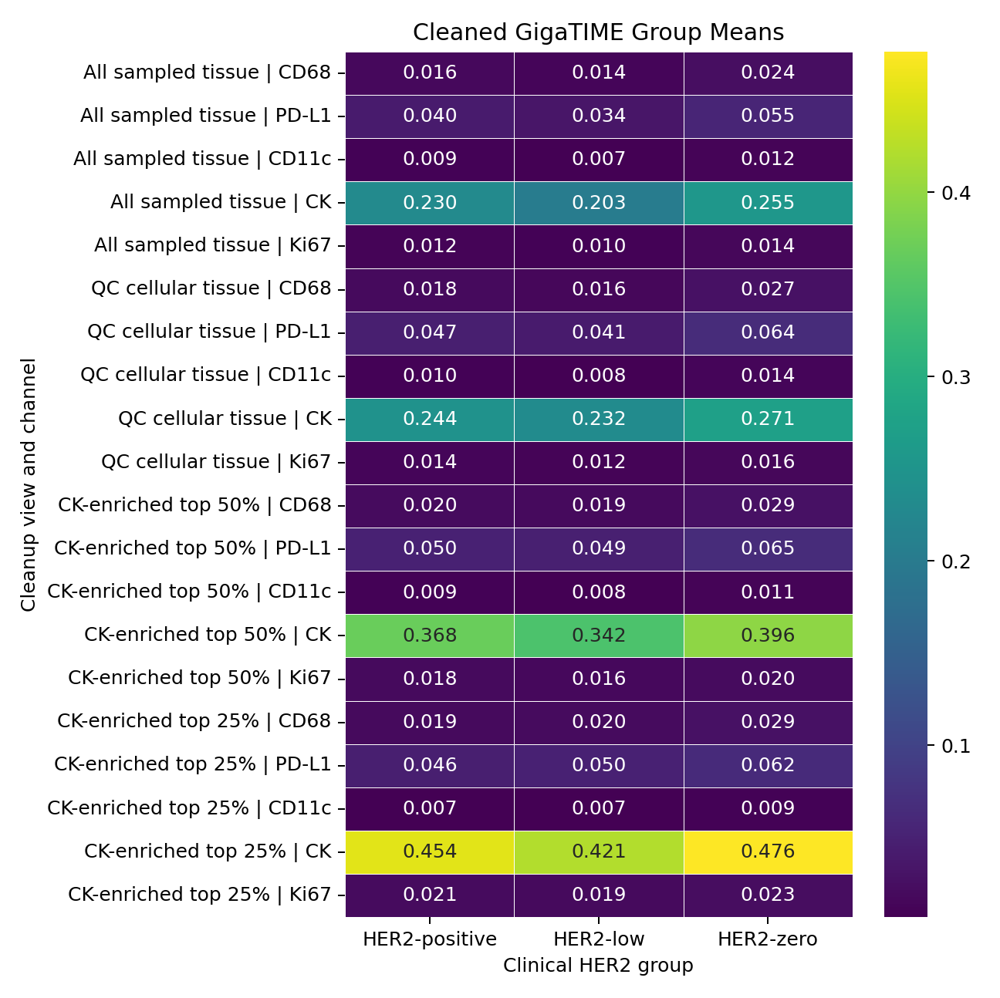
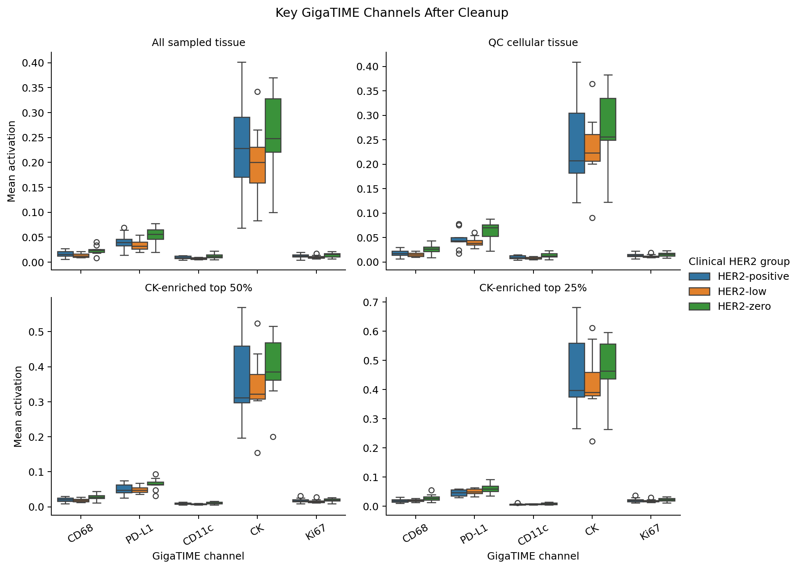

# Clinical HER2 GigaTIME Data Cleanup

This cleanup step goes back before classifier training. It asks whether the GigaTIME input features should be aggregated from all sampled tissue tiles, or from cleaner tile subsets that are more cellular and more epithelial/tumor enriched.

## Cleanup Views

- `all_sampled_tissue`: all tissue tiles selected by the original GigaTIME run.
- `qc_cellular_tissue`: tiles with H&E tissue fraction >= 0.70 and virtual DAPI mean >= 0.05.
- `ck_enriched_top50`: the top 50% virtual CK tiles within each slide after cellular-tissue QC.
- `ck_enriched_top25`: the top 25% virtual CK tiles within each slide after cellular-tissue QC.

Important: CK and DAPI are still GigaTIME virtual predictions from H&E, not laboratory stains. These filters create tumor-enriched research feature views, not confirmed tumor masks.

## Tile Retention

| Cleanup view | Median retained tiles | Median retained fraction | Median DAPI | Median CK |
| --- | --- | --- | --- | --- |
| All sampled tissue | 256.0 | 1.000 | 0.324 | 0.231 |
| QC cellular tissue | 190.5 | 0.744 | 0.360 | 0.249 |
| CK-enriched top 50% | 96.0 | 0.375 | 0.450 | 0.359 |
| CK-enriched top 25% | 48.0 | 0.188 | 0.493 | 0.431 |

## Tile-Level Cleanup Map

This plot shows how the cleanup rules move from broad tissue tiles toward cellular, CK-enriched tiles.

## Group Means After Cleanup

## Top Three-Group Signals Across Cleanup Views

| Cleanup view | Channel | Kruskal p | BH q within view | Highest group | Lowest group | Max-min mean |
| --- | --- | --- | --- | --- | --- | --- |
| All sampled tissue | CD68 | 0.0167 | 0.0951 | HER2-zero | HER2-low | 0.0104 |
| All sampled tissue | PD-L1 | 0.0211 | 0.0951 | HER2-zero | HER2-low | 0.0206 |
| All sampled tissue | CD11c | 0.0384 | 0.1151 | HER2-zero | HER2-low | 0.0050 |
| All sampled tissue | CD3 | 0.0686 | 0.1475 | HER2-zero | HER2-low | 0.0329 |
| All sampled tissue | CD4 | 0.0819 | 0.1475 | HER2-zero | HER2-low | 0.0328 |
| QC cellular tissue | CD68 | 0.0153 | 0.0751 | HER2-zero | HER2-low | 0.0115 |
| QC cellular tissue | PD-L1 | 0.0167 | 0.0751 | HER2-zero | HER2-low | 0.0236 |
| QC cellular tissue | CD11c | 0.0263 | 0.0788 | HER2-zero | HER2-low | 0.0059 |
| QC cellular tissue | CD4 | 0.0600 | 0.1349 | HER2-zero | HER2-low | 0.0370 |
| QC cellular tissue | CD3 | 0.0849 | 0.1529 | HER2-zero | HER2-low | 0.0372 |
| CK-enriched top 50% | CD68 | 0.0341 | 0.2646 | HER2-zero | HER2-low | 0.0097 |
| CK-enriched top 50% | PD-L1 | 0.0588 | 0.2646 | HER2-zero | HER2-low | 0.0161 |
| CK-enriched top 50% | CD11c | 0.1058 | 0.3173 | HER2-zero | HER2-low | 0.0031 |
| CK-enriched top 50% | CD4 | 0.1703 | 0.3226 | HER2-zero | HER2-low | 0.0189 |
| CK-enriched top 50% | CD3 | 0.2151 | 0.3226 | HER2-zero | HER2-low | 0.0188 |
| CK-enriched top 25% | PD-L1 | 0.0494 | 0.3282 | HER2-zero | HER2-positive | 0.0163 |
| CK-enriched top 25% | CD68 | 0.0729 | 0.3282 | HER2-zero | HER2-positive | 0.0095 |
| CK-enriched top 25% | Ki67 | 0.3250 | 0.6470 | HER2-zero | HER2-low | 0.0039 |
| CK-enriched top 25% | CD11c | 0.3594 | 0.6470 | HER2-zero | HER2-positive | 0.0021 |
| CK-enriched top 25% | CK | 0.3594 | 0.6470 | HER2-zero | HER2-low | 0.0548 |

## HER2-Low Versus HER2-Zero Focus

Negative delta means HER2-low is lower than HER2-zero.

| Cleanup view | Channel | HER2-low minus HER2-zero | Mann-Whitney p | BH q within view |
| --- | --- | --- | --- | --- |
| All sampled tissue | CD68 | -0.0104 | 0.0073 | 0.1020 |
| All sampled tissue | PD-L1 | -0.0206 | 0.0091 | 0.1020 |
| All sampled tissue | CD11c | -0.0050 | 0.0113 | 0.1020 |
| QC cellular tissue | CD68 | -0.0115 | 0.0073 | 0.1020 |
| QC cellular tissue | PD-L1 | -0.0236 | 0.0113 | 0.1020 |
| QC cellular tissue | CD11c | -0.0059 | 0.0113 | 0.1020 |
| CK-enriched top 50% | CD68 | -0.0097 | 0.0173 | 0.3387 |
| CK-enriched top 50% | PD-L1 | -0.0161 | 0.0312 | 0.3387 |
| CK-enriched top 50% | CD11c | -0.0031 | 0.0376 | 0.3387 |
| CK-enriched top 25% | CD68 | -0.0090 | 0.0539 | 0.4851 |
| CK-enriched top 25% | PD-L1 | -0.0118 | 0.1212 | 0.6321 |
| CK-enriched top 25% | CD11c | -0.0018 | 0.3075 | 0.7692 |

## Interpretation

This cleanup does not validate the virtual markers, but it makes the next classifier input more biologically defensible. The original baseline averaged all sampled tissue tiles. The cleaned tables let us rerun summaries or classifiers using cellular tissue tiles and CK-enriched tumor-context tiles.

If HER2-low versus HER2-zero signal remains after CK enrichment, it is less likely to be explained only by blank tissue or broad non-cellular sampling. If the signal disappears, then the original classifier may have been leaning on non-tumor tissue composition rather than tumor-region biology.

## Outputs

- `results/gigatime_tcga_brca_clinical_her2_tile256/gigatime_cleanup/tile_qc_scores.csv`
- `results/gigatime_tcga_brca_clinical_her2_tile256/gigatime_cleanup/cleaned_slide_features.csv`
- `results/gigatime_tcga_brca_clinical_her2_tile256/gigatime_cleanup/filter_retention_summary.csv`
- `results/gigatime_tcga_brca_clinical_her2_tile256/gigatime_cleanup/cleanup_channel_summary.csv`
- `results/gigatime_tcga_brca_clinical_her2_tile256/gigatime_cleanup/cleanup_pairwise_tests.csv`

## Next Step

Use `cleaned_slide_features.csv` to rerun the classifier separately for each cleanup view, especially `qc_cellular_tissue`, `ck_enriched_top50`, and `ck_enriched_top25`. The comparison should show whether tumor-enriched GigaTIME features improve HER2 prediction or expose the current model as tissue-composition driven.
