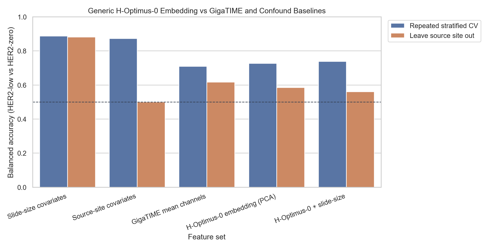
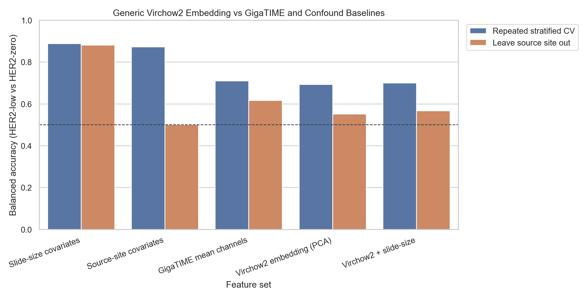

# Strict High-Trust 171-Slide GigaTIME HER2 Result

Status: Current larger strict high-trust TCGA-BRCA HER2 analysis, updated after checking Guardia et al., Genome Research 2025, PMID 40664477, "Alternative splicing generates HER2 isoform diversity underlying antibody-drug conjugate resistance in breast cancer."

## Why This Run Matters

This run uses the cleaned/trustworthy slide list instead of the earlier smaller convenience cohorts.

Input cohort:

- 171 strict high label+slide trust TCGA-BRCA diagnostic H&E slides.
- 53 HER2-positive.
- 57 HER2-low.
- 61 HER2-zero.
- All labels are direct clinical HER2 labels from TCGA IHC/ISH fields.
- Discordant/review cases were excluded from the primary high-trust list.
- Three male TCGA-BRCA cases were excluded from the strict primary analysis because Guardia et al. excluded male samples in the TCGA-BRCA isoform analysis.
- All slide files exist locally, match expected GDC file size, and open with OpenSlide.

GigaTIME run:

- 128 random tissue tiles per slide.
- The raw inference output contains the earlier 174-slide run. The strict analysis filters that output to 171 female-patient slides, giving 21,888 tile predictions for the primary analysis set.
- Apple MPS device.
- Heatmaps disabled for runtime/storage practicality.
- Outputs written incrementally with the new `--resume` option.

Main files:

- `results/gigatime_tcga_brca_clinical_her2_high_trust_tile128/slide_scores.csv`
- `results/gigatime_tcga_brca_clinical_her2_high_trust_tile128/tile_scores.csv`
- `results/gigatime_tcga_brca_clinical_her2_high_trust_tile128/clinical_summary/`
- `results/gigatime_tcga_brca_clinical_her2_high_trust_tile128/gigatime_cleanup/`
- `results/gigatime_tcga_brca_clinical_her2_high_trust_tile128/cleaned_classifier_comparison/`
- `results/gigatime_tcga_brca_clinical_her2_high_trust_tile128/classifier_permutation_sanity/`
- `results/gigatime_tcga_brca_clinical_her2_high_trust_tile128/nested_classifier_model_selection/`
- `results/gigatime_tcga_brca_clinical_her2_high_trust_tile128/clinical_covariate_sensitivity/`
- `results/gigatime_tcga_brca_clinical_her2_high_trust_tile128/matched_low_zero_sensitivity/`

## Main Statistical Result

The strongest and most reproducible finding remains HER2-low versus HER2-zero separation.

In the all-sampled-tissue high-trust run, HER2-low was lower than HER2-zero for multiple virtual immune/myeloid/checkpoint/tissue-context channels:

| Channel | Comparison | HER2-low minus HER2-zero | Mann-Whitney p | BH q |
|---|---|---:|---:|---:|
| CD68 | HER2-low vs HER2-zero | -0.00537 | 0.000371 | 0.00159 |
| CK | HER2-low vs HER2-zero | -0.06377 | 0.000129 | 0.00159 |
| PD-L1 | HER2-low vs HER2-zero | -0.01301 | 0.000302 | 0.00159 |
| PD-1 | HER2-low vs HER2-zero | -0.03948 | 0.000225 | 0.00159 |
| CD11c | HER2-low vs HER2-zero | -0.00325 | 0.000272 | 0.00159 |
| CD4 | HER2-low vs HER2-zero | -0.02379 | 0.000615 | 0.00185 |
| CD3 | HER2-low vs HER2-zero | -0.02433 | 0.000778 | 0.00195 |

Interpretation: in this high-trust TCGA-BRCA cohort, GigaTIME-derived H&E features consistently show HER2-low tumors as having lower virtual immune/myeloid/checkpoint signals than HER2-zero tumors.

## Parameter Robustness

The current high-trust run used 128 random tissue tiles per slide. The earlier expanded run used 256 tiles per slide. A direct overlap check compared the same slide IDs across both runs:

- Reference run: 60-slide expanded tile256 run.
- Comparison run: strict 171-slide high-trust tile128 analysis set.
- Overlap: 56 matched slide IDs.
- HER2-low overlap: 20 of 20 expanded-run HER2-low slides.
- HER2-zero overlap: 20 of 20 expanded-run HER2-zero slides.
- HER2-positive overlap: 16 of 20 expanded-run HER2-positive slides; two review/excluded HER2-positive cases and two male HER2-positive cases were absent from the strict high-trust list.

Key-channel agreement was high. For the channels driving the current interpretation, Spearman correlations between the two runs were approximately 0.97-0.99 on overlapping slides. HER2-low versus HER2-zero direction also matched:

| Result | Count |
|---|---:|
| Key channels tested | 8 |
| Same HER2-low vs HER2-zero direction in both runs | 8 |
| HER2-low lower than HER2-zero in both runs | 7 |

Interpretation: the main HER2-low versus HER2-zero direction is not simply an artifact of using 128 tiles instead of 256 tiles. Absolute scores can shift across random tile samples, but the slide-level ordering and biological direction are stable on overlapping slides.

See:

- `docs/clinical_her2_high_trust_tile128_vs_expanded20_tile256_agreement.md`
- `docs/assets/clinical_her2_high_trust_tile128_vs_expanded20_tile256/`

## Cleanup Result

The HER2-low versus HER2-zero signal persists after tissue/cellularity cleanup:

| Cleanup view | CD68 q | PD-L1 q | CD11c q | Interpretation |
|---|---:|---:|---:|---|
| All sampled tissue | 0.0020 | 0.0020 | 0.0020 | Strongest broad tissue signal |
| QC cellular tissue | 0.0057 | 0.0057 | 0.0057 | Signal survives cellular-tissue filtering |
| CK-enriched top 50% | 0.0150 | 0.0128 | 0.0156 | Signal survives moderate CK enrichment |
| CK-enriched top 25% | 0.0337 | 0.0462 | 0.0708 | Signal weakens under strict CK enrichment |

Interpretation: this argues against the finding being only blank/background artifact. But because the signal weakens in the most CK-enriched tile view, the current result probably reflects broader tissue/microenvironment context rather than a purely epithelial tumor-cell HER2 phenotype.

See:

- `docs/clinical_her2_high_trust_tile128_gigatime_data_cleanup.md`
- `docs/assets/clinical_her2_high_trust_tile128_gigatime_cleanup/`

## Classifier Result

The classifier result is useful but not clinically diagnostic.

Best HER2-low versus HER2-zero held-out performance:

| Cleanup view | Best feature set | Cases | Accuracy | Balanced accuracy | Macro AUC |
|---|---|---:|---:|---:|---:|
| All sampled tissue | Mean + fraction channels | 118 | 0.729 | 0.727 | 0.787 |
| QC cellular tissue | Mean channels | 118 | 0.720 | 0.719 | 0.741 |
| CK-enriched top 50% | Mean channels | 118 | 0.703 | 0.702 | 0.752 |
| CK-enriched top 25% | Mean + fraction channels | 118 | 0.712 | 0.711 | 0.749 |

HER2-positive classification remains weak:

- Best HER2-positive versus HER2-negative balanced accuracy was about 0.589.
- Sensitivity for HER2-positive remained low.
- Three-class HER2 prediction remained close to weak/moderate exploratory performance, with balanced accuracy around 0.50-0.52.

Interpretation: GigaTIME/H&E features currently look most useful for HER2-low versus HER2-zero separation, not for reliable HER2-positive diagnosis.

See:

- `docs/clinical_her2_high_trust_tile128_cleaned_classifier_comparison.md`
- `docs/assets/clinical_her2_high_trust_tile128_cleaned_classifier/`

## Case-Level Driver Check

The case-level driver analysis asks whether the HER2-low versus HER2-zero signal is broad enough to trust or whether it is carried by a few unusual slides.

Method:

- Use only the low-versus-zero virtual channels that are significant within each cleanup view.
- Standardize each selected channel across HER2-low and HER2-zero slides.
- Orient the score so higher values are more HER2-zero-like and lower values are more HER2-low-like.
- Compare the score across all sampled tissue, QC-cellular tissue, CK-enriched top 50%, and CK-enriched top 25% views.

Current result:

| Case-level check | Result |
|---|---:|
| HER2-low/HER2-zero slides scored | 118 |
| Slides matching expected direction in at least 3 of 4 cleanup views | 71 |
| Slides matching expected direction in all 4 cleanup views | 63 |
| Slides with opposite profile in at least 2 cleanup views | 47 |
| Cases misclassified by the best low-vs-zero classifier in at least 2 cleanup views | 37 |

All-sampled-tissue case score:

| Group | N | Mean zero-like score | Median zero-like score |
|---|---:|---:|---:|
| HER2-low | 57 | -0.219 | -0.488 |
| HER2-zero | 61 | 0.205 | 0.123 |

Interpretation: this supports a real case-level HER2-low versus HER2-zero pattern, but the pattern is not clean enough for diagnostic claims. The opposite-profile and classifier-error cases are now a concrete manual pathology/QC review list.

See:

- `docs/clinical_her2_high_trust_tile128_case_driver_analysis.md`
- `docs/assets/clinical_her2_high_trust_tile128_case_drivers/`

## Case-Driver Visual QC

We rendered a small H&E plus virtual mIF visual QC set from the case-driver shortlist:

- 2 stable label-consistent HER2-low cases.
- 2 stable label-consistent HER2-zero cases.
- 4 opposite-profile/manual-review cases.
- 4 selected tiles per case.

The visual QC is not a full cohort validation, but it gives an important failure-mode check.

Selected-tile summary:

| Review category | Group | Tiles | Mean tissue | Mean zero-like tile score | Mean CK | Mean CD68 | Mean PD-L1 | Mean CD11c |
|---|---|---:|---:|---:|---:|---:|---:|---:|
| Label-consistent HER2-low | HER2-low | 8 | 0.987 | -0.605 | 0.0003 | 0.0002 | 0.0006 | 0.0002 |
| Label-consistent HER2-zero | HER2-zero | 8 | 0.955 | 1.675 | 0.0487 | 0.1300 | 0.3153 | 0.1173 |
| Opposite-profile manual review | HER2-low | 8 | 0.923 | 2.800 | 0.0684 | 0.1786 | 0.3879 | 0.1483 |
| Opposite-profile manual review | HER2-zero | 8 | 0.986 | -0.618 | 0.0012 | 0.0003 | 0.0011 | 0.0003 |

Interpretation: this is a serious caveat. The low-like tiles can have high tissue fraction but very low virtual CK, CD68, PD-L1, and CD11c, and visual spot-checking suggests that some are stromal/collagen-rich rather than clearly tumor-rich. The HER2-low versus HER2-zero signal may therefore partly reflect tissue composition unless pathologist review or tumor-rich tile restriction supports it.

See:

- `docs/clinical_her2_high_trust_tile128_case_driver_visual_qc.md`
- `docs/assets/clinical_her2_high_trust_tile128_case_driver_visual_qc/`

## Tissue-Composition Sensitivity

The visual QC caveat was quantified across all HER2-low and HER2-zero slides.

Definition:

- Marker burden = mean virtual `CK`, `CD68`, `PD-L1`, `CD11c`, `CD3`, `CD4`, `CD20`, and `Ki67` per tile.
- Low-marker tile = marker burden in the bottom quartile across strict high-trust tiles.
- Absolute CK-high tile = QC-cellular tile with virtual CK in the top quartile across QC tiles.

Main result:

| Metric | HER2-low mean | HER2-zero mean | Low-zero delta | BH q |
|---|---:|---:|---:|---:|
| Fraction low-marker tiles | 0.349 | 0.180 | 0.169 | 0.000265 |
| Fraction very-low-marker tiles | 0.150 | 0.060 | 0.089 | 0.000265 |
| Mean marker burden | 0.0479 | 0.0669 | -0.0190 | 0.000288 |
| Mean CK | 0.167 | 0.231 | -0.0638 | 0.000288 |
| Fraction high-marker tiles | 0.168 | 0.287 | -0.119 | 0.00139 |
| Fraction high-CK QC tiles | 0.145 | 0.218 | -0.0728 | 0.00192 |

The case-driver score tracks marker/tissue composition strongly. For example, Spearman rho is `0.980` with mean marker burden and `-0.782` with low-marker tile fraction. This is partly expected because the driver score is built from marker channels, but it confirms that the current signal is composition-sensitive.

Most importantly, after adjusting the slide-level channel models for low-marker tile fraction, most HER2-low versus HER2-zero channel effects collapse:

| Channel | Unadjusted beta | Unadjusted BH q | Low-marker adjusted beta | Low-marker adjusted BH q |
|---|---:|---:|---:|---:|
| CD68 | -0.0054 | 0.0392 | 0.0005 | 0.9103 |
| PD-L1 | -0.0130 | 0.0315 | 0.0006 | 0.9103 |
| PD-1 | -0.0395 | 0.0091 | -0.0053 | 0.9103 |
| CD11c | -0.0033 | 0.0408 | -0.0002 | 0.9103 |
| CD4 | -0.0238 | 0.0185 | -0.0031 | 0.9103 |
| CD3 | -0.0243 | 0.0185 | -0.0023 | 0.9103 |
| CK | -0.0638 | 0.000582 | -0.0064 | 0.9103 |

Interpretation: the strongest honest conclusion is now that GigaTIME identifies a HER2-low versus HER2-zero **tissue-context difference**. It is not yet evidence for tumor-cell HER2 biology, HER2 isoform state, or diagnosis. The next necessary step is pathologist-approved/tumor-rich tile restriction.

See:

- `docs/clinical_her2_high_trust_tile128_tissue_composition_sensitivity.md`
- `docs/assets/clinical_her2_high_trust_tile128_tissue_composition/`

## Tumor-Rich Proxy Sensitivity

We tested stricter virtual tumor-rich proxy filters using GigaTIME-derived virtual DAPI, CK, and marker-burden features. These are not pathologist tumor annotations, but they help ask whether the signal disappears when we push toward more epithelial/CK-rich tiles.

Key proxy results:

| Proxy view | Low-zero classifier balanced accuracy | Macro AUC | q<0.05 low-zero channels |
|---|---:|---:|---|
| QC cellular tissue | 0.719 | 0.741 | CD68, PD-L1, PD-1, CD11c, CD4, CD3, CD20, CK |
| CK top 25% within slide | 0.708 | 0.744 | CD68, PD-L1, PD-1, CD4, CD3, CK |
| Top 16 CK tiles per slide | 0.711 | 0.766 | CD68, PD-1, CK |
| Top 8 CK tiles per slide | 0.727 | 0.755 | none |
| Top 16 CK, non-low-marker | 0.708 | 0.761 | none |
| Absolute CK-high QC tiles | 0.761 | 0.782 | PD-1, CD11c, CD4, CD3 |

Interpretation: individual marker-channel effects weaken under the strictest fixed-count CK-rich proxy views, which keeps the tissue-composition caveat alive. However, the multichannel low-versus-zero classifier remains above chance under these proxy filters. This means the signal is still worth pursuing, but the next required validation is real tumor-rich/pathologist-approved tile selection.

See:

- `docs/clinical_her2_high_trust_tile128_tumor_proxy_sensitivity.md`
- `docs/assets/clinical_her2_high_trust_tile128_tumor_proxy_sensitivity/`

## Classifier Permutation Sanity Check

We ran a shuffled-label sanity check for the selected HER2-low versus HER2-zero classifiers. The goal was simple: if HER2 labels are randomly permuted, the classifier should fall back toward chance.

Important caveat: this is a post-hoc sanity check for the selected feature views and feature sets. It is not a fully nested model-selection permutation test and should not be presented as final clinical validation.

| Proxy view | LOOCV balanced accuracy | Repeated-CV balanced accuracy | Null mean | Null 95% | Empirical p | BH q | Repeated-CV AUC |
|---|---:|---:|---:|---:|---:|---:|---:|
| QC cellular tissue | 0.719 | 0.705 | 0.484 | 0.566 | 0.0099 | 0.0099 | 0.744 |
| CK top 25% within slide | 0.708 | 0.693 | 0.485 | 0.557 | 0.0099 | 0.0099 | 0.731 |
| Top 16 CK tiles per slide | 0.711 | 0.705 | 0.485 | 0.561 | 0.0099 | 0.0099 | 0.763 |
| Top 8 CK tiles per slide | 0.727 | 0.716 | 0.488 | 0.586 | 0.0099 | 0.0099 | 0.741 |
| Top 16 CK, non-low-marker | 0.708 | 0.710 | 0.482 | 0.567 | 0.0099 | 0.0099 | 0.767 |
| Absolute CK-high QC tiles | 0.761 | 0.729 | 0.484 | 0.575 | 0.0099 | 0.0099 | 0.764 |

Interpretation: the low-versus-zero classifiers beat the shuffled-label null across all tested views, so the signal is not obviously random. This strengthens the classifier trustworthiness story, but it still does not solve the tissue-composition caveat or prove HER2 isoform biology.

See:

- `docs/clinical_her2_high_trust_tile128_classifier_permutation_sanity.md`
- `docs/assets/clinical_her2_high_trust_tile128_classifier_permutation/`

## Nested Classifier Model-Selection Check

The permutation check above fixed the feature set selected by the earlier analysis. We therefore ran a stricter nested check: each outer training fold chooses the best GigaTIME/H&E feature set using only inner training-fold cross-validation, then evaluates the held-out outer fold.

| Proxy view | Nested balanced accuracy | Nested AUC | Null mean | Null 95% | Empirical p | BH q | Most selected feature set |
|---|---:|---:|---:|---:|---:|---:|---|
| QC cellular tissue | 0.674 | 0.717 | 0.498 | 0.577 | 0.0323 | 0.0323 | Mean channels |
| CK top 25% within slide | 0.672 | 0.706 | 0.500 | 0.578 | 0.0323 | 0.0323 | Mean channels |
| Top 16 CK tiles per slide | 0.706 | 0.731 | 0.506 | 0.566 | 0.0323 | 0.0323 | Mean channels |
| Top 8 CK tiles per slide | 0.721 | 0.739 | 0.514 | 0.565 | 0.0323 | 0.0323 | Mean channels |
| Top 16 CK, non-low-marker | 0.676 | 0.717 | 0.492 | 0.548 | 0.0323 | 0.0323 | Mean channels |
| Absolute CK-high QC tiles | 0.717 | 0.766 | 0.505 | 0.553 | 0.0323 | 0.0323 | Mean channels |

Interpretation: the classifier signal does not disappear when feature-set selection is nested inside cross-validation. This reduces the concern that the low-versus-zero classifier result is only a feature-set selection artifact. It still remains internal validation, not a clinical classifier or proof of HER2 isoform biology.

See:

- `docs/clinical_her2_high_trust_tile128_nested_classifier_model_selection.md`
- `docs/assets/clinical_her2_high_trust_tile128_nested_classifier/`

## Clinical/Site Covariate Sensitivity

This is the strongest cautionary result so far. The strict TCGA HER2-low and HER2-zero slides are not balanced for TCGA source site or slide size.

Key imbalance:

| Covariate | HER2-low mean | HER2-zero mean | Low-zero delta | p |
|---|---:|---:|---:|---:|
| Slide file size MB | 100.486 | 278.961 | -178.475 | 1.45e-15 |
| Slide width | 61509.123 | 102679.066 | -41169.943 | 2.58e-12 |
| Slide height | 23300.702 | 31759.115 | -8458.413 | 6.49e-07 |
| Mean marker burden | 0.056 | 0.076 | -0.019 | 5.79e-04 |
| Mean virtual DAPI | 0.306 | 0.384 | -0.078 | 1.63e-04 |
| Mean virtual CK | 0.191 | 0.245 | -0.054 | 0.0017 |
| Histology group |  |  | imbalanced | 0.0413 |
| TCGA source-site group |  |  | imbalanced | 7.97e-10 |

Most importantly, non-image covariates can classify HER2-low versus HER2-zero better than GigaTIME image features:

| Feature set, top 8 CK proxy view | Balanced accuracy | AUC |
|---|---:|---:|
| Clinical covariates | 0.536 | 0.512 |
| Slide-size covariates | 0.879 | 0.921 |
| Source-site covariates | 0.878 | 0.925 |
| Source-site + slide-size covariates | 0.897 | 0.965 |
| GigaTIME mean channels | 0.745 | 0.751 |
| GigaTIME + clinical + site/slide | 0.890 | 0.952 |

After adjusting QC-cellular channel tests for clinical plus site/slide-size covariates, no key channel remains significant at q < 0.05.

Interpretation: the GigaTIME signal is real inside this dataset, but the current TCGA HER2-low/HER2-zero cohort is strongly confounded by source-site and slide-size effects. This means we should not present the classifier as an independent HER2 biology model. The next check was therefore a matched source-site/slide-size sensitivity analysis, followed by pathologist-reviewed tumor-rich validation.

See:

- `docs/clinical_her2_high_trust_tile128_clinical_covariate_sensitivity.md`
- `docs/assets/clinical_her2_high_trust_tile128_clinical_covariates/`

## Matched HER2-Low Versus HER2-Zero Sensitivity

After the confounder check, we built matched HER2-low/HER2-zero subsets:

| Matched subset | Pairs | Same-source-site pairs | Median abs log-size diff | Median abs MB diff |
|---|---:|---:|---:|---:|
| Exact source-site, nearest size | 12 | 12 | 0.150 | 17.4 |
| Slide-size matched, caliper 0.25 | 14 | 2 | 0.017 | 2.0 |
| Slide-size matched, caliper 0.50 | 20 | 2 | 0.031 | 3.1 |

Top 8 CK proxy view, leave-one-pair-out classifier comparison:

| Matched subset | Slide-size BA | Source-site BA | Site+size BA | GigaTIME BA | GigaTIME AUC |
|---|---:|---:|---:|---:|---:|
| Exact source-site, nearest size | 0.667 | 0.500 | 0.625 | 0.708 | 0.750 |
| Slide-size matched, caliper 0.25 | 0.607 | 0.821 | 0.786 | 0.679 | 0.694 |
| Slide-size matched, caliper 0.50 | 0.650 | 0.750 | 0.850 | 0.675 | 0.623 |

Paired channel tests in the same top 8 CK proxy view did not reach BH q < 0.05. The exact source-site subset's strongest paired channel was `CD20` with q = 0.347; the strict slide-size subset's strongest was `CK` with q = 0.706; the wider slide-size subset's strongest was `CK` with q = 0.138.

Interpretation: matching keeps a modest GigaTIME signal, but it does not remove the confounder concern. In the larger matched subsets, non-image source-site/slide-size baselines remain competitive or stronger than GigaTIME. This is an important negative/disciplining result: the HER2-low/HER2-zero signal is worth validating, but TCGA alone is not enough to claim independent HER2 biology.

See:

- `docs/clinical_her2_high_trust_tile128_matched_low_zero_sensitivity.md`
- `docs/assets/clinical_her2_high_trust_tile128_matched_low_zero/`

## Source-Site Held-Out Generalization

We then asked whether the low-versus-zero classifier generalizes when entire TCGA source sites are held out.

The source-site imbalance is severe. The largest low/zero sites are:

| TSS | HER2-low | HER2-zero | Cases | Both classes |
|---|---:|---:|---:|---|
| AO | 2 | 17 | 19 | yes |
| A2 | 7 | 12 | 19 | yes |
| BH | 0 | 12 | 12 | no |
| A8 | 2 | 8 | 10 | yes |
| A7 | 10 | 0 | 10 | no |
| AN | 0 | 9 | 9 | no |

Top 8 CK proxy view:

| Feature set | Repeated CV BA | Leave-source-site-out BA | Leave-source-site-out AUC |
|---|---:|---:|---:|
| Slide-size covariates | 0.879 | 0.882 | 0.915 |
| Tissue/QC covariates | 0.581 | 0.507 | 0.478 |
| GigaTIME mean channels | 0.745 | 0.669 | 0.679 |
| GigaTIME + slide-size | 0.857 | 0.837 | 0.894 |
| GigaTIME + tissue/QC | 0.734 | 0.668 | 0.683 |

GigaTIME mean-channel performance drops under source-site holdout across every tested feature view. For example, in the top 16 CK tiles per slide view it drops from 0.755 to 0.601 balanced accuracy; in the top 8 CK proxy view it drops from 0.745 to 0.669.

Interpretation: this is a major classifier caveat. GigaTIME retains some above-chance signal, but slide-size covariates remain very strong even when entire source sites are held out. The current TCGA classifier is therefore not source-independent HER2 biology. It remains a hypothesis-generating tissue-context signal that needs external/site-balanced validation.

See:

- `docs/clinical_her2_high_trust_tile128_source_site_generalization.md`
- `docs/assets/clinical_her2_high_trust_tile128_source_site_generalization/`

## Within-Source-Site Low/Zero Sensitivity

Because source-site confounding is so strong, we also restricted the analysis to source sites that contain both HER2-low and HER2-zero cases.

Only four TCGA source sites qualify:

| TSS | HER2-low | HER2-zero | Cases |
|---|---:|---:|---:|
| A2 | 7 | 12 | 19 |
| AO | 2 | 17 | 19 |
| A8 | 2 | 8 | 10 |
| A1 | 1 | 2 | 3 |

This mixed-site subset has only 51 cases: 12 HER2-low and 39 HER2-zero. Site-fixed channel models retain 7 channel/view effects with BH q < 0.05, mostly in QC-cellular, CK-top-25%, and absolute CK-high views. In the top 8 CK proxy view, GigaTIME all mean channels reach balanced accuracy 0.667 under repeated stratified CV and 0.628 under leave-mixed-source-site-out validation. Key-marker-only GigaTIME is weaker, around 0.505 repeated-CV and 0.490 leave-site-out balanced accuracy.

Interpretation: this partially supports continued investigation because some all-channel signal remains inside mixed source sites. But the qualifying subset is tiny, HER2-low is underrepresented, and specificity is low. This does not solve the TCGA confounding problem.

See:

- `docs/clinical_her2_high_trust_tile128_within_source_site_low_zero.md`
- `results/gigatime_tcga_brca_clinical_her2_high_trust_tile128/within_source_site_low_zero/`

## ER/PR and HER2-Subgroup Sensitivity

The main all-sampled-tissue HER2-low versus HER2-zero signal mostly survives ER/PR adjustment:

| Cleanup view | Unadjusted q<0.05 channels | ER/PR adjusted q<0.05 channels | ER/PR+ERBB2 adjusted q<0.05 channels |
|---|---:|---:|---:|
| All sampled tissue | 8 | 7 | 4 |
| QC cellular tissue | 7 | 4 | 3 |
| CK-enriched top 50% | 7 | 4 | 3 |
| CK-enriched top 25% | 7 | 1 | 2 |

In the all-sampled-tissue view, `CK`, `PD-1`, `CD4`, `CD3`, `PD-L1`, `CD68`, and `CD11c` remain significant after ER/PR adjustment. `Ki67` does not.

The signal also remains visible across the main HER2-low and HER2-zero detail subgroups:

- HER2-low IHC `1+` cases are lower than HER2-zero overall.
- HER2-low IHC `2+`/ISH-negative cases are also lower than HER2-zero overall.
- HER2-low overall is lower than both HER2-zero IHC `0`/ISH-negative and HER2-zero IHC `0`/ISH-not-evaluated subgroups.

Interpretation: the high-trust result is less likely to be an obvious ER/PR imbalance artifact or a single HER2-detail subgroup artifact. The strict CK-enriched view still weakens, so the best interpretation remains broader tissue-context association rather than a purely epithelial HER2 phenotype.

See:

- `docs/clinical_her2_high_trust_tile128_erpr_subgroup_sensitivity.md`
- `docs/assets/clinical_her2_high_trust_tile128_erpr_subgroup_sensitivity/`

## Local ERBB2 Gene-Level Validation

We extracted ERBB2 gene-level TPM from all local GDC STAR augmented gene-count files. This gives ERBB2 RNA context for 110 TCGA-BRCA cases, including 56 strict high-trust GigaTIME/HER2 cases and 40 HER2-low/HER2-zero high-trust cases.

| Clinical HER2 group | N with local ERBB2 | Median ERBB2 TPM | Q25 | Q75 |
|---|---:|---:|---:|---:|
| HER2-positive | 16 | 778.7 | 182.7 | 1519.5 |
| HER2-low | 20 | 83.4 | 53.2 | 156.9 |
| HER2-zero | 20 | 62.7 | 41.8 | 119.4 |

ERBB2 RNA strongly validates broad HER2-positive status as a molecular sanity check: ERBB2-only AUC is 0.905 for HER2-positive versus non-positive. However, ERBB2 RNA weakly separates HER2-low from HER2-zero: AUC 0.605, best-threshold balanced accuracy 0.625, and pairwise p/q 0.262/0.262.

Interpretation: the GigaTIME HER2-low versus HER2-zero signal is not simply a strong gene-level ERBB2 expression separation. But this still does not validate HER2 isoforms; local STAR files are gene-level, not transcript-level.

See:

- `docs/clinical_her2_high_trust_tile128_local_erbb2_validation.md`
- `results/gigatime_tcga_brca_clinical_her2_high_trust_tile128/local_erbb2_expression_validation/`

## HER2 Isoform Feasibility

After correcting the advisor paper to Guardia et al., Genome Research 2025, PMID 40664477, we audited whether the current local RNA files can directly validate HER2 isoform biology.

Result:

- Local RNA data are GDC STAR augmented gene-count TSVs.
- They include gene-level counts/TPM and can support ERBB2 expression or RNA-program context.
- They do not include transcript-level isoform quantification, BAM/FASTQ reads, or junction-count outputs.
- There are 110 local STAR gene-count cases, 56 strict high-trust cases with local STAR counts, and 40 HER2-low/HER2-zero high-trust cases with local STAR counts.
- There are 0 local BAM, FASTQ, junction, isoform, or transcript-level files under `data/tcga_brca`.

Interpretation: the current project cannot directly test Guardia-style HER2 isoform states yet. To do that, we need sample-level HER2 isoform labels from the Guardia/Galante workflow or appropriate RNA-seq read/junction data. Until then, the safe wording is that GigaTIME features may associate with HER2 state hypotheses, not that GigaTIME detects HER2 isoforms.

See:

- `docs/her2_isoform_validation_feasibility.md`
- `results/gigatime_tcga_brca_clinical_her2_high_trust_tile128/her2_isoform_validation_feasibility/`

## Generic H&E Embedding Control

This control asks whether the GigaTIME virtual-immune framing is required to reproduce the HER2-low versus HER2-zero separation, or whether generic H&E foundation-model embeddings do the same thing. We ran the control with two independent foundation models, `bioptimus/H-optimus-0` (1536-d) and `paige-ai/Virchow2` (2560-d), each mean-pooled over 128 random tissue tiles per slide across the same 171 high-trust slides, then classified HER2-low versus HER2-zero on identical cross-validation folds with PCA fit inside each training fold to avoid leakage.

| Feature set | Repeated-CV balanced accuracy | Leave-source-site-out balanced accuracy |
|---|---:|---:|
| Slide-size covariates | 0.888 | 0.882 |
| Source-site covariates | 0.873 | 0.500 |
| GigaTIME mean channels | 0.710 | 0.617 |
| H-Optimus-0 embedding | 0.726 | 0.586 |
| Virchow2 embedding | 0.693 | 0.551 |

Both generic embeddings separate HER2-low from HER2-zero about as well as GigaTIME (H-Optimus-0 0.726, Virchow2 0.693, GigaTIME 0.710), and both beat their own shuffled-label nulls (empirical p 0.005), stable across 10/20/30 PCA components. Both then collapse under leave-source-site-out validation the same way GigaTIME does (H-Optimus-0 0.726 to 0.586, Virchow2 0.693 to 0.551), while slide-size covariates remain portable at 0.882. The source-site covariate's 0.500 under holdout is the expected degenerate case, because one-hot site identity cannot predict an unseen held-out site; slide size is the portable confound.

Interpretation: two independent generic morphology embeddings, with no immune-channel meaning, each reproduce both the low-versus-zero signal and the same source-site collapse. The GigaTIME-specific virtual immune/myeloid/checkpoint framing is therefore not required to explain the separation. The most parsimonious reading is generic tissue/morphology that tracks TCGA acquisition structure. This is an internal TCGA control rather than external validation, but the replication across two foundation models removes the need to invoke virtual-immune biology and reinforces the confounded tissue-context interpretation.

See:

- `docs/clinical_her2_high_trust_tile128_hoptimus_embedding_control.md`
- `docs/clinical_her2_high_trust_tile128_virchow2_embedding_control.md`
- `docs/assets/clinical_her2_high_trust_tile128_hoptimus_embedding_control/`
- `docs/assets/clinical_her2_high_trust_tile128_virchow2_embedding_control/`

## What We Can Present

Strongest presentable claim:

> In a strict high-trust female TCGA-BRCA diagnostic H&E cohort, using HER2 isoform/state biology from Guardia et al. as the motivating context, GigaTIME-derived virtual mIF features reproducibly separate HER2-low from HER2-zero cases, especially through lower virtual immune/myeloid/checkpoint and CK-associated signals in HER2-low tumors. Local gene-level ERBB2 RNA validates broad HER2-positive status but weakly separates HER2-low from HER2-zero, suggesting the image signal is not just a strong ERBB2 expression split. However, clinical/site covariate, matched-subset, source-site held-out, and within-source-site sensitivity checks show that source-site and slide-size effects remain major confounders, so the current classifier result should be treated as hypothesis-generating internal evidence, not an independent HER2 biology or diagnostic model.

What not to claim:

- Do not claim that GigaTIME diagnoses HER2 status.
- Do not claim that GigaTIME detects HER2 isoforms.
- Do not claim that virtual mIF channels are real measured mIF.
- Do not claim clinical readiness.

## Best Next Analyses

1. Ask a pathologist/advisor to review the case-driver visual QC panels, especially whether low-like tiles are tumor-rich or mostly stromal/collagen-rich.
2. Rerun the key HER2-low versus HER2-zero statistics using tumor-rich/pathologist-approved tile subsets if feasible.
3. Add tumor purity, histologic type, grade, and batch/stain proxies if available.
4. Search for external H&E plus real HER2 IHC/ISH/mIF validation data.
5. If isoform data are available, test whether GigaTIME features associate with ERBB2 isoform groups rather than only clinical HER2 labels.
