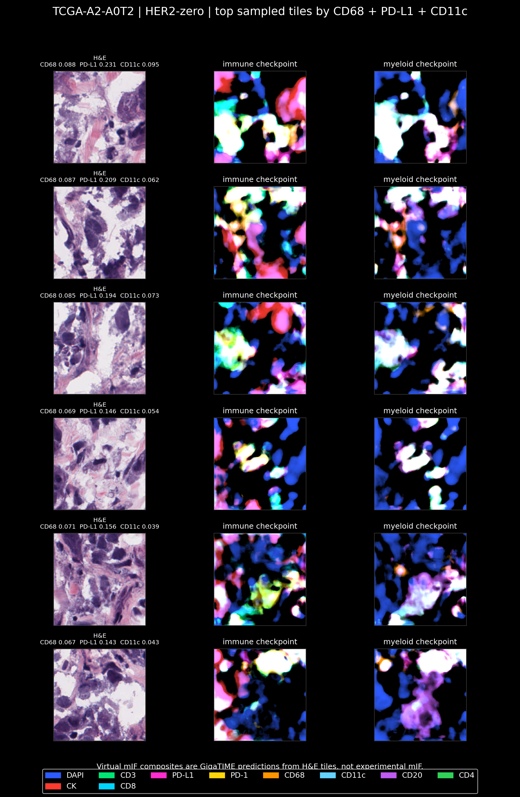
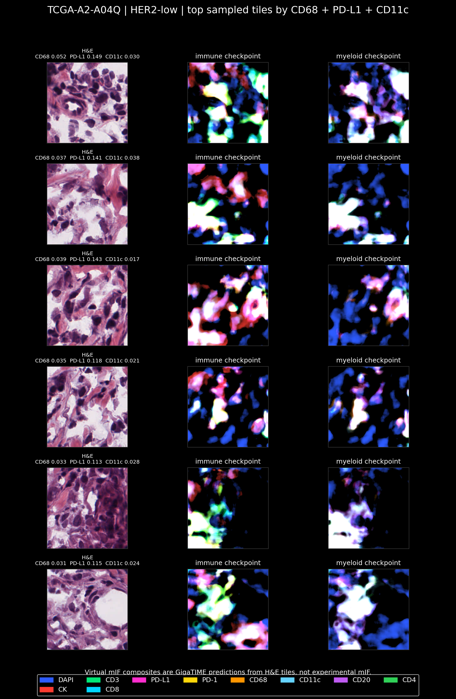
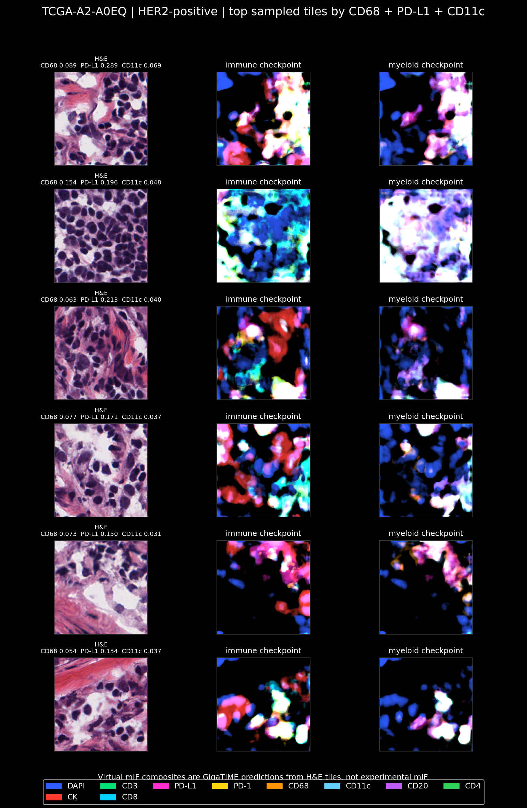
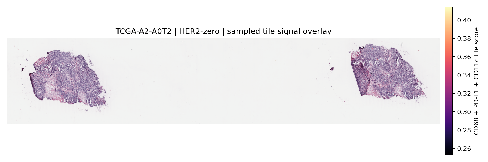

# Clinical HER2 Visual QC

This document records the first visual/spatial QC pass for the 30-slide clinical HER2 GigaTIME pilot.

## Why This Was Done

The clinical HER2 pilot suggested that HER2-zero slides had higher GigaTIME-predicted `CD68`, `PD-L1`, and `CD11c` signal than HER2-low slides. The RNA-seq validation check did not strongly confirm that virtual immune-channel pattern.

The next question was therefore visual:

> Are the high virtual `CD68`, `PD-L1`, and `CD11c` predictions coming from plausible tissue-containing regions, or are they mostly coming from blank areas, folds, debris, necrosis, or obvious artifacts?

This QC step does not validate the predictions as true mIF. It checks whether the model signal is visually plausible enough to justify deeper follow-up.

## Command

```bash
conda run -n gigatime-tcga python scripts/render_clinical_her2_visual_qc.py
```

Inputs:

- `results/gigatime_tcga_brca_clinical_her2/clinical_summary/joined_slide_clinical_her2_gigatime.csv`
- `results/gigatime_tcga_brca_clinical_her2/tile_scores.csv`
- Selected local `.svs` slides under `data/tcga_brca/slides/`

Tracked outputs:

- `docs/assets/clinical_her2_visual_qc/clinical_her2_visual_qc_selected_cases.csv`
- `docs/assets/clinical_her2_visual_qc/clinical_her2_visual_qc_manifest.csv`
- H&E-versus-virtual-mIF QC panels for selected cases.
- Whole-slide sampled-tile overlays for selected cases.

## Case Selection

For each clinical HER2 group, the script selected the case with the highest slide-level combined signal:

```text
mean_CD68 + mean_PD-L1 + mean_CD11c
```

| Clinical HER2 group | Selected case | Combined signal | mean CD68 | mean PD-L1 | mean CD11c |
|---|---|---:|---:|---:|---:|
| HER2-positive | TCGA-A2-A0EQ | 0.115 | 0.029 | 0.072 | 0.014 |
| HER2-low | TCGA-A2-A04Q | 0.086 | 0.018 | 0.058 | 0.010 |
| HER2-zero | TCGA-A2-A0T2 | 0.126 | 0.037 | 0.069 | 0.021 |

For each selected case, the script then chose the top six sampled tiles by the same combined tile-level signal.

## Visual QC Panels

Each QC panel shows:

- Left: original H&E tile.
- Middle: immune-checkpoint virtual mIF composite.
- Right: myeloid/checkpoint virtual mIF composite.

The composites are GigaTIME predictions from H&E tiles, not experimental mIF.

### HER2-Zero Selected Case



The HER2-zero selected case shows top tiles that contain real tissue and dense cellular regions rather than blank background. The high virtual signals are visually located on cellular H&E regions, which supports continuing QC. This does not prove the signals are true immune-marker expression.

### HER2-Low Selected Case



The HER2-low selected case also shows tissue-containing high-signal tiles, but the combined slide-level signal is lower than the selected HER2-zero and HER2-positive cases.

### HER2-Positive Selected Case



The HER2-positive selected case also contains visually plausible high-signal tiles. This is important: the high virtual immune/checkpoint pattern is not unique to HER2-zero at the tile level. The current HER2-zero versus HER2-low finding is a slide-level group trend, not a clean single-case visual separation.

## Whole-Slide Spatial Context

The sampled-tile overlays show where the selected sampled tiles are located in the whole-slide image.



These overlays are useful for spatial context, but the rectangles can be very small at whole-slide scale. The H&E-versus-virtual-mIF QC panels above are better for detailed inspection.

## Visual QC Interpretation

What this QC pass supports:

- The highest virtual `CD68`/`PD-L1`/`CD11c` tiles are not obviously blank background.
- The selected tiles contain cellular H&E tissue that could plausibly drive model predictions.
- The HER2-zero selected case has the highest combined slide-level `CD68` + `PD-L1` + `CD11c` signal among the selected top cases.

What this QC pass does not prove:

- It does not prove that the virtual `CD68`, `PD-L1`, or `CD11c` predictions are biologically correct.
- It does not replace real mIF validation.
- It does not establish a clean HER2-zero versus HER2-low visual phenotype.
- It does not rule out subtle artifacts, tumor/stroma sampling differences, necrosis, inflammation unrelated to HER2, or slide-level batch effects.

## 256-Tile Visual QC Update

After rerunning the same 30 slides with up to 256 random tissue tiles per slide, the visual QC step was repeated using:

```bash
conda run -n gigatime-tcga python scripts/render_clinical_her2_visual_qc.py \
  --joined results/gigatime_tcga_brca_clinical_her2_tile256/clinical_summary/joined_slide_clinical_her2_gigatime.csv \
  --tile-scores results/gigatime_tcga_brca_clinical_her2_tile256/tile_scores.csv \
  --out-dir docs/assets/clinical_her2_visual_qc_tile256
```

The selected representative cases were the same as in the 64-tile QC pass:

| Clinical HER2 group | Selected case | Combined signal | mean CD68 | mean PD-L1 | mean CD11c |
|---|---|---:|---:|---:|---:|
| HER2-positive | TCGA-A2-A0EQ | 0.110 | 0.028 | 0.069 | 0.013 |
| HER2-low | TCGA-A2-A04Q | 0.080 | 0.017 | 0.054 | 0.009 |
| HER2-zero | TCGA-A2-A0T2 | 0.140 | 0.041 | 0.077 | 0.022 |


The HER2-zero representative had the highest combined slide-level `CD68` + `PD-L1` + `CD11c` signal after denser sampling. The top tiles still contain tissue and dense cellular regions rather than obvious blank background. This supports continued review but still does not prove true immune-marker expression.

## Proposal Language

A careful way to describe this step:

> We performed a first visual QC pass on cases driving high virtual CD68/PD-L1/CD11c signal. The high-scoring tiles contained tissue and dense cellular regions rather than obvious blank background, supporting continued investigation. However, because RNA-seq marker-signature validation was weak and the visual review is not equivalent to real mIF, the finding remains hypothesis-generating.

## Next Step

The denser 256-tile sampling step, broader RNA-program validation, and first held-out classifier baseline are now complete. The next methodological improvement should be validation plus better classifier inputs:

- Ask an advisor/pathologist to review whether the high-signal H&E regions are plausible.
- Restrict the next classifier to tumor-rich tiles rather than all sampled tissue tiles.
- Add tile distribution features and, if available, GigaTIME/pathology embeddings.
- Compare the predictions with tumor purity estimates and immune deconvolution outputs.
- Review whether endothelial/stromal/tissue-composition differences may explain part of the virtual signal, based on the broader RNA program validation.
- Look for an external dataset with paired H&E and real mIF for direct validation.

See `docs/clinical_her2_classifier_baseline.md` for the first classifier baseline.
