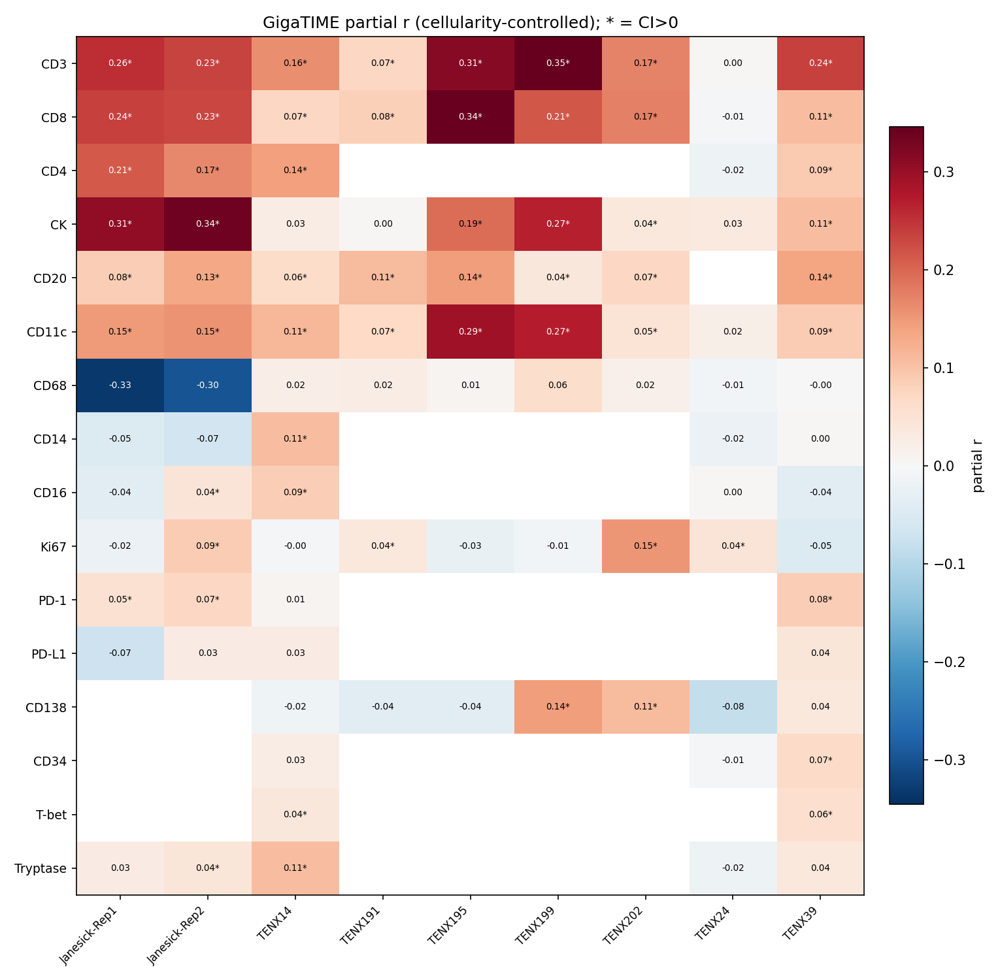
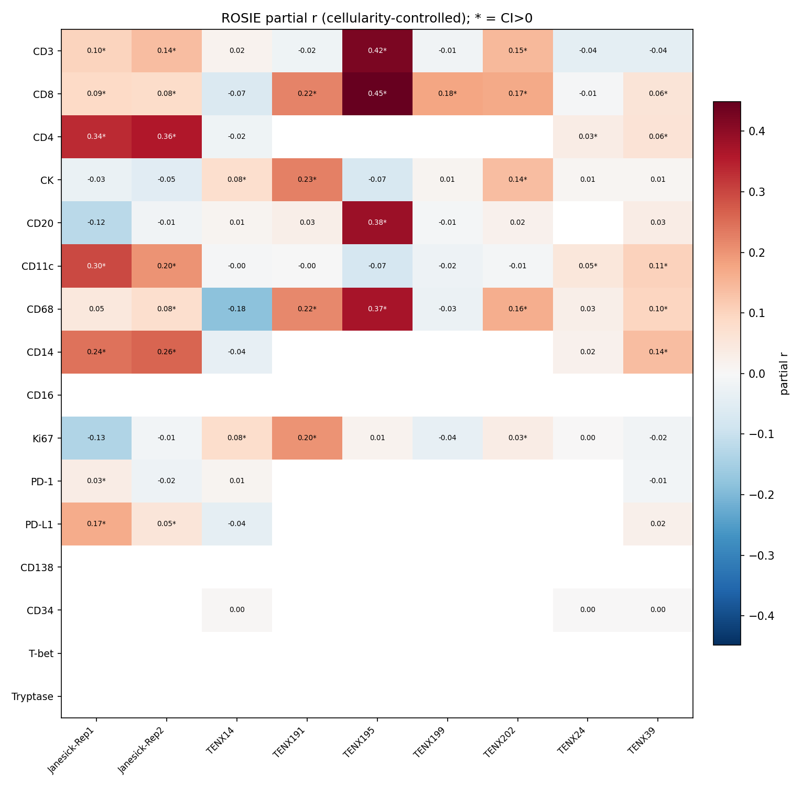

# Field-Level Two-Model Comparison: GigaTIME vs ROSIE (RNA specificity)

Status: head-to-head of two independent H&E->virtual-mIF models on 9 matched HEST-1k breast sections, run through the identical within-slide RNA-specificity audit. Tests whether the limited marker specificity is a property of GigaTIME or of the whole H&E->virtual-mIF approach.

**Matched cohort (9 sections, both models, same pipeline):** Janesick-Rep1, Janesick-Rep2, TENX14, TENX191, TENX195, TENX199, TENX202, TENX24, TENX39.
GigaTIME also has a 2-section Janesick reference not included here (it predates the HEST pipeline); the field-level claim rests on these matched samples.

The statistic is the cellularity-controlled partial correlation between each virtual channel and its own-gene RNA, per sample (positive with 95% CI>0 = channel-specific signal beyond tissue density).

## Per-channel verdict, both models (over the matched samples)

| Channel | GigaTIME verdict | GigaTIME mean / n+ | ROSIE verdict | ROSIE mean / n+ | agree? |
|---|---|---:|---|---:|:--:|
| CD3 | consistent | 0.20 / 8/9 | variable | 0.08 / 4/9 | **no** |
| CD8 | consistent | 0.16 / 8/9 | consistent | 0.13 / 7/9 | yes |
| CD4 | consistent | 0.12 / 4/5 | consistent | 0.15 / 4/5 | yes |
| CK | variable | 0.15 / 6/9 | variable | 0.04 / 3/9 | yes |
| CD20 | variable | 0.10 / 8/8 | variable | 0.04 / 1/8 | yes |
| CD11c | consistent | 0.13 / 8/9 | variable | 0.06 / 4/9 | **no** |
| CD68 | never | -0.06 / 0/9 | variable | 0.09 / 5/9 | **no** |
| CD14 | never | -0.01 / 1/5 | variable | 0.13 / 3/5 | **no** |
| CD16 | never | 0.01 / 2/5 | untested | n/a (not in ROSIE panel) | — |
| Ki67 | variable | 0.02 / 4/9 | never | 0.01 / 3/9 | **no** |
| PD-1 | variable | 0.05 / 3/4 | never | 0.00 / 1/4 | **no** |
| PD-L1 | never | 0.01 / 0/4 | variable | 0.05 / 2/4 | **no** |
| CD138 | never | 0.02 / 2/7 | untested | n/a (not in ROSIE panel) | — |
| CD34 | variable | 0.03 / 1/3 | never | 0.00 / 0/3 | **no** |
| T-bet | variable | 0.05 / 2/2 | untested | n/a (not in ROSIE panel) | — |
| Tryptase | variable | 0.04 / 2/5 | untested | n/a (not in ROSIE panel) | — |

## Heatmaps (partial r per channel x sample)

## Concordance between the two models

- Over 83 channel x sample measurements tested by both models, the per-measurement partial-r correlation between GigaTIME and ROSIE is **Pearson r = 0.12** — the two models do not agree on where/which channels carry specific signal.
- Binary 'channel-specific' calls (CI>0): both models agree-positive 22, agree-negative 17, **disagree 44** of 83.

## Field-level conclusion

Both models show only weak, tissue-variable marker specificity, and crucially they **disagree on which channels are trustworthy**. GigaTIME's specific channels (consistent: CD3, CD8, CD4, CD11c; variable: CK, CD20, Ki67, PD-1, CD34, T-bet, Tryptase; never: CD68, CD14, CD16, PD-L1, CD138) differ from ROSIE's (consistent: CD8, CD4; variable: CD3, CK, CD20, CD11c, CD68, CD14, PD-L1; never: Ki67, PD-1, CD34). The clearest divergences: CD3 and CD11c are consistently specific for GigaTIME but not for ROSIE, while CD68 (macrophage) is never specific for GigaTIME yet variable (sometimes strongly positive) for ROSIE, which instead recovers CD14/CD11c (myeloid). The T-cell channels (CD8, and CD4 where measured) are the only ones both models reliably recover; every other channel is model-dependent. 

This upgrades the single-model finding to a field-level claim: limited, tissue-dependent marker specificity is a property of the H&E->virtual-mIF approach, not of one model — and because two independent models give different per-channel answers on the same tissue, no single model's virtual channels can be trusted as quantitative cell-type readouts. They remain useful only as interpretive context. (Both models are also applied out-of-domain to breast: GigaTIME trained on lung, ROSIE on colorectal — a fair, like-for-like cross-organ comparison.)

Generated by `scripts/compare_gigatime_rosie.py`.