# HEST-1k Breast RNA-Validation Results — TENX14 (ROSIE)

Status: within-slide validation of ROSIE virtual channels against HEST-1k spatial RNA (Visium). Same audited pipeline as the GigaTIME run, applied to a second H&E->virtual-mIF model for a field-level specificity claim.

- Sample: `TENX14` (Visium, HEST-1k); nan; `nan`. Dataset: Human Breast Cancer (Block A Section 2).
- Clinical (from HEST metadata): IDC; AJCC/UICC Stage Group IIA, ER positive, PR negative, Her2 positive.

## Method

- H&E full resolution: 24240 x 24240 px (0.3663 um/px); 3737 tiles used at 256 px (stride 256).
- Visium: 4,015 spots (73,976,393 total UMI), binned onto the tile grid via `pxl_col/row_in_fullres`. Analysis restricted to the **3737** tiles containing >=1 spot (spots are ~100 um apart, sparser than 256 px tiles).
- Channels with a panel gene (16/16): CD3, CD8, CD4, CD20, CD68, CD14, CD11c, CD16, PD-1, PD-L1, CK, Ki67, CD138, CD34, T-bet, Tryptase. Not in this panel: none.
- Statistics are computed by the same audited core as the Xenium Rep1/Rep2 run (`scripts/validate_gigatime_xenium_rna.py`, imported unchanged): within-slide Spearman, channel x gene-set specificity matrix, cellularity-controlled partial correlation, spatial block-bootstrap 95% CIs.

## Alignment Sanity (model-free)

Spearman(tile tissue fraction, total transcript density) = **0.450** (p=4.3e-186, 95% CI [0.381, 0.510]). A strongly positive value confirms the transcript-to-H&E mapping before interpreting channels.

## Channel Correlations (virtual channel vs RNA)

| Channel | Gene(s) | Spearman r | 95% CI | p | Counts on grid |
|---|---|---:|---|---:|---:|
| CK | KRT8, KRT18, KRT19, KRT7, EPCAM | 0.276 | [0.204, 0.344] | 3.0e-66 | 1,119,347 |
| Ki67 | MKI67 | 0.091 | [0.045, 0.136] | 2.5e-08 | 2,561 |
| CD68 | CD68 | 0.078 | [0.020, 0.134] | 1.7e-06 | 6,456 |
| CD3 | CD3D, CD3E, CD3G | 0.055 | [0.009, 0.100] | 7.9e-04 | 3,788 |
| CD4 | CD4 | 0.036 | [-0.004, 0.077] | 2.7e-02 | 2,378 |
| PD-1 | PDCD1 | 0.027 | [-0.004, 0.061] | 9.8e-02 | 348 |
| CD20 | MS4A1 | -0.004 | [-0.049, 0.044] | 8.2e-01 | 722 |
| CD14 | CD14 | -0.008 | [-0.067, 0.051] | 6.3e-01 | 5,959 |
| CD34 | CD34 | -0.043 | [-0.076, -0.006] | 8.8e-03 | 1,344 |
| CD11c | ITGAX | -0.044 | [-0.096, 0.011] | 6.7e-03 | 1,776 |
| CD8 | CD8A, CD8B | -0.085 | [-0.134, -0.033] | 1.9e-07 | 1,341 |
| PD-L1 | CD274 | -0.101 | [-0.136, -0.067] | 5.5e-10 | 417 |

### Scatter plots

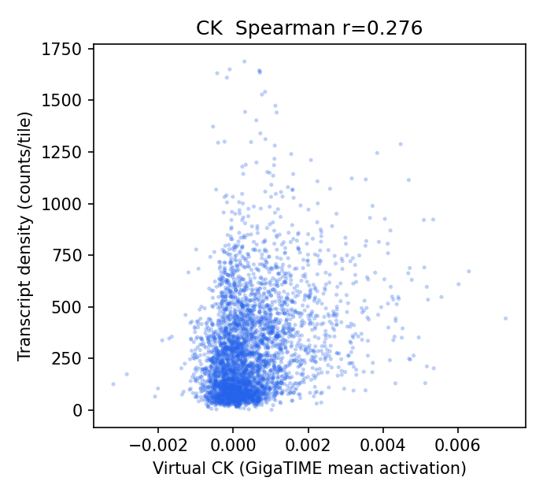
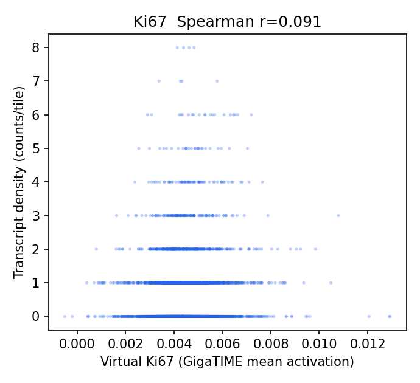
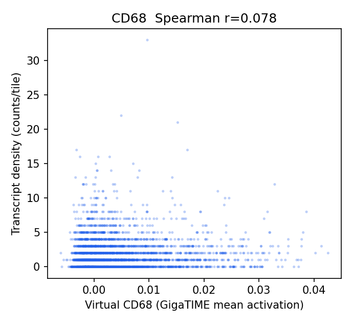
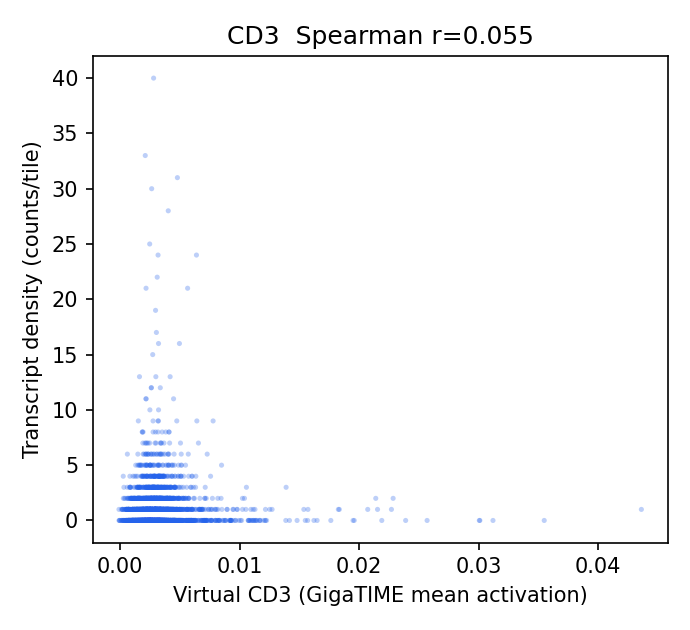
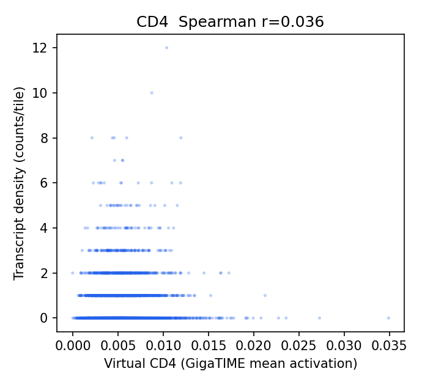
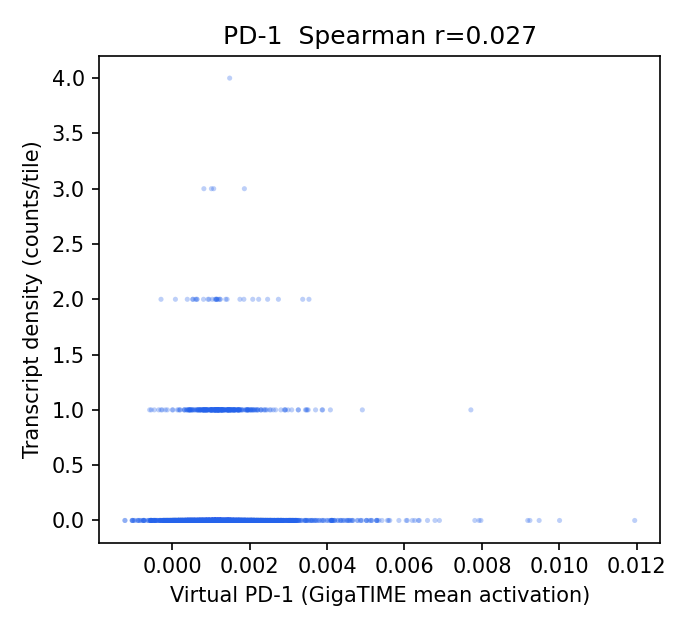
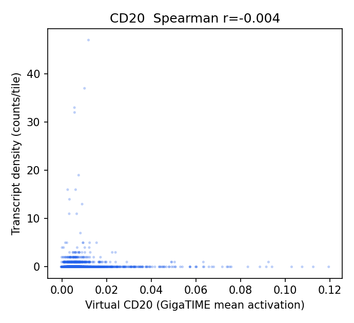
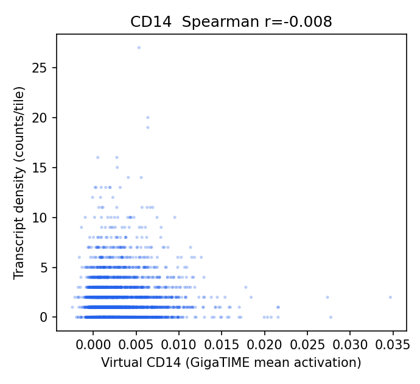
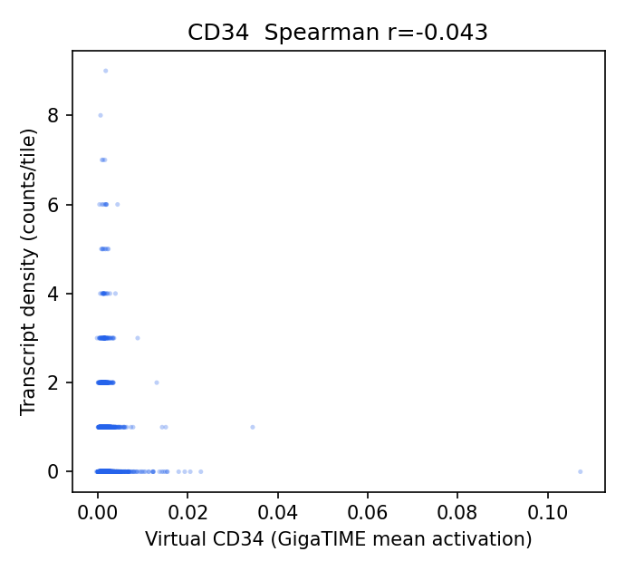
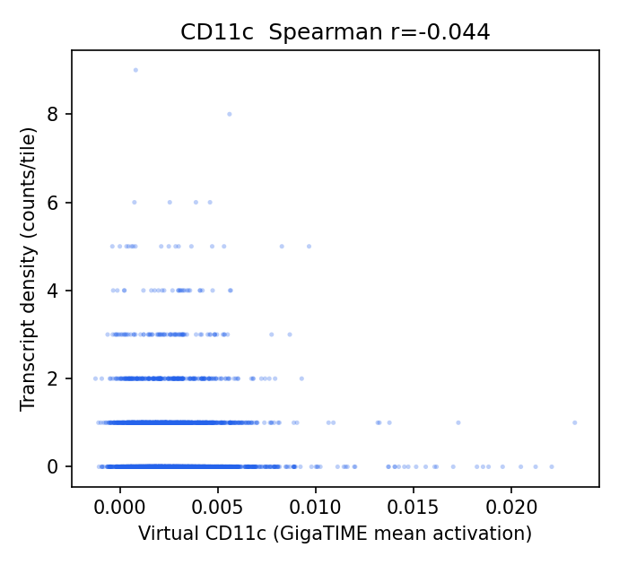
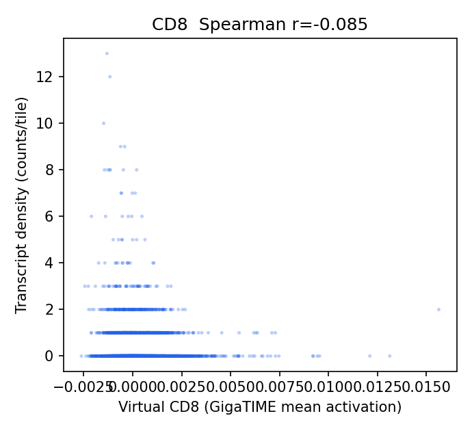
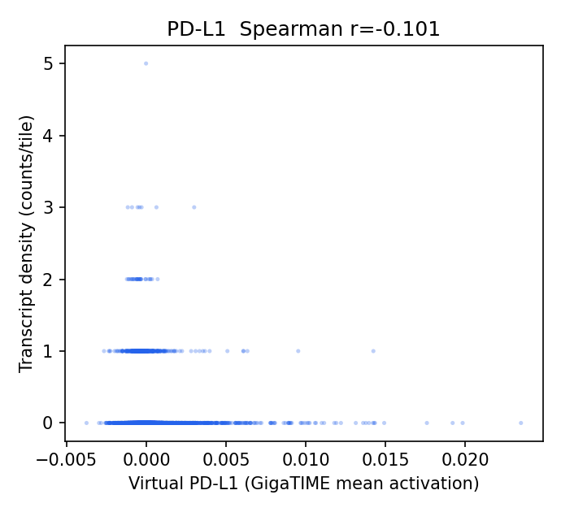

## Channel Specificity (is the signal channel-specific, not just cellularity?)

(1) Row-max: own-gene is the most-correlated gene-set for **3/12** channels. (2) Partial correlation controlling for total per-tile transcript density stays positive (95% CI > 0) for **2/12** channels.

| Channel | Own-gene r | Partial r (control total tx) | Partial 95% CI | Own-gene row-max? | Closest other channel |
|---|---:|---:|---|:--:|---|
| Ki67 | 0.091 | 0.079 | [0.043, 0.117] | yes | CK (0.055) |
| CK | 0.276 | 0.076 | [0.010, 0.141] | yes | Ki67 (0.154) |
| CD3 | 0.055 | 0.017 | [-0.024, 0.059] | no | CK (0.133) |
| PD-1 | 0.027 | 0.011 | [-0.020, 0.046] | no | CK (0.107) |
| CD20 | -0.004 | 0.011 | [-0.036, 0.059] | no | PD-L1 (0.012) |
| CD34 | -0.043 | 0.005 | [-0.029, 0.041] | yes | CD20 (-0.044) |
| CD11c | -0.044 | -0.005 | [-0.051, 0.039] | no | CD20 (0.055) |
| CD4 | 0.036 | -0.018 | [-0.060, 0.026] | no | CK (0.188) |
| CD14 | -0.008 | -0.036 | [-0.086, 0.014] | no | Ki67 (0.159) |
| PD-L1 | -0.101 | -0.041 | [-0.074, -0.008] | no | CD20 (0.018) |
| CD8 | -0.085 | -0.066 | [-0.113, -0.019] | no | Ki67 (0.002) |
| CD68 | 0.078 | -0.183 | [-0.229, -0.131] | no | CK (0.517) |

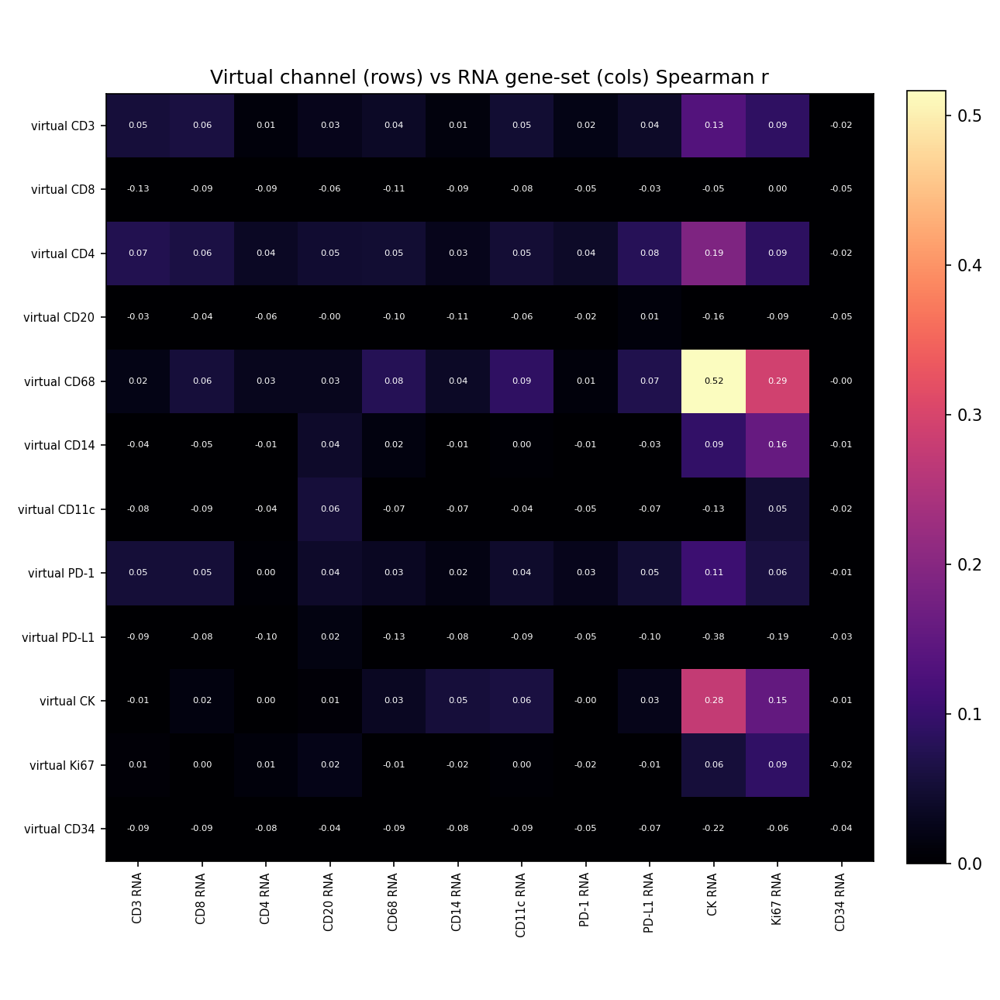

## Interpretation

- Own-gene is the most-correlated gene-set for **3/12** channels; after partialling out total per-tile transcript density (cellularity), channel-specific signal stays positive (95% CI > 0) for **2/12** channels: Ki67 0.08, CK 0.08.
- Channels going negative after the cellularity control (track epithelium/cellularity, not their marker): CD8 -0.07, CD68 -0.18.
- Headline-channel check (CK epithelium; T-cell; CD68 macrophage): CK partial r = 0.08 (specific/positive); T-cell CD3 0.02, CD8 -0.07, CD4 -0.02; CD68 = -0.18 (negative).

## Output Files

- `results/rosie_hest_rna_validation/TENX14/hest_rna_validation_report.json`
- `docs/assets/rosie_hest_rna_validation_TENX14/`
