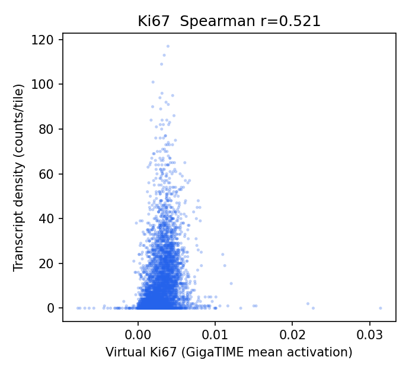
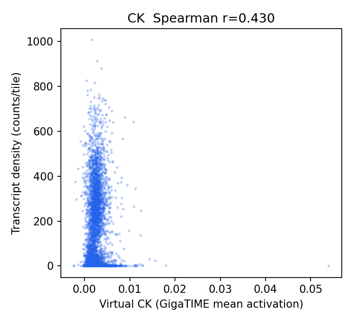
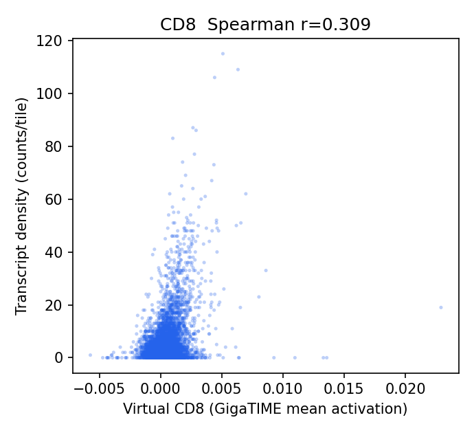
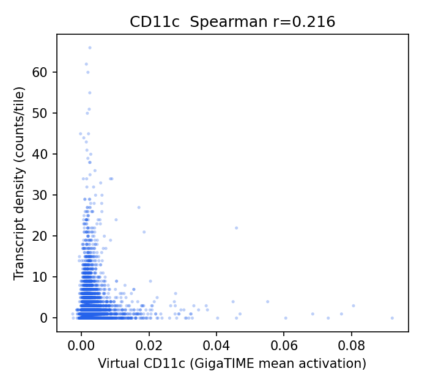
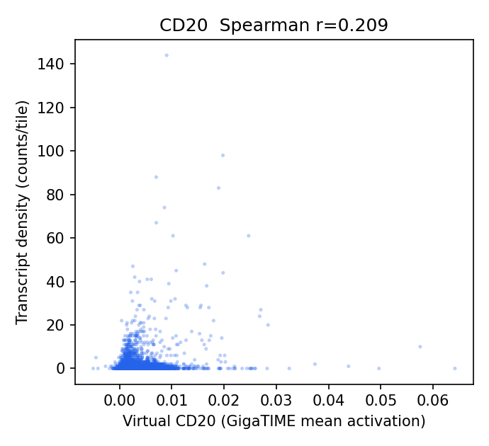
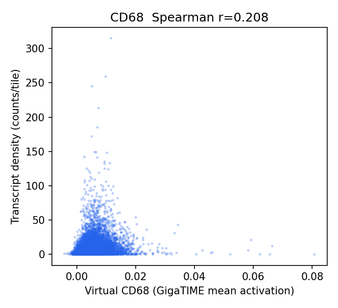
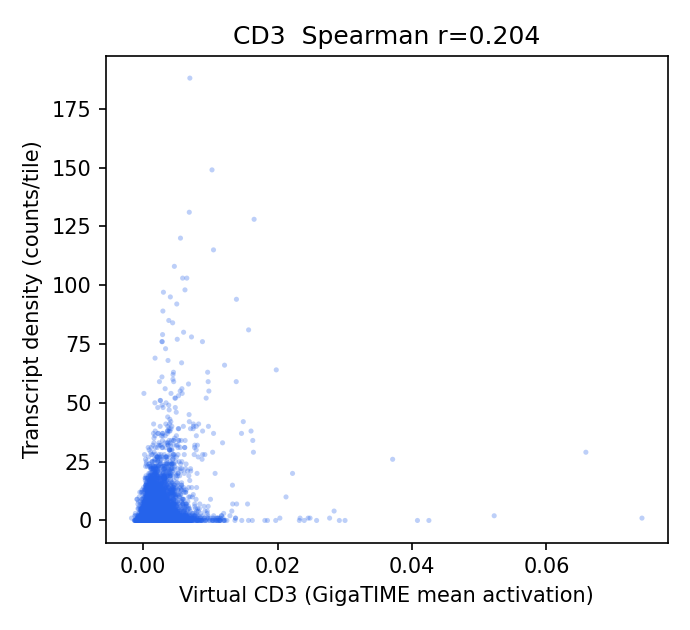
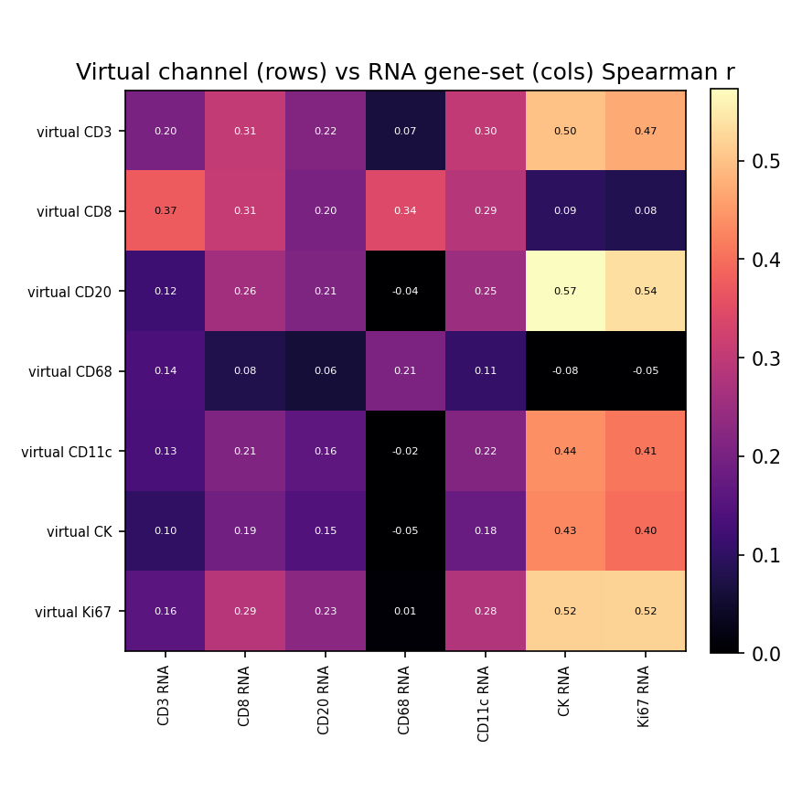

# HEST-1k Breast RNA-Validation Results — TENX191 (ROSIE)

Status: within-slide validation of ROSIE virtual channels against HEST-1k spatial RNA (Xenium). Same audited pipeline as the GigaTIME run, applied to a second H&E->virtual-mIF model for a field-level specificity claim.

- Sample: `TENX191` (Xenium, HEST-1k); Patient 1; `Section 1, top`. Dataset: Xenium v1 Human Breast FFPE with Biomarkers & Housekeeping Genes Custom Panel.
- Clinical (from HEST metadata): IDC; IDC, T3 N0 M0, G3, HER2-Neg.

## Method

- H&E full resolution: 43995 x 20515 px (0.2740 um/px); 9837 tiles used at 256 px (stride 256).
- Transcripts: 64,433,598 gene transcripts (of 64,581,006 incl. controls), binned onto the tile grid directly via the HEST-provided H&E pixel coordinates (`he_x`/`he_y`) — no alignment affine.
- Channels with a panel gene (8/16): CD3, CD8, CD20, CD68, CD11c, CK, Ki67, CD138. Not in this panel: CD4, CD14, CD16, PD-1, PD-L1, CD34, T-bet, Tryptase.
- Statistics are computed by the same audited core as the Xenium Rep1/Rep2 run (`scripts/validate_gigatime_xenium_rna.py`, imported unchanged): within-slide Spearman, channel x gene-set specificity matrix, cellularity-controlled partial correlation, spatial block-bootstrap 95% CIs.

## Alignment Sanity (model-free)

Spearman(tile tissue fraction, total transcript density) = **0.104** (p=4.9e-25, 95% CI [0.060, 0.147]). A strongly positive value confirms the transcript-to-H&E mapping before interpreting channels.

## Channel Correlations (virtual channel vs RNA)

| Channel | Gene(s) | Spearman r | 95% CI | p | Counts on grid |
|---|---|---:|---|---:|---:|
| Ki67 | MKI67 | 0.521 | [0.480, 0.555] | 0.0e+00 | 58,626 |
| CK | KRT19, EPCAM | 0.430 | [0.397, 0.463] | 0.0e+00 | 758,493 |
| CD8 | CD8A | 0.309 | [0.272, 0.344] | 4.8e-216 | 35,366 |
| CD11c | ITGAX | 0.216 | [0.182, 0.247] | 5.1e-104 | 18,091 |
| CD20 | MS4A1 | 0.209 | [0.179, 0.237] | 6.2e-98 | 7,611 |
| CD68 | CD68 | 0.208 | [0.175, 0.242] | 1.1e-96 | 96,807 |
| CD3 | CD3E | 0.204 | [0.166, 0.241] | 7.1e-93 | 36,095 |

### Scatter plots

## Channel Specificity (is the signal channel-specific, not just cellularity?)

(1) Row-max: own-gene is the most-correlated gene-set for **3/7** channels. (2) Partial correlation controlling for total per-tile transcript density stays positive (95% CI > 0) for **4/7** channels.

| Channel | Own-gene r | Partial r (control total tx) | Partial 95% CI | Own-gene row-max? | Closest other channel |
|---|---:|---:|---|:--:|---|
| CK | 0.430 | 0.227 | [0.194, 0.256] | yes | Ki67 (0.400) |
| CD8 | 0.309 | 0.223 | [0.186, 0.258] | no | CD3 (0.374) |
| CD68 | 0.208 | 0.217 | [0.183, 0.249] | yes | CD3 (0.137) |
| Ki67 | 0.521 | 0.202 | [0.170, 0.231] | yes | CK (0.518) |
| CD20 | 0.209 | 0.025 | [-0.001, 0.052] | no | CK (0.573) |
| CD11c | 0.216 | -0.003 | [-0.031, 0.025] | no | CK (0.440) |
| CD3 | 0.204 | -0.019 | [-0.050, 0.014] | no | CK (0.500) |

## Interpretation

- Own-gene is the most-correlated gene-set for **3/7** channels; after partialling out total per-tile transcript density (cellularity), channel-specific signal stays positive (95% CI > 0) for **4/7** channels: CK 0.23, CD8 0.22, CD68 0.22, Ki67 0.20.
- Headline-channel check (CK epithelium; T-cell; CD68 macrophage): CK partial r = 0.23 (specific/positive); T-cell CD3 -0.02, CD8 0.22; CD68 = 0.22 (not negative).

## Output Files

- `results/rosie_hest_rna_validation/TENX191/hest_rna_validation_report.json`
- `docs/assets/rosie_hest_rna_validation_TENX191/`
