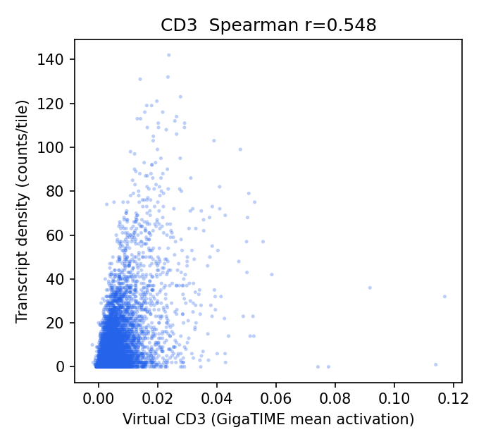
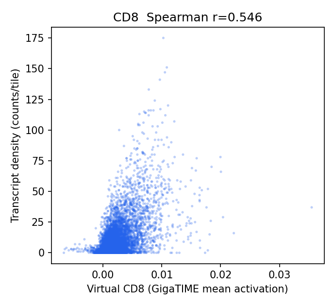
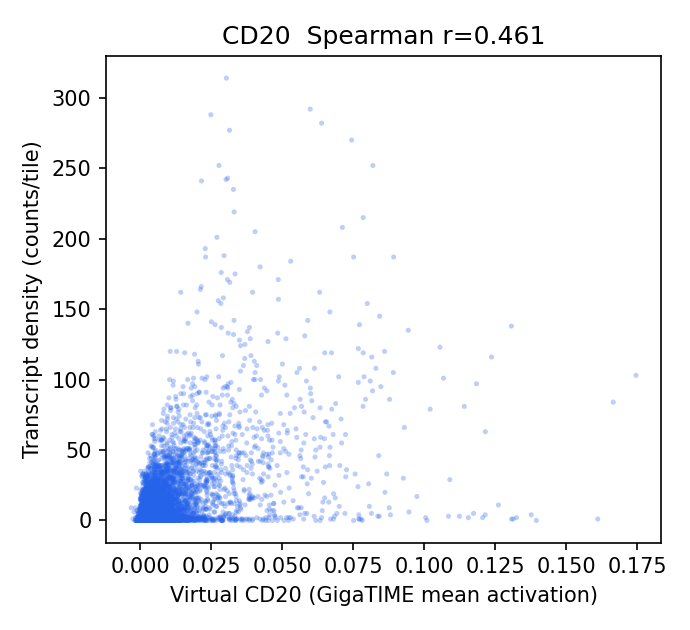
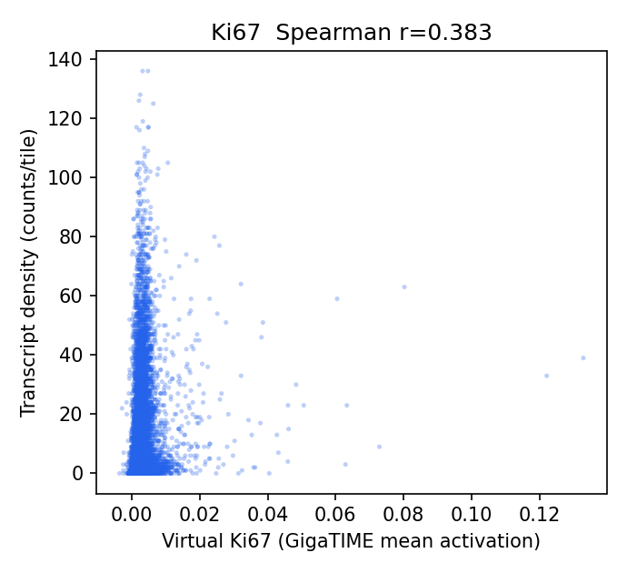
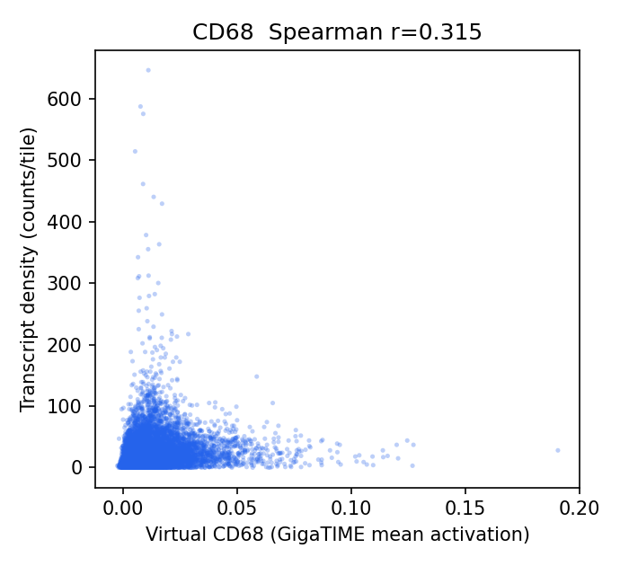
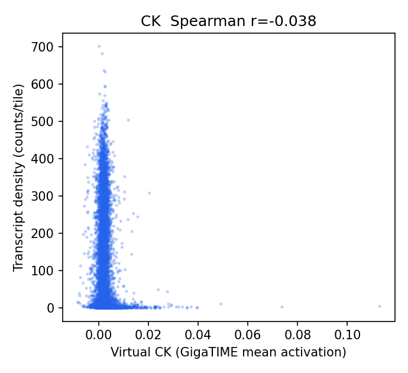
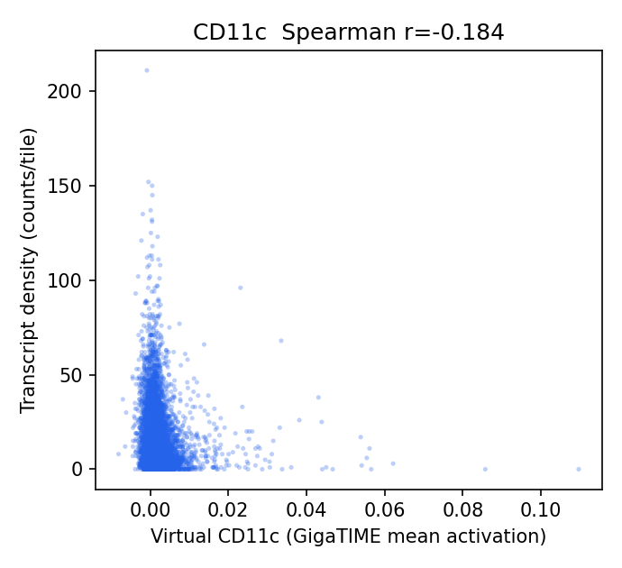
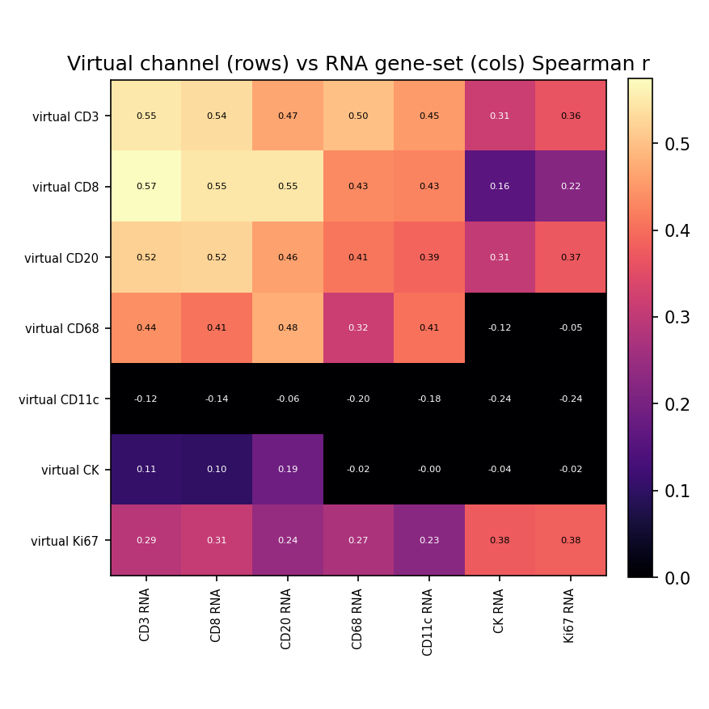

# HEST-1k Breast RNA-Validation Results — TENX195 (ROSIE)

Status: within-slide validation of ROSIE virtual channels against HEST-1k spatial RNA (Xenium). Same audited pipeline as the GigaTIME run, applied to a second H&E->virtual-mIF model for a field-level specificity claim.

- Sample: `TENX195` (Xenium, HEST-1k); Patient 2; `Section 2, middle`. Dataset: Xenium v1 Human Breast FFPE with Biomarkers & Housekeeping Genes Custom Panel.
- Clinical (from HEST metadata): IDC; DCIS, T1c N1 MX, G2, HER2-2+.

## Method

- H&E full resolution: 38540 x 27235 px (0.2740 um/px); 12494 tiles used at 256 px (stride 256).
- Transcripts: 74,131,254 gene transcripts (of 74,273,457 incl. controls), binned onto the tile grid directly via the HEST-provided H&E pixel coordinates (`he_x`/`he_y`) — no alignment affine.
- Channels with a panel gene (8/16): CD3, CD8, CD20, CD68, CD11c, CK, Ki67, CD138. Not in this panel: CD4, CD14, CD16, PD-1, PD-L1, CD34, T-bet, Tryptase.
- Statistics are computed by the same audited core as the Xenium Rep1/Rep2 run (`scripts/validate_gigatime_xenium_rna.py`, imported unchanged): within-slide Spearman, channel x gene-set specificity matrix, cellularity-controlled partial correlation, spatial block-bootstrap 95% CIs.

## Alignment Sanity (model-free)

Spearman(tile tissue fraction, total transcript density) = **-0.022** (p=1.3e-02, 95% CI [-0.070, 0.025]). A strongly positive value confirms the transcript-to-H&E mapping before interpreting channels.

## Channel Correlations (virtual channel vs RNA)

| Channel | Gene(s) | Spearman r | 95% CI | p | Counts on grid |
|---|---|---:|---|---:|---:|
| CD3 | CD3E | 0.548 | [0.524, 0.575] | 0.0e+00 | 87,331 |
| CD8 | CD8A | 0.546 | [0.520, 0.571] | 0.0e+00 | 87,606 |
| CD20 | MS4A1 | 0.461 | [0.428, 0.493] | 0.0e+00 | 97,189 |
| Ki67 | MKI67 | 0.383 | [0.350, 0.414] | 0.0e+00 | 137,001 |
| CD68 | CD68 | 0.315 | [0.280, 0.348] | 5.2e-286 | 253,318 |
| CK | KRT19, EPCAM | -0.038 | [-0.075, -0.003] | 2.7e-05 | 1,072,709 |
| CD11c | ITGAX | -0.184 | [-0.209, -0.159] | 5.4e-96 | 142,302 |

### Scatter plots

## Channel Specificity (is the signal channel-specific, not just cellularity?)

(1) Row-max: own-gene is the most-correlated gene-set for **2/7** channels. (2) Partial correlation controlling for total per-tile transcript density stays positive (95% CI > 0) for **4/7** channels.

| Channel | Own-gene r | Partial r (control total tx) | Partial 95% CI | Own-gene row-max? | Closest other channel |
|---|---:|---:|---|:--:|---|
| CD8 | 0.546 | 0.448 | [0.418, 0.478] | no | CD3 (0.574) |
| CD3 | 0.548 | 0.422 | [0.393, 0.453] | yes | CD8 (0.536) |
| CD20 | 0.461 | 0.383 | [0.341, 0.417] | no | CD8 (0.525) |
| CD68 | 0.315 | 0.370 | [0.343, 0.396] | no | CD20 (0.477) |
| Ki67 | 0.383 | 0.015 | [-0.010, 0.041] | yes | CK (0.377) |
| CK | -0.038 | -0.071 | [-0.105, -0.032] | no | CD20 (0.186) |
| CD11c | -0.184 | -0.074 | [-0.097, -0.050] | no | CD20 (-0.060) |

## Interpretation

- Own-gene is the most-correlated gene-set for **2/7** channels; after partialling out total per-tile transcript density (cellularity), channel-specific signal stays positive (95% CI > 0) for **4/7** channels: CD8 0.45, CD3 0.42, CD20 0.38, CD68 0.37.
- Channels going negative after the cellularity control (track epithelium/cellularity, not their marker): CK -0.07, CD11c -0.07.
- Headline-channel check (CK epithelium; T-cell; CD68 macrophage): CK partial r = -0.07 (not positive); T-cell CD3 0.42, CD8 0.45; CD68 = 0.37 (not negative).

## Output Files

- `results/rosie_hest_rna_validation/TENX195/hest_rna_validation_report.json`
- `docs/assets/rosie_hest_rna_validation_TENX195/`
