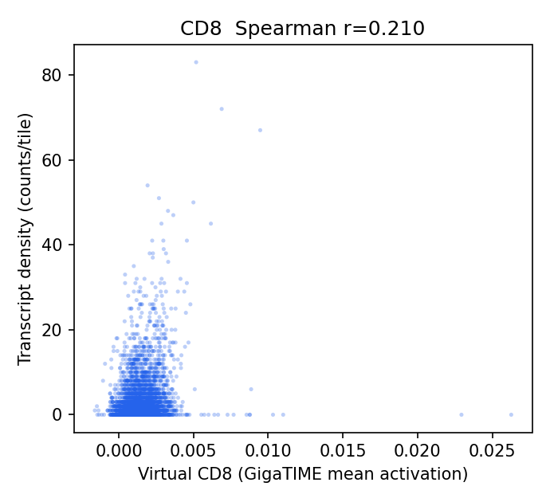
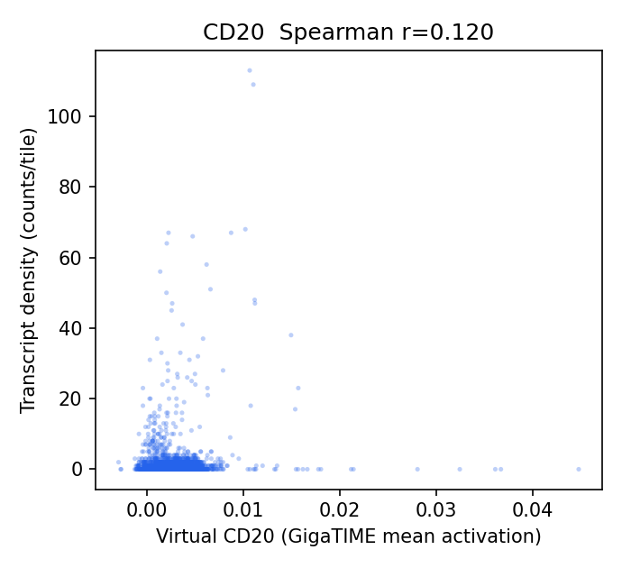
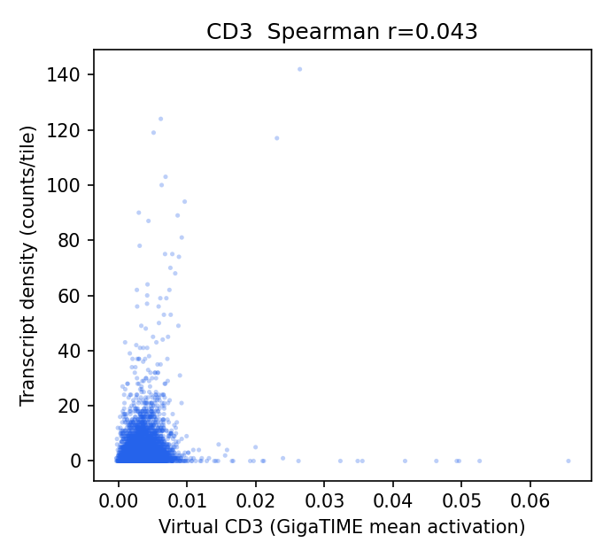
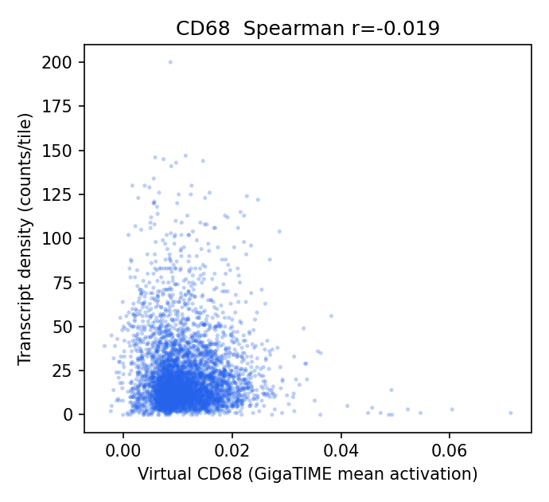
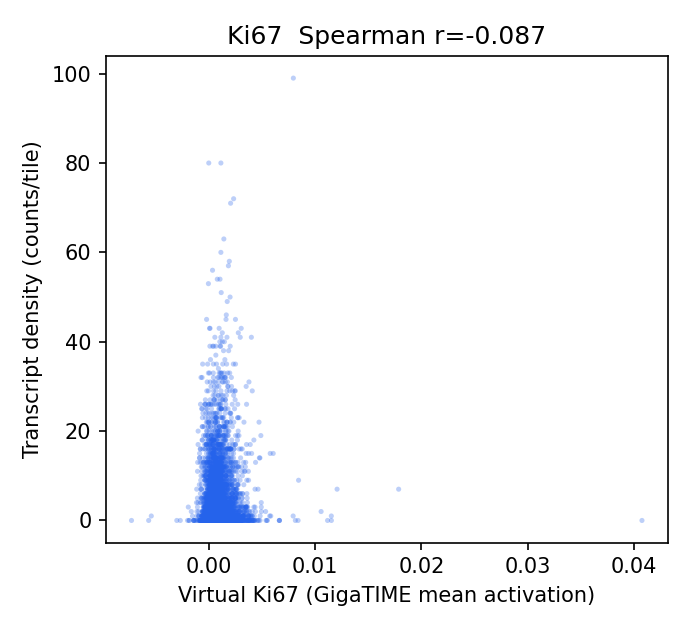
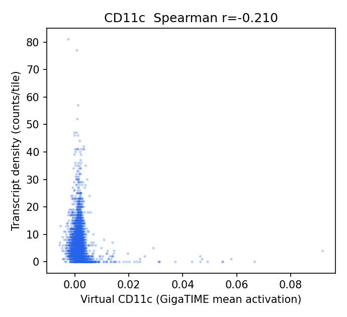
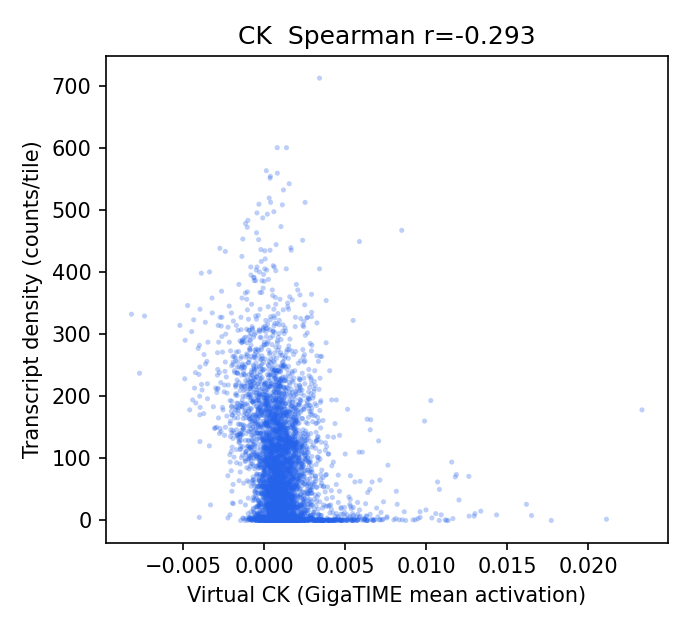
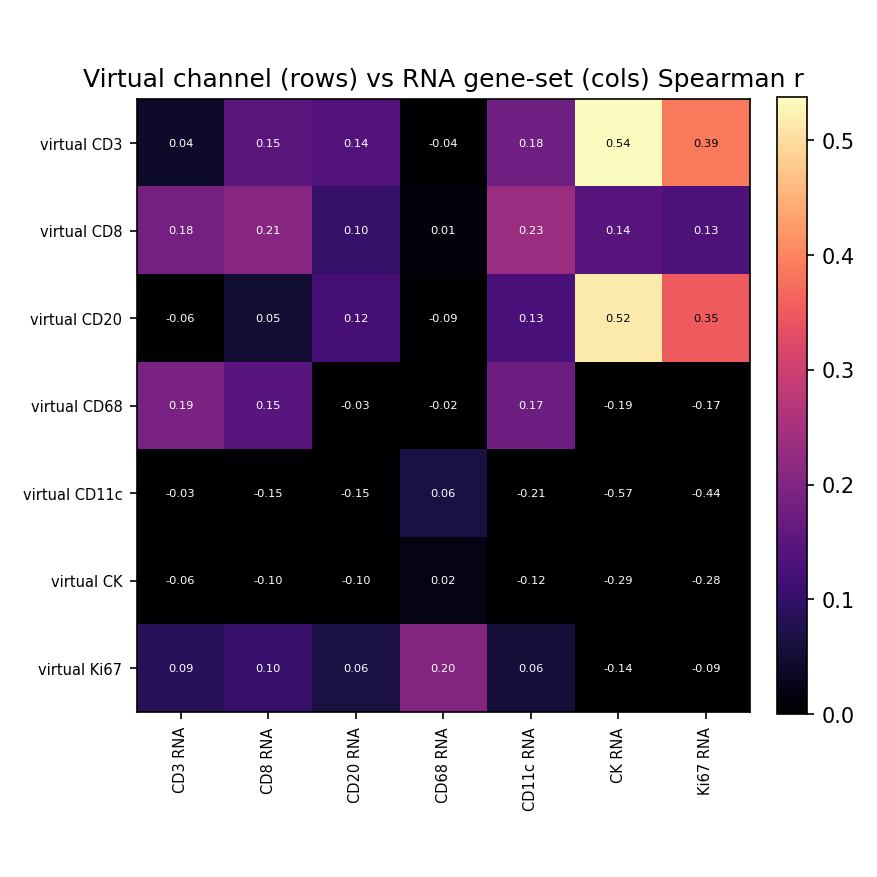

# HEST-1k Breast RNA-Validation Results — TENX199 (ROSIE)

Status: within-slide validation of ROSIE virtual channels against HEST-1k spatial RNA (Xenium). Same audited pipeline as the GigaTIME run, applied to a second H&E->virtual-mIF model for a field-level specificity claim.

- Sample: `TENX199` (Xenium, HEST-1k); Patient 3; `Section 3, bottom`. Dataset: Xenium v1 Human Breast FFPE with Biomarkers & Housekeeping Genes Custom Panel.
- Clinical (from HEST metadata): IDC; DCIS, TX NX M0, G2, ER-/PR-/HER2-2+.

## Method

- H&E full resolution: 31607 x 14853 px (0.2741 um/px); 4469 tiles used at 256 px (stride 256).
- Transcripts: 43,579,291 gene transcripts (of 43,717,142 incl. controls), binned onto the tile grid directly via the HEST-provided H&E pixel coordinates (`he_x`/`he_y`) — no alignment affine.
- Channels with a panel gene (8/16): CD3, CD8, CD20, CD68, CD11c, CK, Ki67, CD138. Not in this panel: CD4, CD14, CD16, PD-1, PD-L1, CD34, T-bet, Tryptase.
- Statistics are computed by the same audited core as the Xenium Rep1/Rep2 run (`scripts/validate_gigatime_xenium_rna.py`, imported unchanged): within-slide Spearman, channel x gene-set specificity matrix, cellularity-controlled partial correlation, spatial block-bootstrap 95% CIs.

## Alignment Sanity (model-free)

Spearman(tile tissue fraction, total transcript density) = **0.317** (p=3.9e-105, 95% CI [0.248, 0.378]). A strongly positive value confirms the transcript-to-H&E mapping before interpreting channels.

## Channel Correlations (virtual channel vs RNA)

| Channel | Gene(s) | Spearman r | 95% CI | p | Counts on grid |
|---|---|---:|---|---:|---:|
| CD8 | CD8A | 0.210 | [0.164, 0.248] | 1.4e-45 | 14,918 |
| CD20 | MS4A1 | 0.120 | [0.079, 0.160] | 7.1e-16 | 4,911 |
| CD3 | CD3E | 0.043 | [-0.004, 0.091] | 4.1e-03 | 20,663 |
| CD68 | CD68 | -0.019 | [-0.074, 0.039] | 2.0e-01 | 100,065 |
| Ki67 | MKI67 | -0.087 | [-0.137, -0.036] | 5.5e-09 | 24,757 |
| CD11c | ITGAX | -0.210 | [-0.256, -0.161] | 1.4e-45 | 26,283 |
| CK | KRT19, EPCAM | -0.293 | [-0.353, -0.224] | 6.4e-89 | 428,132 |

### Scatter plots

## Channel Specificity (is the signal channel-specific, not just cellularity?)

(1) Row-max: own-gene is the most-correlated gene-set for **0/7** channels. (2) Partial correlation controlling for total per-tile transcript density stays positive (95% CI > 0) for **1/7** channels.

| Channel | Own-gene r | Partial r (control total tx) | Partial 95% CI | Own-gene row-max? | Closest other channel |
|---|---:|---:|---|:--:|---|
| CD8 | 0.210 | 0.177 | [0.134, 0.221] | no | CD11c (0.235) |
| CK | -0.293 | 0.014 | [-0.047, 0.078] | no | CD68 (0.022) |
| CD20 | 0.120 | -0.007 | [-0.043, 0.032] | no | CK (0.515) |
| CD3 | 0.043 | -0.015 | [-0.065, 0.042] | no | CK (0.538) |
| CD11c | -0.210 | -0.021 | [-0.059, 0.020] | no | CD68 (0.063) |
| CD68 | -0.019 | -0.026 | [-0.085, 0.027] | no | CD3 (0.189) |
| Ki67 | -0.087 | -0.038 | [-0.070, -0.006] | no | CD68 (0.201) |

## Interpretation

- Own-gene is the most-correlated gene-set for **0/7** channels; after partialling out total per-tile transcript density (cellularity), channel-specific signal stays positive (95% CI > 0) for **1/7** channels: CD8 0.18.
- Headline-channel check (CK epithelium; T-cell; CD68 macrophage): CK partial r = 0.01 (not positive); T-cell CD3 -0.01, CD8 0.18; CD68 = -0.03 (negative).

## Output Files

- `results/rosie_hest_rna_validation/TENX199/hest_rna_validation_report.json`
- `docs/assets/rosie_hest_rna_validation_TENX199/`
