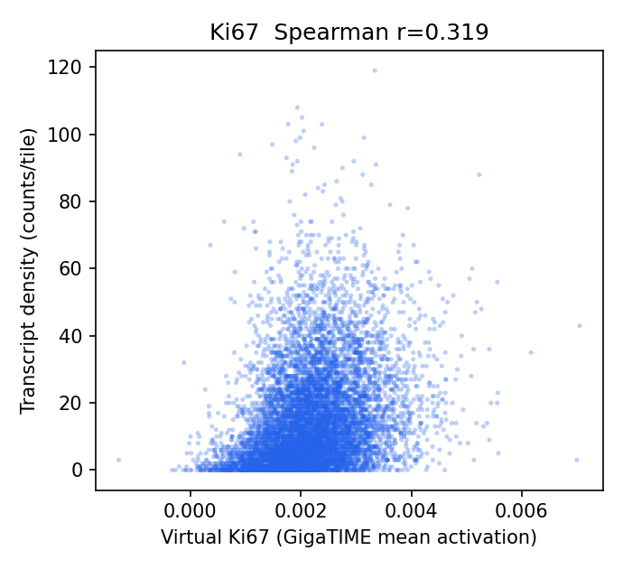
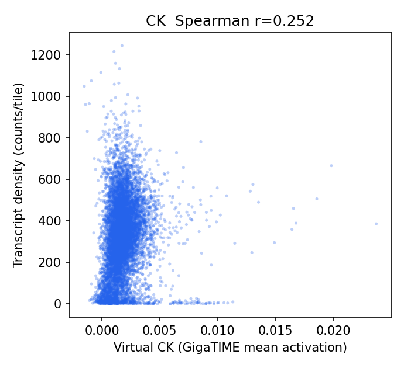
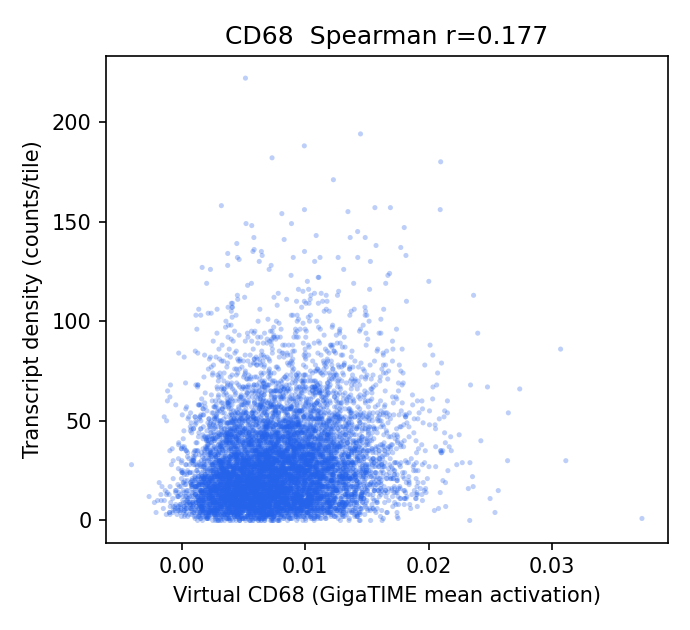
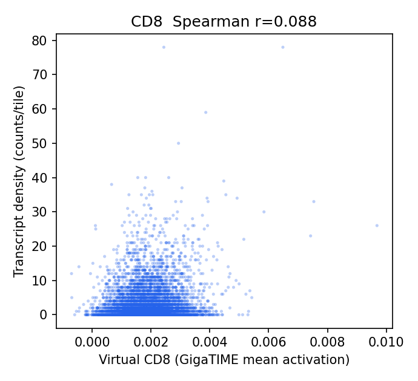
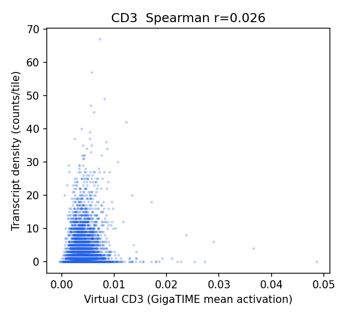
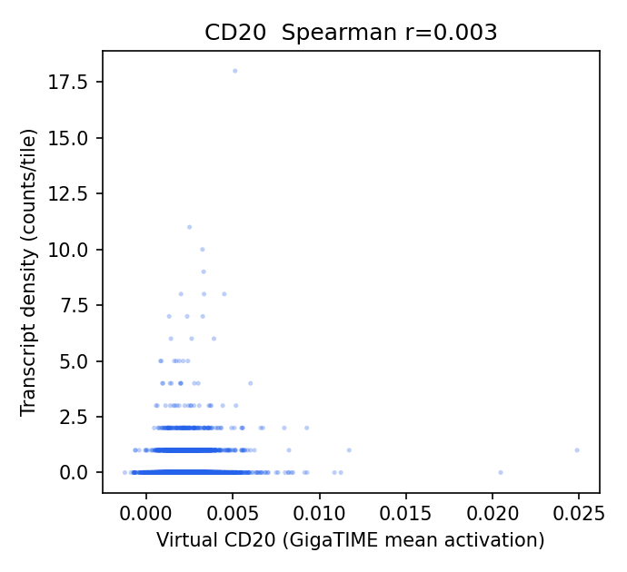
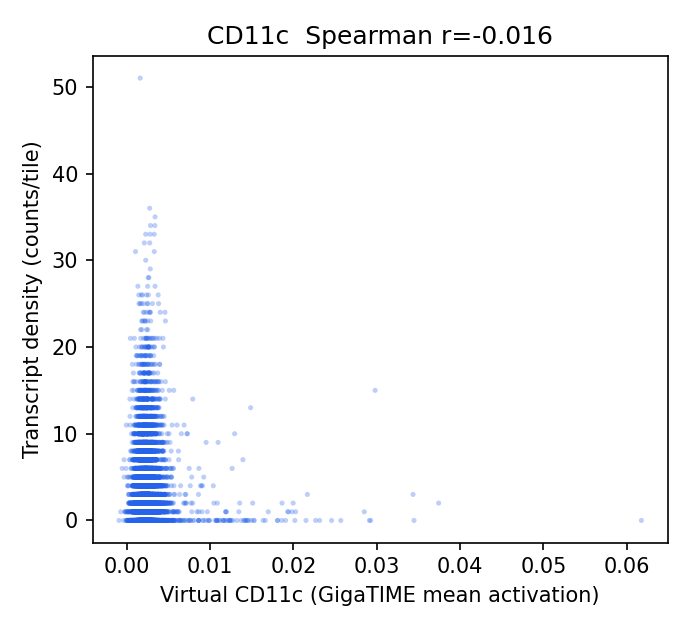
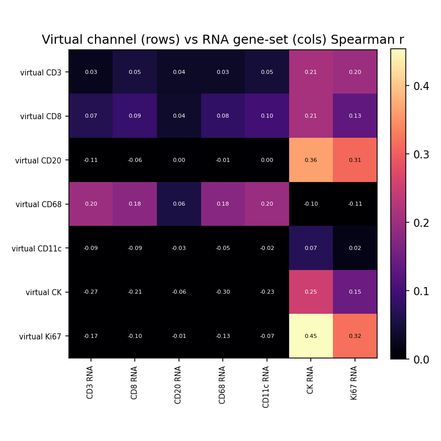

# HEST-1k Breast RNA-Validation Results — TENX202 (ROSIE)

Status: within-slide validation of ROSIE virtual channels against HEST-1k spatial RNA (Xenium). Same audited pipeline as the GigaTIME run, applied to a second H&E->virtual-mIF model for a field-level specificity claim.

- Sample: `TENX202` (Xenium, HEST-1k); Patient 4; `Section 4, bottom`. Dataset: Xenium v1 Human Breast FFPE with Biomarkers & Housekeeping Genes Custom Panel.
- Clinical (from HEST metadata): IDC; DCIS, T4a N2a, G3, HER2-1+.

## Method

- H&E full resolution: 30322 x 21607 px (0.2740 um/px); 8494 tiles used at 256 px (stride 256).
- Transcripts: 90,354,760 gene transcripts (of 90,495,390 incl. controls), binned onto the tile grid directly via the HEST-provided H&E pixel coordinates (`he_x`/`he_y`) — no alignment affine.
- Channels with a panel gene (8/16): CD3, CD8, CD20, CD68, CD11c, CK, Ki67, CD138. Not in this panel: CD4, CD14, CD16, PD-1, PD-L1, CD34, T-bet, Tryptase.
- Statistics are computed by the same audited core as the Xenium Rep1/Rep2 run (`scripts/validate_gigatime_xenium_rna.py`, imported unchanged): within-slide Spearman, channel x gene-set specificity matrix, cellularity-controlled partial correlation, spatial block-bootstrap 95% CIs.

## Alignment Sanity (model-free)

Spearman(tile tissue fraction, total transcript density) = **0.073** (p=1.5e-11, 95% CI [0.021, 0.120]). A strongly positive value confirms the transcript-to-H&E mapping before interpreting channels.

## Channel Correlations (virtual channel vs RNA)

| Channel | Gene(s) | Spearman r | 95% CI | p | Counts on grid |
|---|---|---:|---|---:|---:|
| Ki67 | MKI67 | 0.319 | [0.289, 0.349] | 1.2e-199 | 132,786 |
| CK | KRT19, EPCAM | 0.252 | [0.202, 0.295] | 4.2e-123 | 2,787,588 |
| CD68 | CD68 | 0.177 | [0.144, 0.211] | 1.3e-60 | 250,082 |
| CD8 | CD8A | 0.088 | [0.061, 0.117] | 3.3e-16 | 22,728 |
| CD3 | CD3E | 0.026 | [-0.007, 0.062] | 1.5e-02 | 19,383 |
| CD20 | MS4A1 | 0.003 | [-0.021, 0.027] | 7.6e-01 | 1,258 |
| CD11c | ITGAX | -0.016 | [-0.041, 0.009] | 1.4e-01 | 33,579 |

### Scatter plots

## Channel Specificity (is the signal channel-specific, not just cellularity?)

(1) Row-max: own-gene is the most-correlated gene-set for **1/7** channels. (2) Partial correlation controlling for total per-tile transcript density stays positive (95% CI > 0) for **5/7** channels.

| Channel | Own-gene r | Partial r (control total tx) | Partial 95% CI | Own-gene row-max? | Closest other channel |
|---|---:|---:|---|:--:|---|
| CD8 | 0.088 | 0.169 | [0.141, 0.196] | no | CK (0.209) |
| CD68 | 0.177 | 0.163 | [0.129, 0.198] | no | CD3 (0.200) |
| CD3 | 0.026 | 0.146 | [0.110, 0.183] | no | CK (0.212) |
| CK | 0.252 | 0.140 | [0.108, 0.167] | yes | Ki67 (0.145) |
| Ki67 | 0.319 | 0.034 | [0.008, 0.060] | no | CK (0.453) |
| CD20 | 0.003 | 0.021 | [-0.002, 0.046] | no | CK (0.363) |
| CD11c | -0.016 | -0.008 | [-0.035, 0.019] | no | CK (0.068) |

## Interpretation

- Own-gene is the most-correlated gene-set for **1/7** channels; after partialling out total per-tile transcript density (cellularity), channel-specific signal stays positive (95% CI > 0) for **5/7** channels: CD8 0.17, CD68 0.16, CD3 0.15, CK 0.14, Ki67 0.03.
- Headline-channel check (CK epithelium; T-cell; CD68 macrophage): CK partial r = 0.14 (specific/positive); T-cell CD3 0.15, CD8 0.17; CD68 = 0.16 (not negative).

## Output Files

- `results/rosie_hest_rna_validation/TENX202/hest_rna_validation_report.json`
- `docs/assets/rosie_hest_rna_validation_TENX202/`
