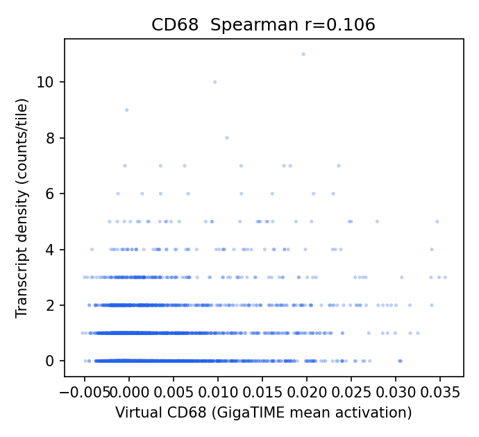
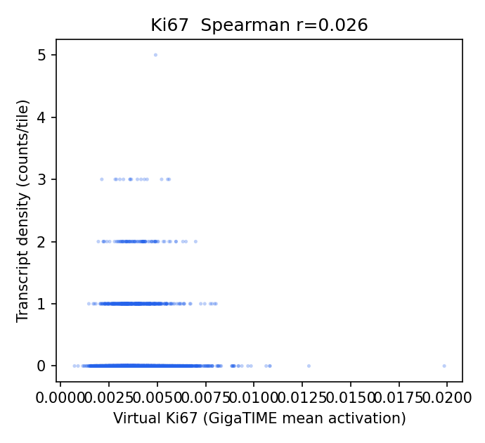
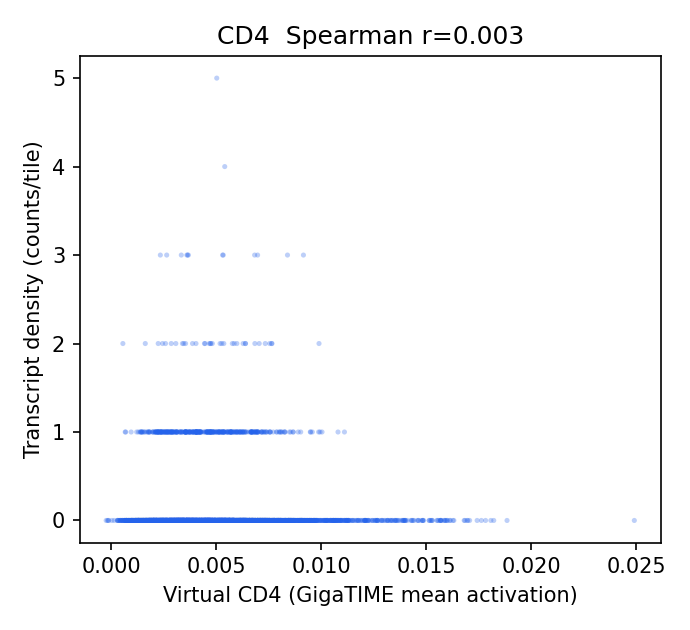
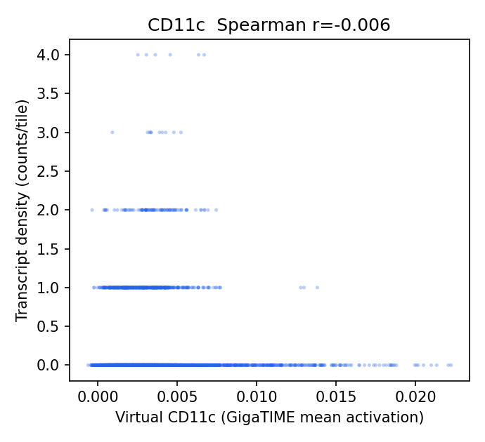
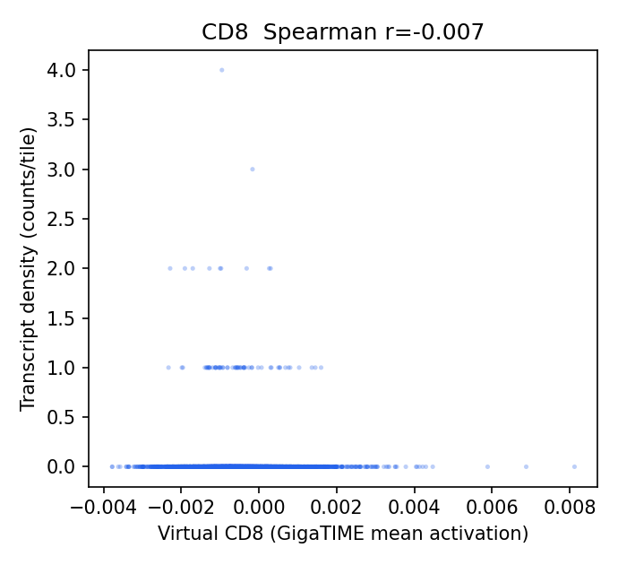
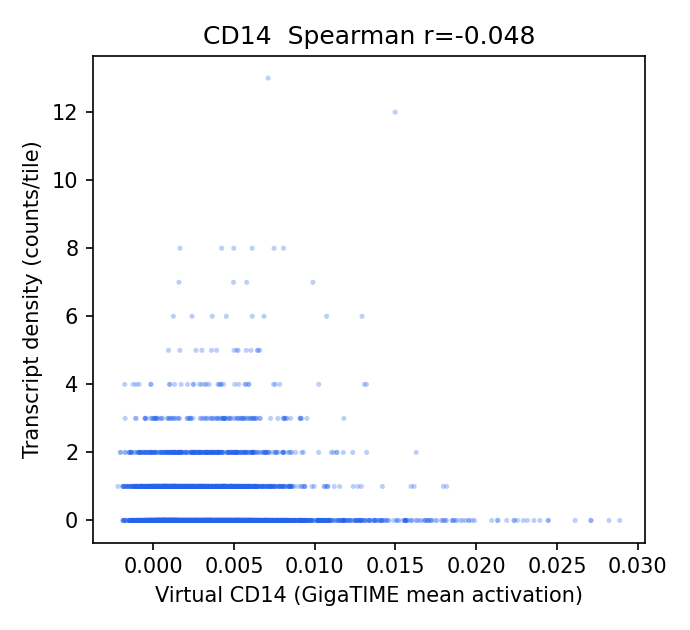
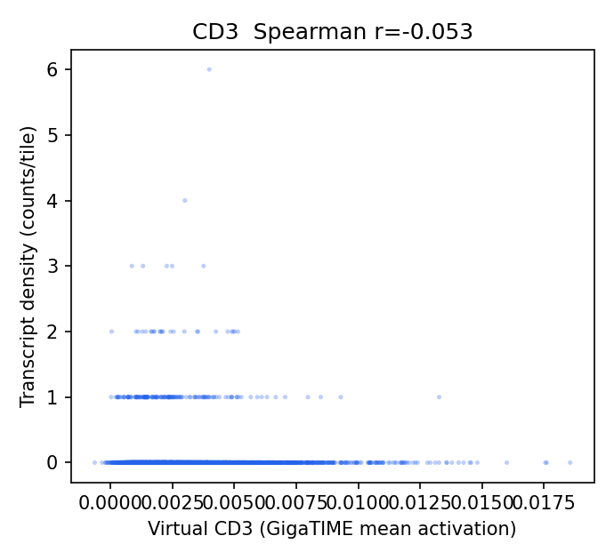
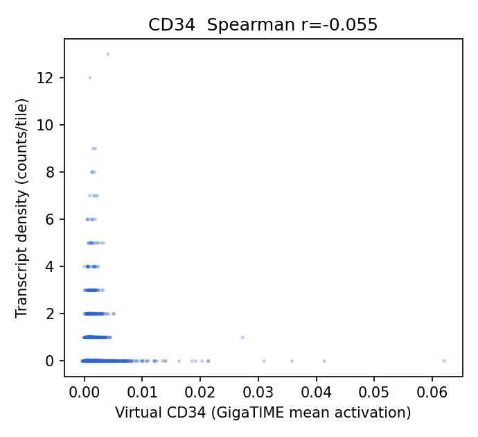
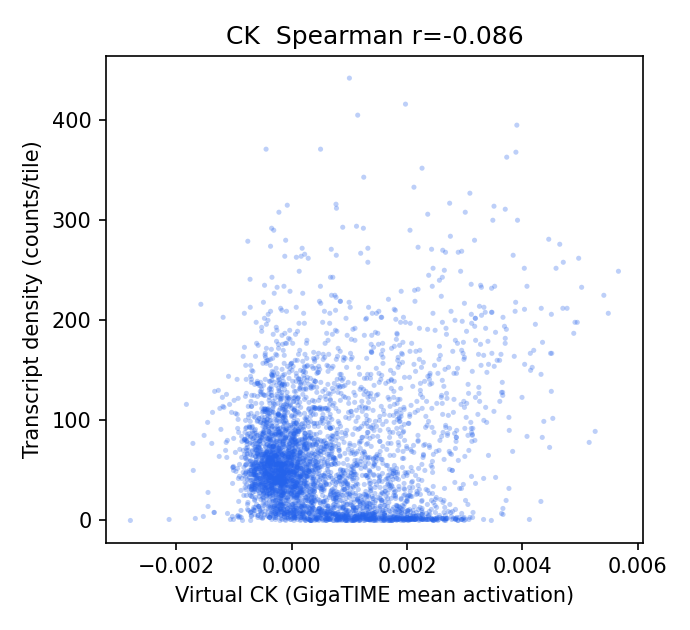
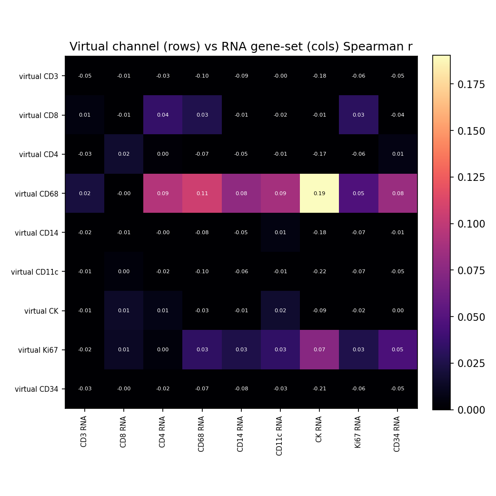

# HEST-1k Breast RNA-Validation Results — TENX24 (ROSIE)

Status: within-slide validation of ROSIE virtual channels against HEST-1k spatial RNA (Visium). Same audited pipeline as the GigaTIME run, applied to a second H&E->virtual-mIF model for a field-level specificity claim.

- Sample: `TENX24` (Visium, HEST-1k); nan; `nan`. Dataset: Human Breast Cancer: Whole Transcriptome Analysis.
- Clinical (from HEST metadata): ILC; Invasive Lobular Carcinoma, AJCC/UICC Stage Group I, ER positive, PR positive, HER2 negative.

## Method

- H&E full resolution: 24240 x 24240 px (0.3662 um/px); 4026 tiles used at 256 px (stride 256).
- Visium: 4,325 spots (50,821,784 total UMI), binned onto the tile grid via `pxl_col/row_in_fullres`. Analysis restricted to the **4026** tiles containing >=1 spot (spots are ~100 um apart, sparser than 256 px tiles).
- Channels with a panel gene (16/16): CD3, CD8, CD4, CD20, CD68, CD14, CD11c, CD16, PD-1, PD-L1, CK, Ki67, CD138, CD34, T-bet, Tryptase. Not in this panel: none.
- Statistics are computed by the same audited core as the Xenium Rep1/Rep2 run (`scripts/validate_gigatime_xenium_rna.py`, imported unchanged): within-slide Spearman, channel x gene-set specificity matrix, cellularity-controlled partial correlation, spatial block-bootstrap 95% CIs.

## Alignment Sanity (model-free)

Spearman(tile tissue fraction, total transcript density) = **0.524** (p=2.8e-282, 95% CI [0.466, 0.575]). A strongly positive value confirms the transcript-to-H&E mapping before interpreting channels.

## Channel Correlations (virtual channel vs RNA)

| Channel | Gene(s) | Spearman r | 95% CI | p | Counts on grid |
|---|---|---:|---|---:|---:|
| CD68 | CD68 | 0.106 | [0.047, 0.165] | 1.4e-11 | 2,687 |
| Ki67 | MKI67 | 0.026 | [-0.010, 0.063] | 1.0e-01 | 606 |
| CD4 | CD4 | 0.003 | [-0.036, 0.039] | 8.7e-01 | 465 |
| CD11c | ITGAX | -0.006 | [-0.043, 0.033] | 7.0e-01 | 667 |
| CD8 | CD8A, CD8B | -0.007 | [-0.041, 0.027] | 6.7e-01 | 82 |
| CD14 | CD14 | -0.048 | [-0.101, 0.004] | 2.4e-03 | 2,155 |
| CD3 | CD3D, CD3E, CD3G | -0.053 | [-0.090, -0.016] | 7.7e-04 | 218 |
| CD34 | CD34 | -0.055 | [-0.098, -0.013] | 5.0e-04 | 1,176 |
| CK | KRT8, KRT18, KRT19, KRT7, EPCAM | -0.086 | [-0.182, 0.009] | 4.8e-08 | 262,787 |

### Scatter plots

## Channel Specificity (is the signal channel-specific, not just cellularity?)

(1) Row-max: own-gene is the most-correlated gene-set for **0/9** channels. (2) Partial correlation controlling for total per-tile transcript density stays positive (95% CI > 0) for **2/9** channels.

| Channel | Own-gene r | Partial r (control total tx) | Partial 95% CI | Own-gene row-max? | Closest other channel |
|---|---:|---:|---|:--:|---|
| CD11c | -0.006 | 0.052 | [0.018, 0.083] | no | CD8 (0.004) |
| CD4 | 0.003 | 0.034 | [0.001, 0.069] | no | CD8 (0.017) |
| CD68 | 0.106 | 0.026 | [-0.016, 0.069] | no | CK (0.190) |
| CD14 | -0.048 | 0.020 | [-0.027, 0.062] | no | CD11c (0.006) |
| CK | -0.086 | 0.007 | [-0.041, 0.057] | no | CD11c (0.017) |
| CD34 | -0.055 | 0.001 | [-0.036, 0.041] | no | CD8 (-0.004) |
| Ki67 | 0.026 | 0.000 | [-0.029, 0.028] | no | CK (0.074) |
| CD8 | -0.007 | -0.007 | [-0.043, 0.028] | no | CD4 (0.036) |
| CD3 | -0.053 | -0.044 | [-0.081, -0.007] | no | CD11c (-0.005) |

## Interpretation

- Own-gene is the most-correlated gene-set for **0/9** channels; after partialling out total per-tile transcript density (cellularity), channel-specific signal stays positive (95% CI > 0) for **2/9** channels: CD11c 0.05, CD4 0.03.
- Headline-channel check (CK epithelium; T-cell; CD68 macrophage): CK partial r = 0.01 (not positive); T-cell CD3 -0.04, CD8 -0.01, CD4 0.03; CD68 = 0.03 (not negative).

## Output Files

- `results/rosie_hest_rna_validation/TENX24/hest_rna_validation_report.json`
- `docs/assets/rosie_hest_rna_validation_TENX24/`
