# HEST-1k Breast RNA-Validation Results — TENX39 (ROSIE)

Status: within-slide validation of ROSIE virtual channels against HEST-1k spatial RNA (Visium). Same audited pipeline as the GigaTIME run, applied to a second H&E->virtual-mIF model for a field-level specificity claim.

- Sample: `TENX39` (Visium, HEST-1k); nan; `nan`. Dataset: Human Breast Cancer: Ductal Carcinoma In Situ, Invasive Carcinoma (FFPE).
- Clinical (from HEST metadata): IDC; Ductal Carcinoma In Situ, Invasive Carcinoma, grade II.

## Method

- H&E full resolution: 25233 x 27452 px (0.3448 um/px); 2442 tiles used at 256 px (stride 256).
- Visium: 2,518 spots (33,540,635 total UMI), binned onto the tile grid via `pxl_col/row_in_fullres`. Analysis restricted to the **2442** tiles containing >=1 spot (spots are ~100 um apart, sparser than 256 px tiles).
- Channels with a panel gene (16/16): CD3, CD8, CD4, CD20, CD68, CD14, CD11c, CD16, PD-1, PD-L1, CK, Ki67, CD138, CD34, T-bet, Tryptase. Not in this panel: none.
- Statistics are computed by the same audited core as the Xenium Rep1/Rep2 run (`scripts/validate_gigatime_xenium_rna.py`, imported unchanged): within-slide Spearman, channel x gene-set specificity matrix, cellularity-controlled partial correlation, spatial block-bootstrap 95% CIs.

## Alignment Sanity (model-free)

Spearman(tile tissue fraction, total transcript density) = **0.148** (p=1.9e-13, 95% CI [0.070, 0.224]). A strongly positive value confirms the transcript-to-H&E mapping before interpreting channels.

## Channel Correlations (virtual channel vs RNA)

| Channel | Gene(s) | Spearman r | 95% CI | p | Counts on grid |
|---|---|---:|---|---:|---:|
| CD11c | ITGAX | 0.124 | [0.059, 0.187] | 6.8e-10 | 3,705 |
| CK | KRT8, KRT18, KRT7, EPCAM | 0.111 | [0.026, 0.203] | 3.7e-08 | 85,369 |
| CD14 | CD14 | 0.102 | [0.040, 0.160] | 4.5e-07 | 6,338 |
| CD68 | CD68 | 0.085 | [0.012, 0.152] | 2.6e-05 | 10,314 |
| CD4 | CD4 | 0.072 | [0.016, 0.125] | 3.5e-04 | 2,609 |
| CD8 | CD8A, CD8B | 0.061 | [0.008, 0.112] | 2.5e-03 | 1,280 |
| CD34 | CD34 | 0.051 | [0.001, 0.105] | 1.1e-02 | 1,542 |
| CD20 | MS4A1 | 0.035 | [-0.031, 0.103] | 8.1e-02 | 536 |
| Ki67 | MKI67 | -0.006 | [-0.047, 0.040] | 7.7e-01 | 495 |
| PD-L1 | CD274 | -0.009 | [-0.050, 0.034] | 6.5e-01 | 373 |
| PD-1 | PDCD1 | -0.015 | [-0.060, 0.024] | 4.5e-01 | 214 |
| CD3 | CD3D, CD3E, CD3G | -0.024 | [-0.089, 0.041] | 2.3e-01 | 4,301 |

### Scatter plots

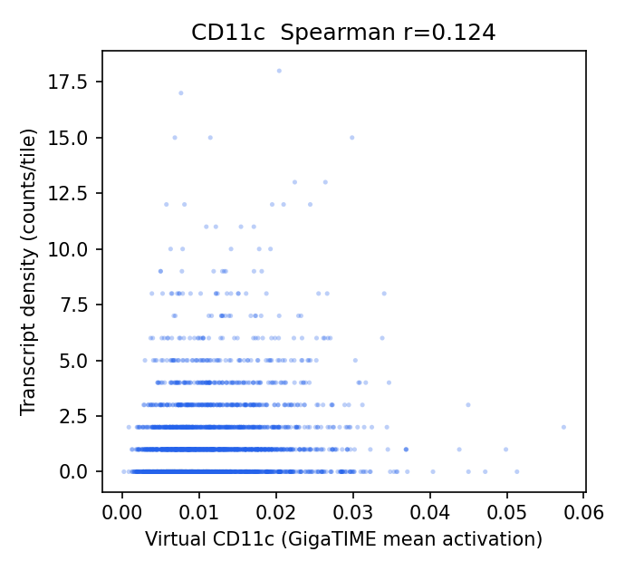
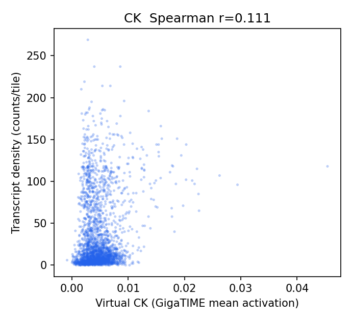
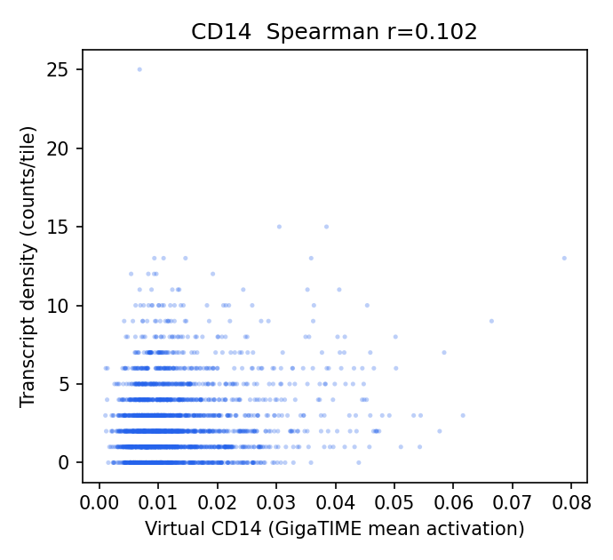
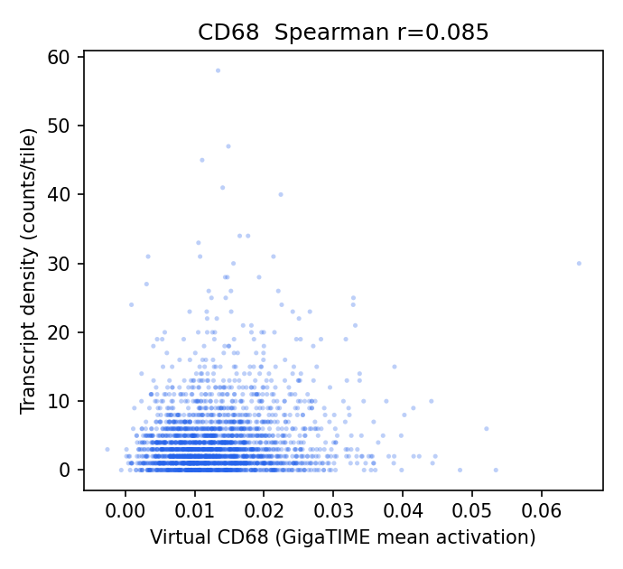
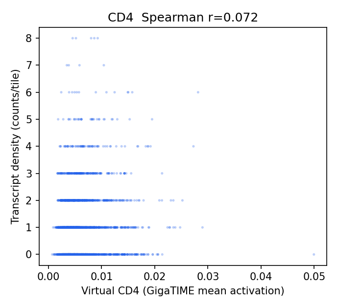
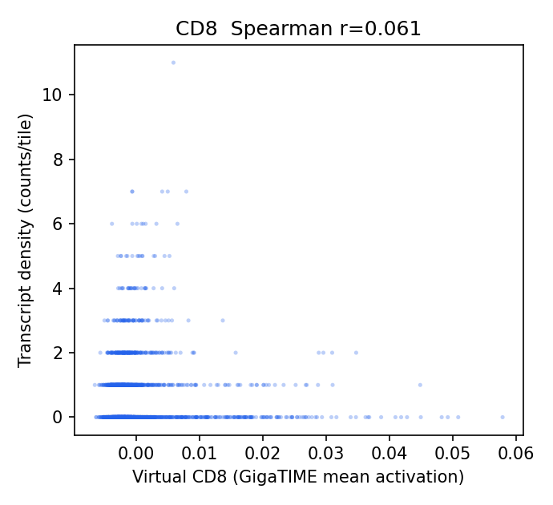
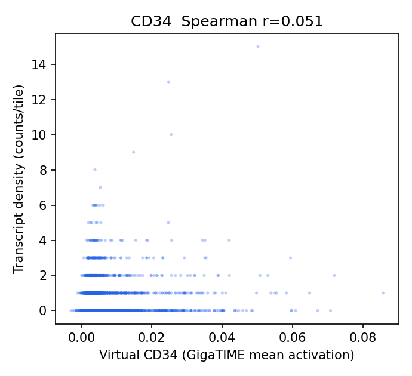
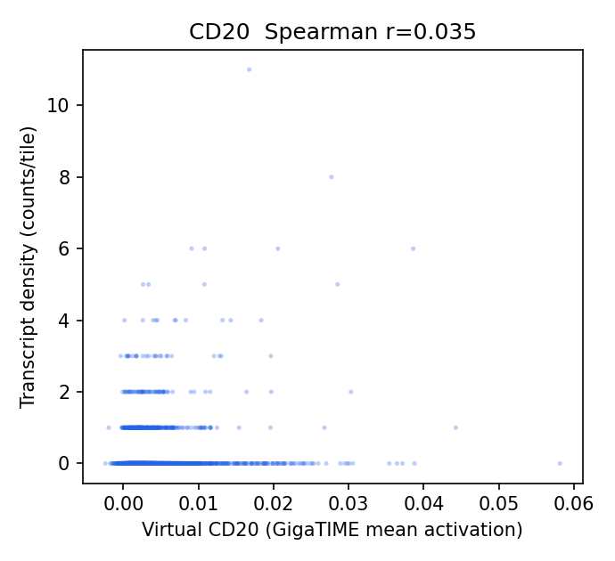
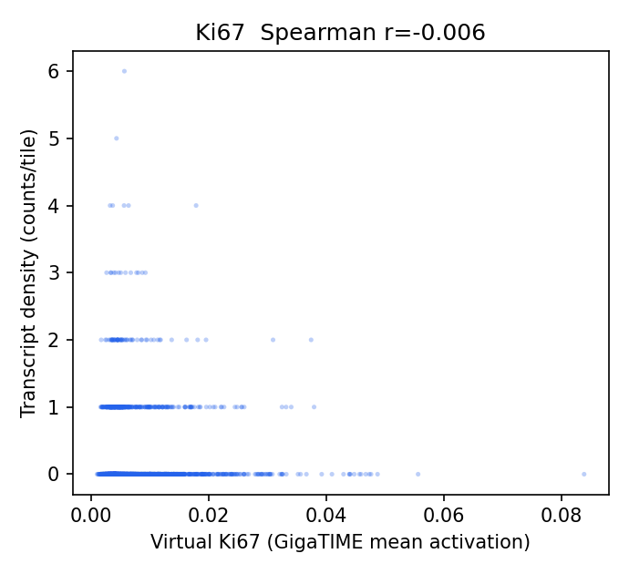
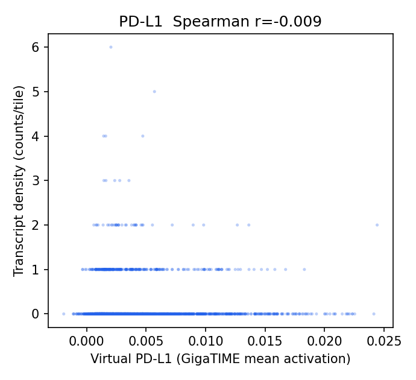
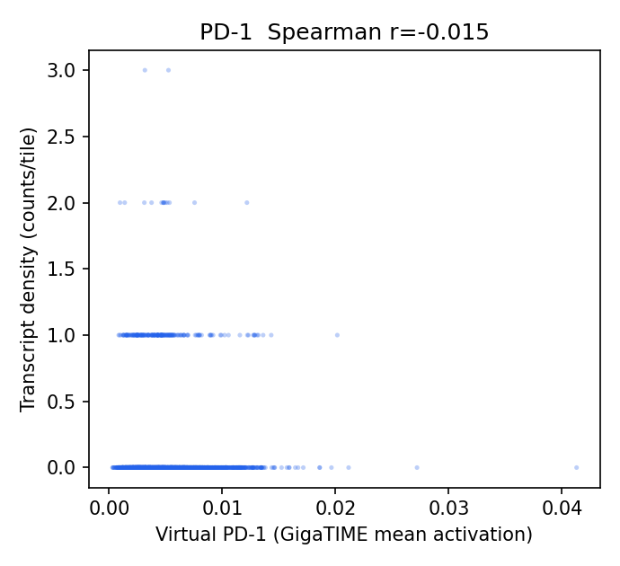
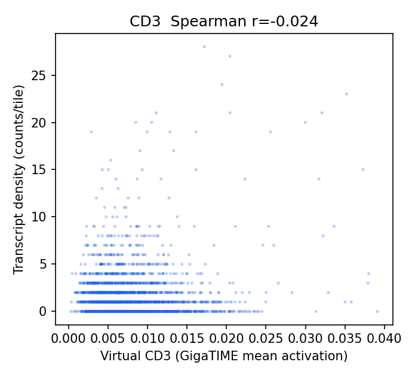

## Channel Specificity (is the signal channel-specific, not just cellularity?)

(1) Row-max: own-gene is the most-correlated gene-set for **2/12** channels. (2) Partial correlation controlling for total per-tile transcript density stays positive (95% CI > 0) for **5/12** channels.

| Channel | Own-gene r | Partial r (control total tx) | Partial 95% CI | Own-gene row-max? | Closest other channel |
|---|---:|---:|---|:--:|---|
| CD14 | 0.102 | 0.139 | [0.081, 0.198] | no | CD68 (0.215) |
| CD11c | 0.124 | 0.105 | [0.036, 0.167] | no | CK (0.187) |
| CD68 | 0.085 | 0.097 | [0.028, 0.161] | yes | CD11c (0.066) |
| CD4 | 0.072 | 0.062 | [0.009, 0.114] | no | CD68 (0.233) |
| CD8 | 0.061 | 0.056 | [0.006, 0.113] | no | CD68 (0.245) |
| CD20 | 0.035 | 0.035 | [-0.035, 0.104] | no | CK (0.116) |
| PD-L1 | -0.009 | 0.022 | [-0.015, 0.057] | no | CD68 (0.206) |
| CK | 0.111 | 0.010 | [-0.062, 0.082] | yes | CD11c (0.088) |
| CD34 | 0.051 | 0.001 | [-0.050, 0.055] | no | CD68 (0.218) |
| PD-1 | -0.015 | -0.011 | [-0.051, 0.032] | no | CD68 (0.143) |
| Ki67 | -0.006 | -0.015 | [-0.056, 0.023] | no | CD68 (0.205) |
| CD3 | -0.024 | -0.044 | [-0.107, 0.024] | no | CK (0.171) |

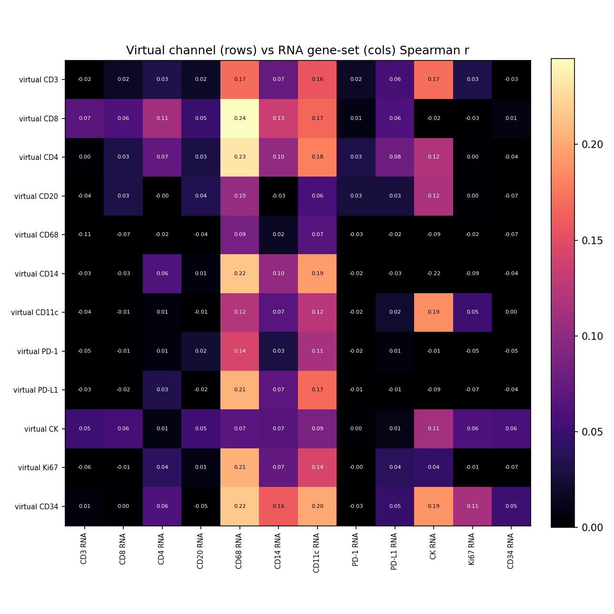

## Interpretation

- Own-gene is the most-correlated gene-set for **2/12** channels; after partialling out total per-tile transcript density (cellularity), channel-specific signal stays positive (95% CI > 0) for **5/12** channels: CD14 0.14, CD11c 0.11, CD68 0.10, CD4 0.06, CD8 0.06.
- Headline-channel check (CK epithelium; T-cell; CD68 macrophage): CK partial r = 0.01 (not positive); T-cell CD3 -0.04, CD8 0.06, CD4 0.06; CD68 = 0.10 (not negative).

## Output Files

- `results/rosie_hest_rna_validation/TENX39/hest_rna_validation_report.json`
- `docs/assets/rosie_hest_rna_validation_TENX39/`
