# Xenium Breast RNA-Validation Results

Status: within-slide validation of GigaTIME virtual channels against Xenium spatial RNA. Sample `Xenium_FFPE_Human_Breast_Cancer_Rep2`.

## Method

- H&E full resolution: 19877 x 30786 px; 6023 tissue tiles at 256 px (stride 256).
- Transcripts: 31,997,227 total; binned to the tile grid via the H&E alignment affine (direction `he_to_morph`, in-bounds fraction 0.928).
- Per channel: within-slide Spearman correlation of virtual-channel mean activation vs transcript density across tiles, with a spatial block-bootstrap 95% CI.

## Alignment Sanity (model-free)

Spearman(tile tissue fraction, total transcript density) = **0.143** (p=8.8e-29, 95% CI [0.073, 0.209]).
A strongly positive value confirms the transcript-to-H&E coordinate mapping is correct before interpreting channels.

## Channel Correlations (virtual channel vs RNA)

| Channel | Gene(s) | Spearman r | 95% CI | p | Transcripts on grid |
|---|---|---:|---|---:|---:|
| CD14 | CD14 | 0.253 | [0.200, 0.302] | 7.5e-89 | 67,274 |
| PD-L1 | CD274 | 0.213 | [0.173, 0.253] | 1.5e-62 | 6,118 |
| CD68 | CD68 | 0.183 | [0.128, 0.240] | 1.9e-46 | 133,585 |
| CD11c | ITGAX | 0.180 | [0.129, 0.232] | 3.3e-45 | 39,436 |
| CK | KRT8, KRT7, EPCAM | 0.152 | [0.084, 0.224] | 2.3e-32 | 1,621,929 |
| CD3 | CD3D, CD3E, CD3G | 0.130 | [0.077, 0.185] | 3.2e-24 | 150,657 |
| Ki67 | MKI67 | 0.120 | [0.067, 0.179] | 7.8e-21 | 31,775 |
| CD4 | CD4 | 0.089 | [0.039, 0.143] | 5.3e-12 | 131,921 |
| PD-1 | PDCD1 | 0.003 | [-0.032, 0.034] | 8.4e-01 | 864 |
| CD20 | MS4A1 | -0.013 | [-0.064, 0.039] | 3.2e-01 | 22,060 |
| CD8 | CD8A, CD8B | -0.070 | [-0.126, -0.006] | 5.2e-08 | 85,913 |

### Scatter plots

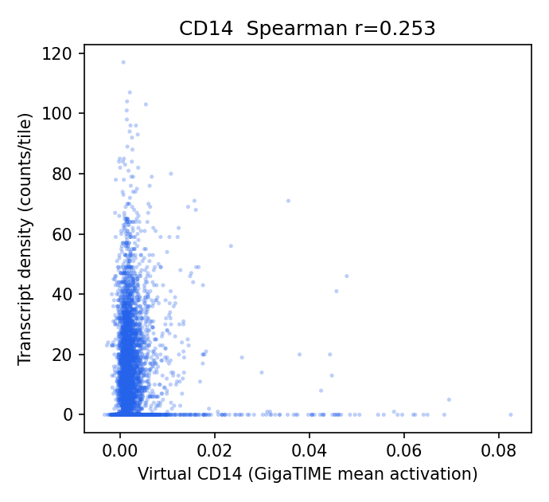
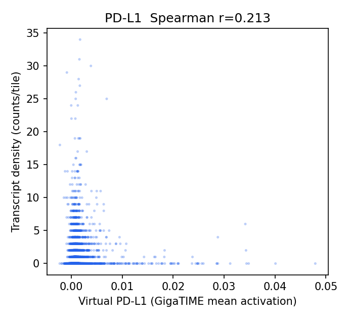
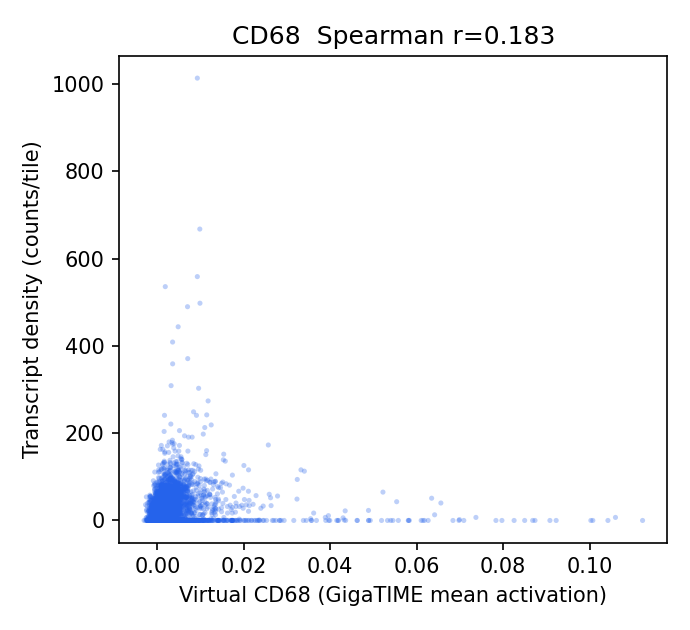
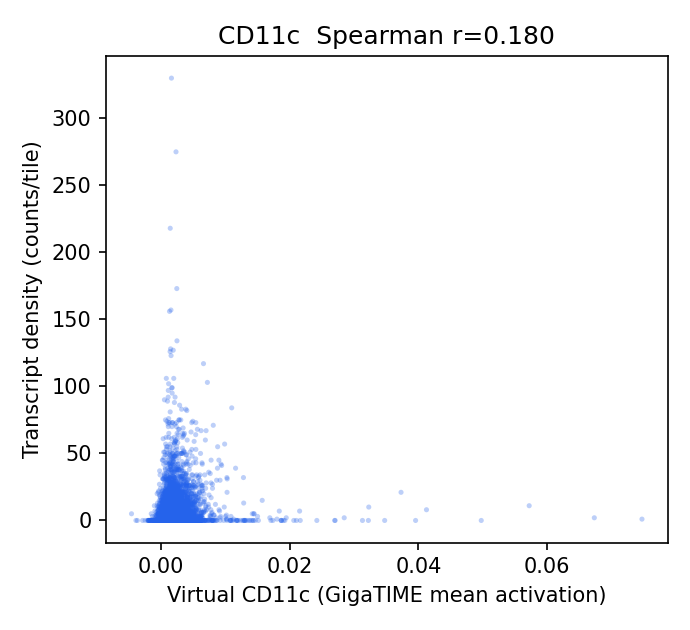
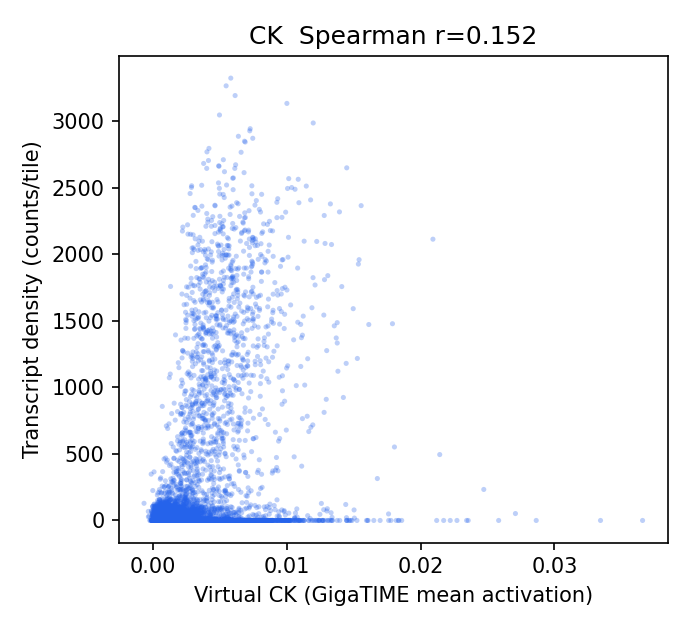
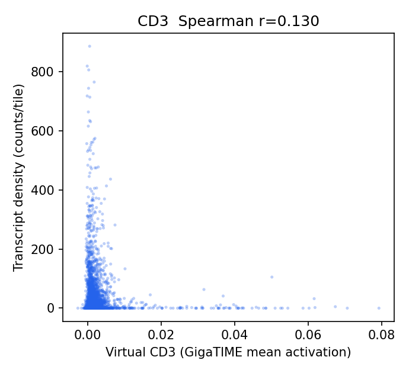
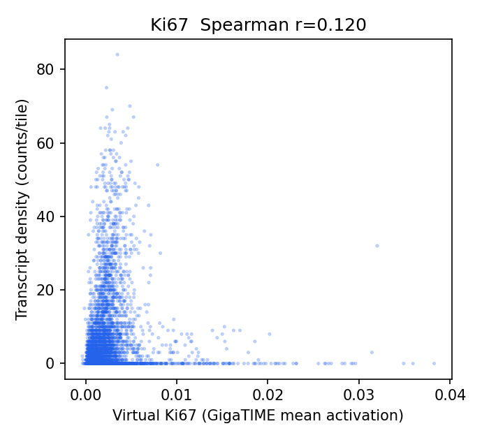
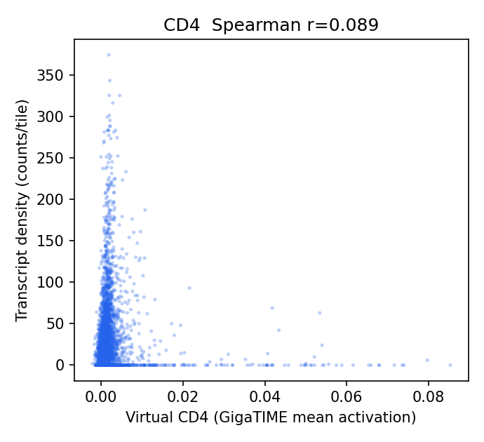
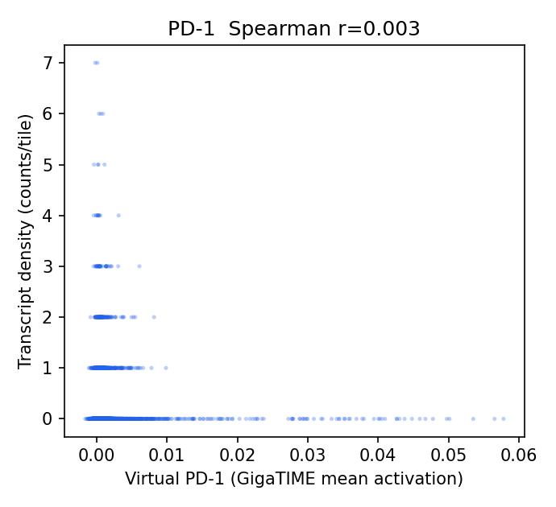
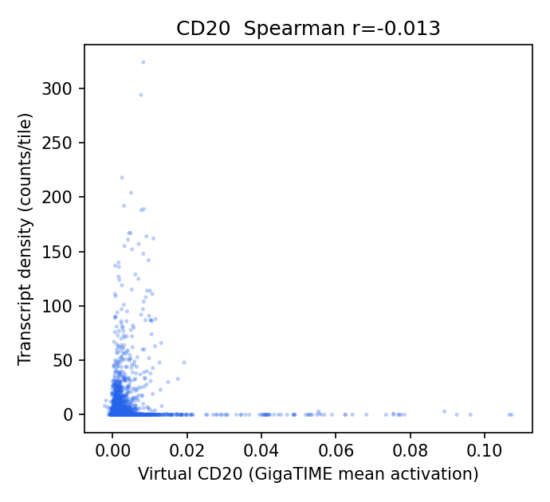
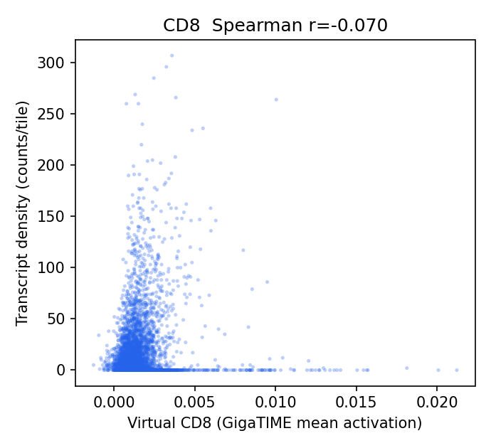

## Channel Specificity (is the signal channel-specific, not just cellularity?)

Two tests beyond the raw correlation. (1) Row-max: for each virtual channel, is its own gene the most correlated gene-set among all channels? Own-gene is the row maximum for **1/11** channels. (2) Partial correlation: does the virtual-vs-own-gene correlation survive partialling out total transcript density per tile (a per-tile cellularity control)? It stays positive (95% CI > 0) for **7/11** channels.

| Channel | Own-gene r | Partial r (control total tx) | Partial 95% CI | Own-gene row-max? | Closest other channel |
|---|---:|---:|---|:--:|---|
| CD4 | 0.089 | 0.357 | [0.314, 0.397] | no | CD20 (0.143) |
| CD14 | 0.253 | 0.263 | [0.221, 0.299] | yes | CD3 (0.240) |
| CD11c | 0.180 | 0.202 | [0.152, 0.247] | no | CD20 (0.252) |
| CD3 | 0.130 | 0.138 | [0.092, 0.186] | no | CD14 (0.147) |
| CD8 | -0.070 | 0.082 | [0.042, 0.122] | no | PD-1 (0.067) |
| CD68 | 0.183 | 0.076 | [0.029, 0.119] | no | CD11c (0.221) |
| PD-L1 | 0.213 | 0.053 | [0.020, 0.085] | no | CD3 (0.323) |
| Ki67 | 0.120 | -0.012 | [-0.051, 0.024] | no | PD-L1 (0.139) |
| CD20 | -0.013 | -0.014 | [-0.053, 0.021] | no | PD-1 (0.034) |
| PD-1 | 0.003 | -0.022 | [-0.058, 0.012] | no | CD14 (0.254) |
| CK | 0.152 | -0.051 | [-0.085, -0.016] | no | Ki67 (0.168) |

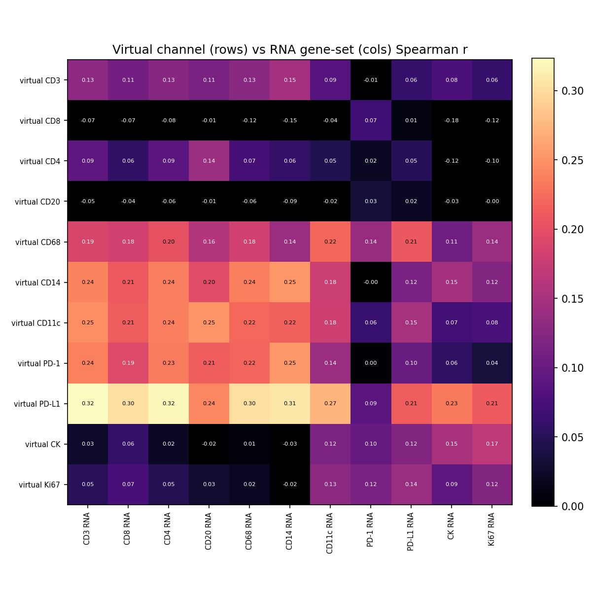

Read the heatmap diagonal: a channel-specific model has its brightest cell on the diagonal (virtual-X tracks gene-X more than other genes). Off-diagonal brightness is expected among co-localized cell types (e.g. T-cell markers travel together).

## Interpretation

- Raw within-slide correlations are positive and significant for all 13 channels (r about 0.13 to 0.43), so the virtual channels do carry real, spatially-localized signal that tracks RNA. This is the first RNA check of these channels. But raw correlation is not the same as channel specificity, and the specificity tests qualify it sharply.
- Specificity is limited. Own-gene is the most-correlated gene-set for only 1/11 channels (CK, CD11c); for the rest, some other channel's gene correlates as well or better, and the immune channels (CD3/CD4/CD8/CD20) collectively track lymphocyte-dense regions rather than their specific cell type.
- After partialling out total per-tile transcript density (a cellularity control), channel-specific signal survives (95% CI > 0) for 7/11 channels and is meaningful for only a few: CK 0.31 (epithelium, the most specific), then the T-cell channels CD3 0.26 / CD8 0.24 / CD4 0.21. Ki67, CD14, CD16 and PD-L1 collapse to about zero, and CD68 goes strongly negative (about -0.33) - i.e. virtual CD68 tracks cellularity/epithelium, not macrophages.
- Note the CK inversion: CK had the weakest raw correlation (0.15) but the strongest cellularity-controlled correlation (0.31), because epithelium-rich tiles are immune-poor, which suppresses the raw number until cellularity is removed. This is exactly why the specificity control matters.
- Takeaway: GigaTIME virtual channels mostly reflect a broad epithelial-versus-immune/cellularity contrast rather than faithful per-marker stains. Only the epithelial (CK) and aggregate T-cell channels are even modestly marker-specific. Use GigaTIME as interpretive context, not as a quantitative cell-type readout and not as load-bearing biological evidence.
- Caveats: single section (repeat across Xenium breast replicates and/or HEST-1k for generalization); sparse channels are exploratory (PD-1 n=1,219; PD-L1 n=9,099); GigaTIME predicts protein (IF) so RNA is a proxy with a concordance ceiling, a partial excuse for low coefficients but not for the failed specificity.

## Output Files

- `results/rosie_xenium_rna_validation_rep2/xenium_rna_validation_report.json`
- `docs/assets/rosie_xenium_rna_validation_rep2/`
