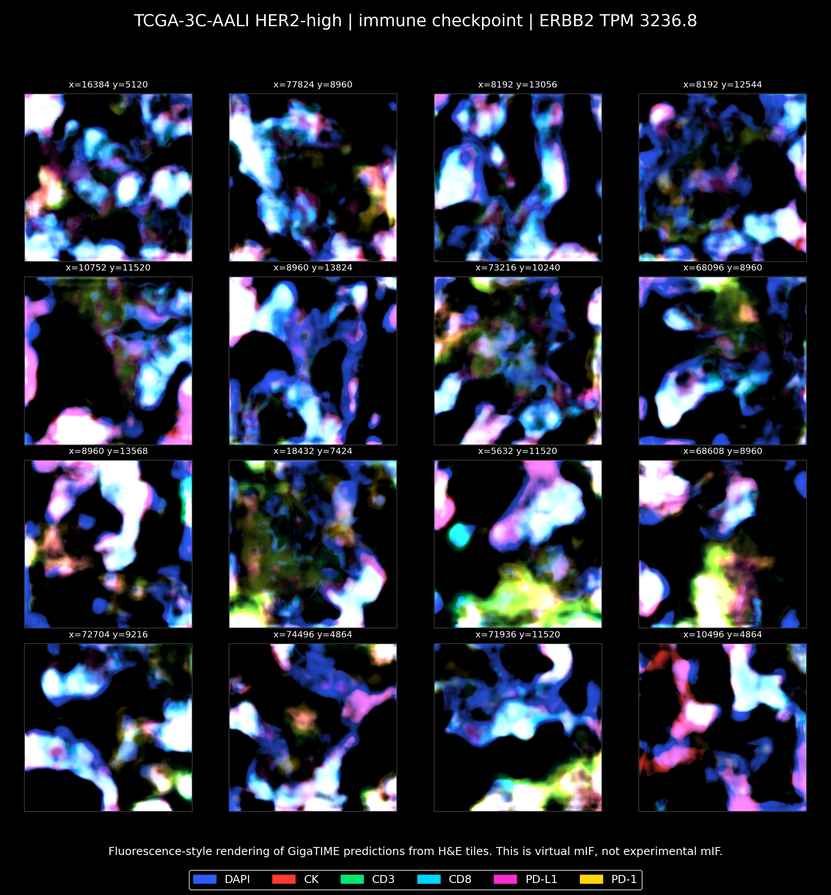
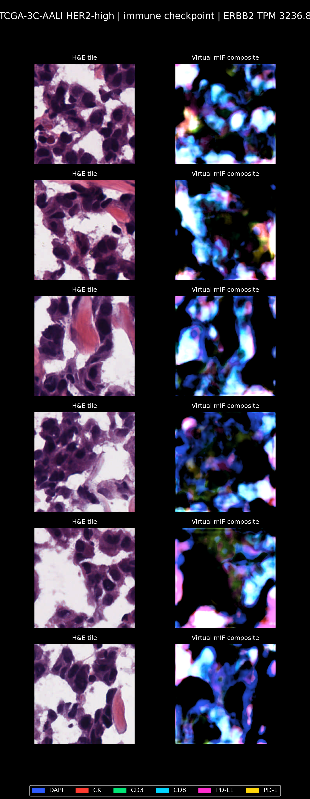
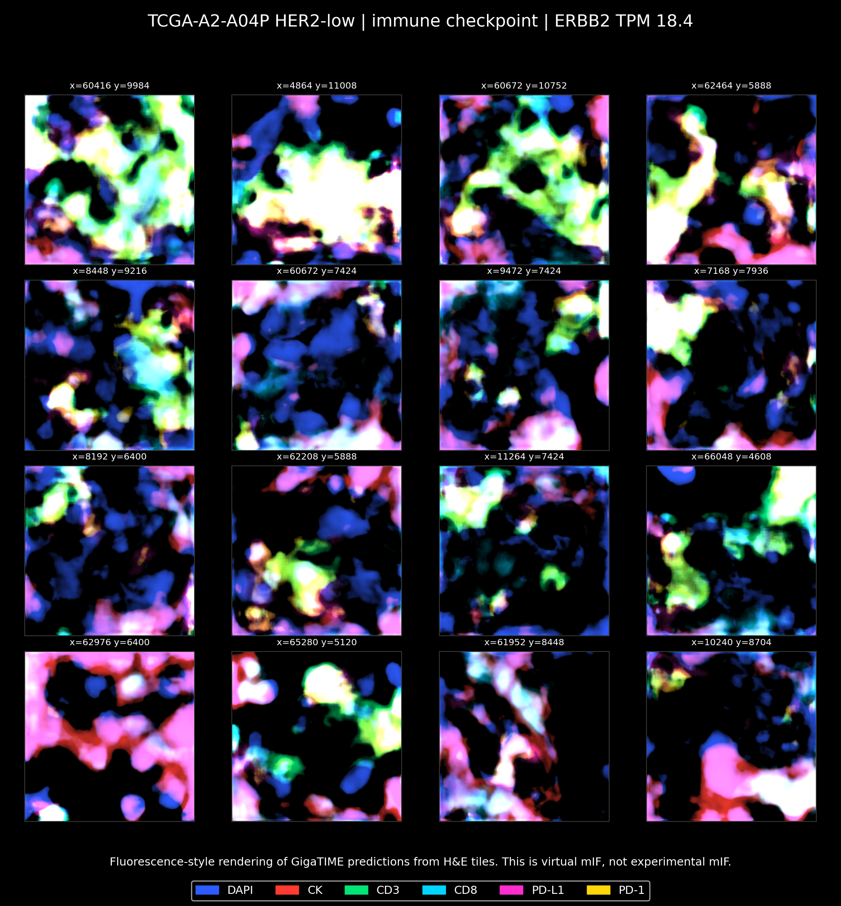
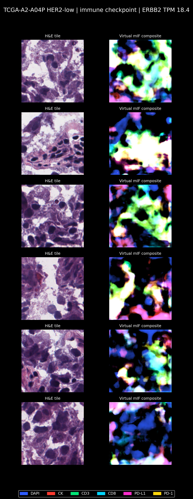
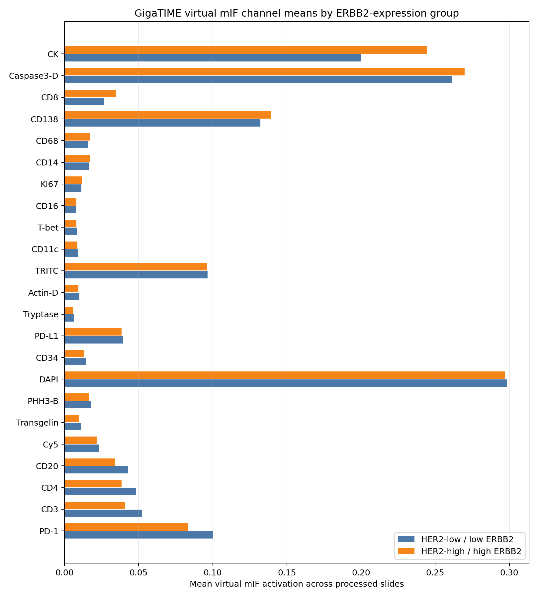
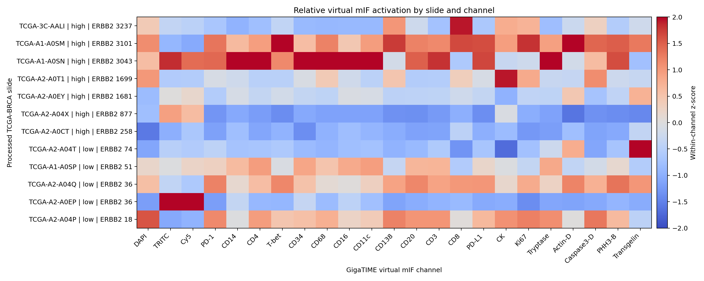
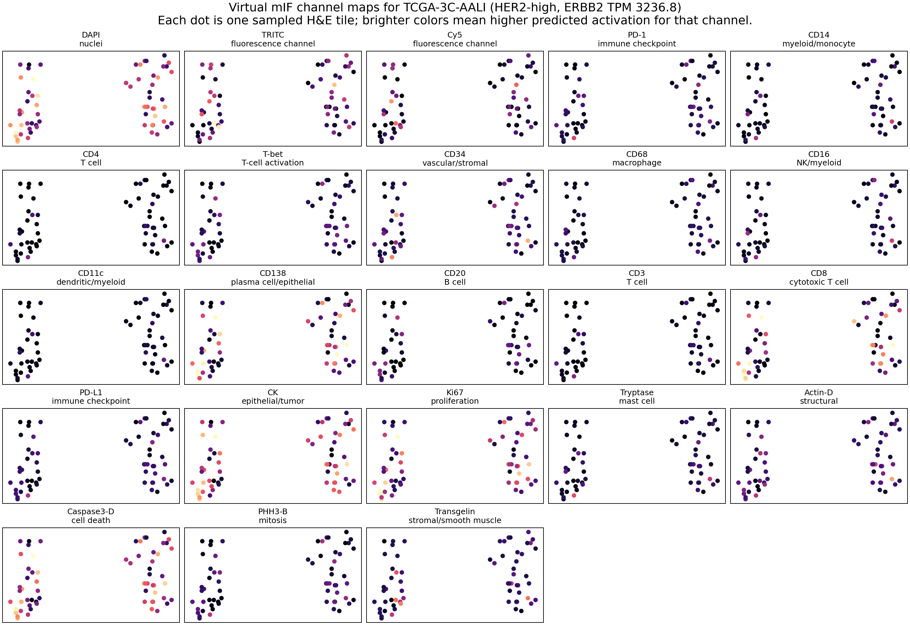
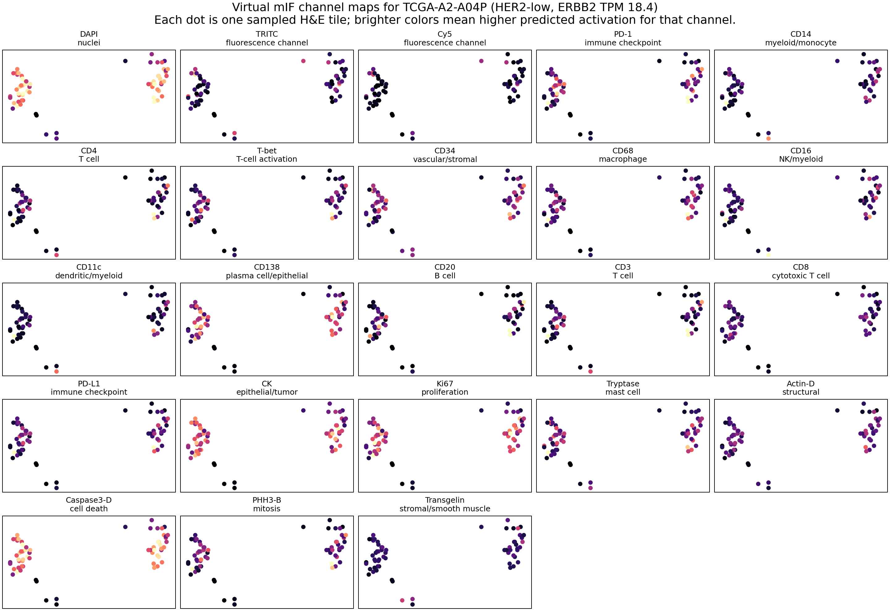

# Virtual mIF Channel Image Outputs

This document explains the images generated from the GigaTIME virtual multiplex immunofluorescence channel predictions.

The images are based on existing GigaTIME outputs in:

```text
results/gigatime_tcga_brca_extremes/slide_scores.csv
results/gigatime_tcga_brca_extremes/tile_scores.csv
results/gigatime_tcga_brca_extremes/advisor_summary/joined_slide_her2_gigatime.csv
```

The documentation-facing image files are stored in:

```text
docs/assets/virtual_mif_channels/
```

They can be regenerated with:

```bash
conda run -n gigatime-tcga python scripts/render_virtual_mif_channel_images.py
```

Fluorescence-style composites can be regenerated with:

```bash
conda run -n gigatime-tcga python scripts/render_virtual_mif_composites.py
```

## What These Images Are

GigaTIME predicts 23 virtual mIF channels from ordinary H&E pathology image tiles. Each channel is a model-estimated marker signal, not a real multiplex immunofluorescence measurement from the TCGA tissue.

For the spatial channel grids, each dot is one sampled H&E tile from the slide. Brighter colors indicate higher predicted activation for that channel. The color scale is normalized per channel across the processed tile set, so the same channel can be visually compared across the HER2-high and HER2-low reference grids.

The fluorescence-style composites are different from the dot-grid images. They rerun GigaTIME on selected H&E tiles, keep the full predicted 2D channel maps, and combine several channels into a black-background image that resembles a real mIF panel.

## Fluorescence-Style Virtual mIF Composites



This image is a virtual immune-checkpoint mIF-style montage for the highest-ERBB2 case in the current processed subset. Colors represent predicted channels: DAPI, CK, CD3, CD8, PD-L1, and PD-1.



This panel shows the source H&E tiles on the left and the corresponding GigaTIME-predicted virtual mIF composites on the right.



This is the equivalent immune-checkpoint virtual mIF-style montage for the lowest-ERBB2 case in the current processed subset.



This panel shows H&E tiles and corresponding virtual mIF composites for the lowest-ERBB2 reference case.

## All-Channel Group Means



This figure compares the mean virtual activation of all 23 GigaTIME channels between the currently processed ERBB2-high and ERBB2-low slides.

It expands the earlier summary beyond the selected immune markers. The comparison remains exploratory because the processed subset is small: 7 ERBB2-high slides and 5 ERBB2-low slides.

## Slide-by-Channel Matrix



This heatmap shows each processed TCGA-BRCA slide against all 23 virtual mIF channels.

The values are shown as within-channel z-scores. That means each channel is centered and scaled across the processed slides so the figure highlights relative patterns. Red means higher-than-average activation for that channel in that slide; blue means lower-than-average activation.

## HER2-High Reference Slide



This grid shows all 23 virtual mIF channel maps for the processed slide with the highest ERBB2 expression in the current subset.

It is useful for seeing that GigaTIME does not produce only one score per slide. It produces tile-level marker predictions that can be inspected spatially.

## HER2-Low Reference Slide



This grid shows all 23 virtual mIF channel maps for the processed slide with the lowest ERBB2 expression in the current subset.

Comparing this with the HER2-high reference grid gives a qualitative visual check, but it should not be interpreted as proof of a biological difference by itself.

## Interpretation Guardrails

- These images show GigaTIME predictions, not experimental mIF measurements.
- The TCGA-BRCA slides used here do not currently have matched real mIF data in this project.
- The spatial maps show only the sampled tiles processed by the pilot run, not every possible tile in each whole-slide image.
- The current cohort is still small, so the images are best used for workflow inspection, advisor discussion, and planning the full 20 high / 20 low ERBB2-extreme run.
